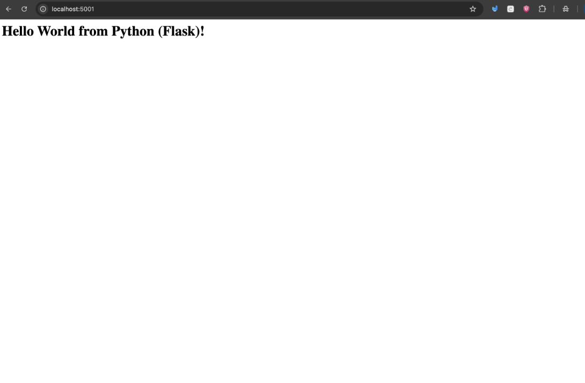
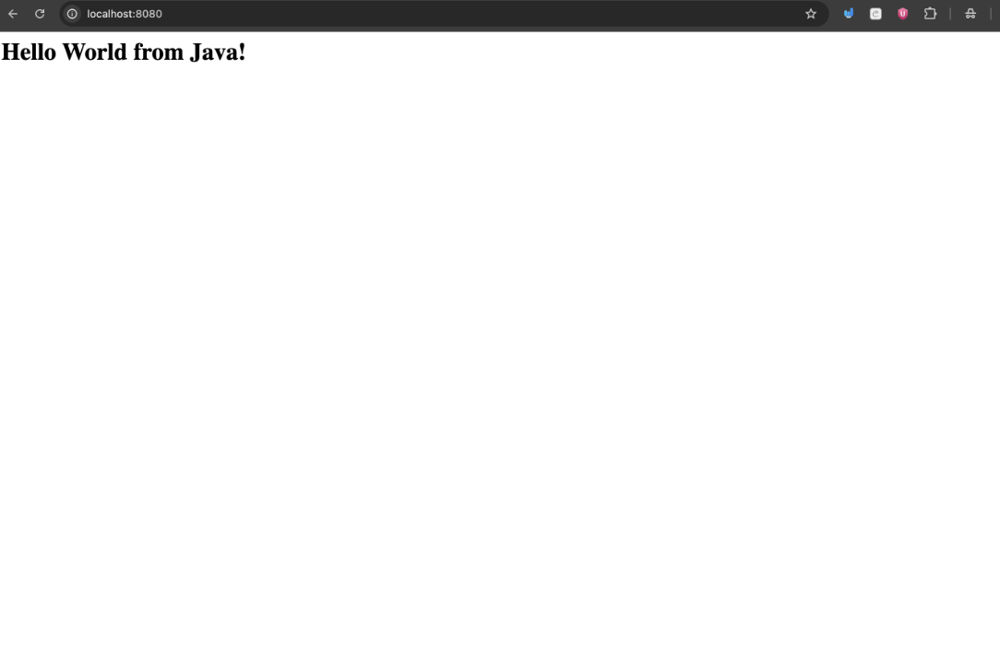
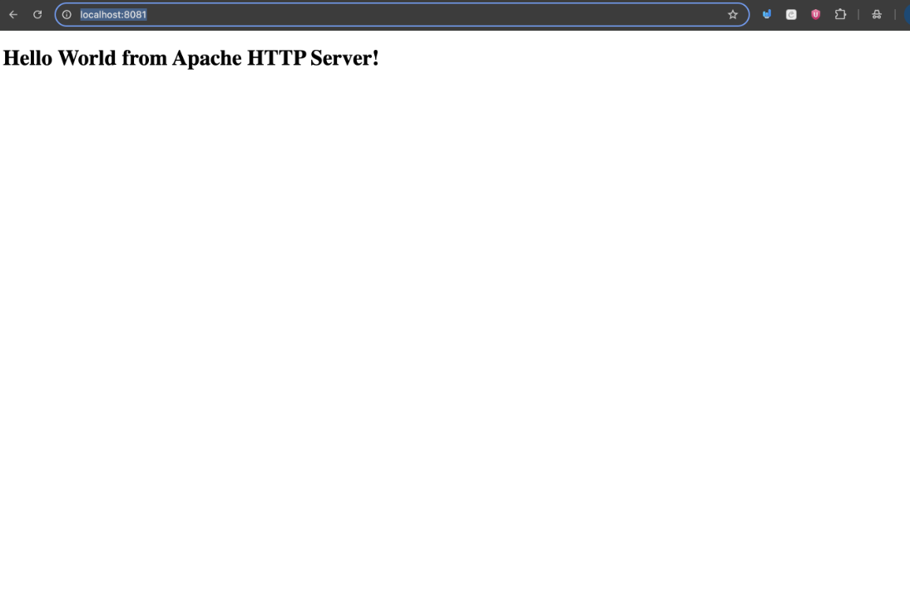
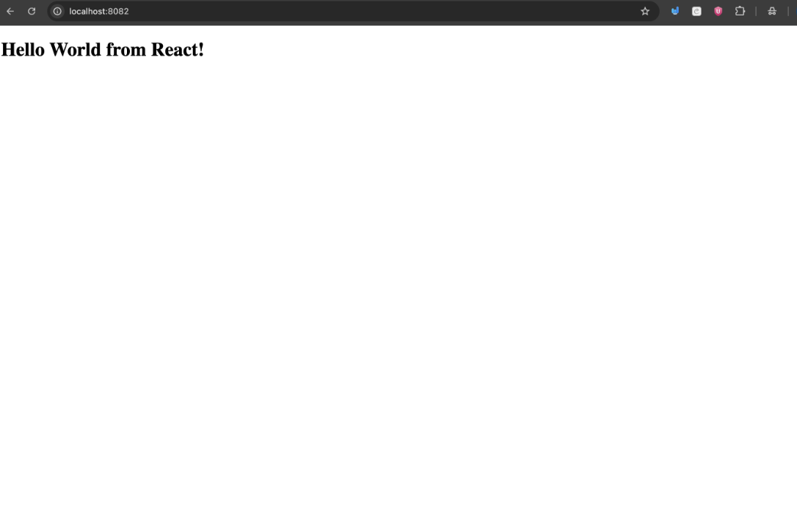
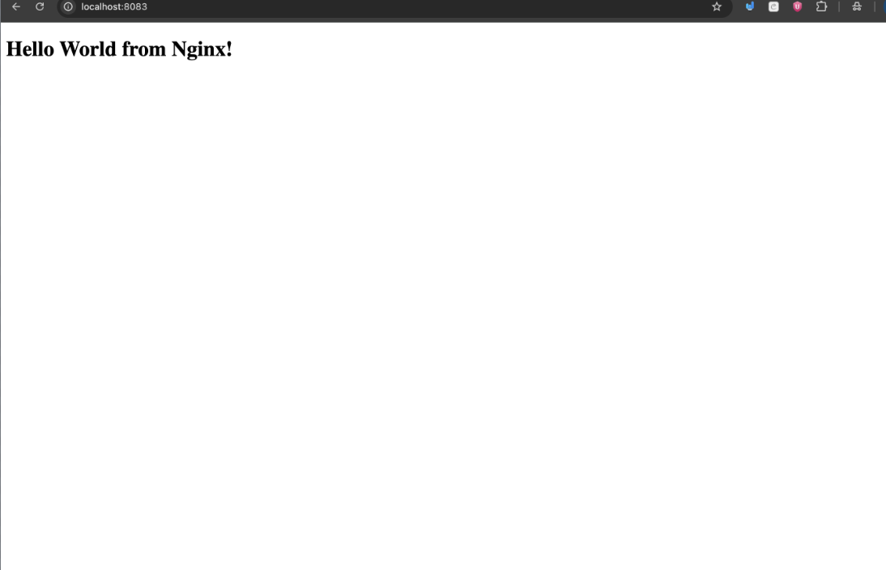

# Docker Fundamentals - Hello World Applications

Six lightweight "Hello World" applications built with different tech stacks, each fully containerized with its own `Dockerfile`.

---

## 📁 Folder Structure

```text
docker-fundamentals/
├── nodejs-app/     # Node.js (built-in HTTP server)
├── python-app/     # Python (Flask framework)
├── java-app/       # Java 21 (built-in HttpServer)
├── apache-app/     # Apache HTTP Server (static HTML page)
├── react-app/      # React (multi-stage build served by Nginx)
└── nginx-app/      # Nginx (static HTML page)
```

---

## 🔌 Ports & Run Summary

| Application | Container Port | Host Port | Build & Run Command |
|---|---|---|---|
| **nodejs-app** | `3000` | `3000` | `docker build -t nodejs-app . && docker run -d -p 3000:3000 nodejs-app` |
| **python-app** | `5000` | `5000` | `docker build -t python-app . && docker run -d -p 5000:5000 python-app` |
| **java-app** | `8080` | `8080` | `docker build -t java-app . && docker run -d -p 8080:8080 java-app` |
| **apache-app** | `80` | `8081` | `docker build -t apache-app . && docker run -d -p 8081:80 apache-app` |
| **react-app** | `80` | `8082` | `docker build -t react-app . && docker run -d -p 8082:80 react-app` |
| **nginx-app** | `80` | `8083` | `docker build -t nginx-app . && docker run -d -p 8083:80 nginx-app` |

---

## 🚀 Build and Run Each Application

Run these commands from inside each application's directory.

### 1. `nodejs-app`
```bash
cd nodejs-app
docker build -t nodejs-app .
docker run -d -p 3000:3000 nodejs-app
# Access at: http://localhost:3000
```

### 2. `python-app`
```bash
cd python-app
docker build -t python-app .
docker run -d -p 5000:5000 python-app
# Access at: http://localhost:5000
```

### 3. `java-app`
```bash
cd java-app
docker build -t java-app .
docker run -d -p 8080:8080 java-app
# Access at: http://localhost:8080
```

### 4. `apache-app`
```bash
cd apache-app
docker build -t apache-app .
docker run -d -p 8081:80 apache-app
# Access at: http://localhost:8081
```

### 5. `react-app`
```bash
cd react-app
docker build -t react-app .
docker run -d -p 8082:80 react-app
# Access at: http://localhost:8082
```

### 6. `nginx-app`
```bash
cd nginx-app
docker build -t nginx-app .
docker run -d -p 8083:80 nginx-app
# Access at: http://localhost:8083
```

---

## 🛠️ Essential Docker Commands

```bash
docker images            # List all locally built Docker images
docker ps                # List all running containers
docker ps -a             # List all containers (running & stopped)
docker stop <container>  # Stop a running container by ID or name
docker rm <container>    # Remove a container
docker logs <container>  # View logs of a specific container
```

---

## 📸 Screenshots

- **Node.js App:** 
- **Python App:** 
- **Java App:** 
- **Apache App:** 
- **React App:** 
- **Nginx App:** 
