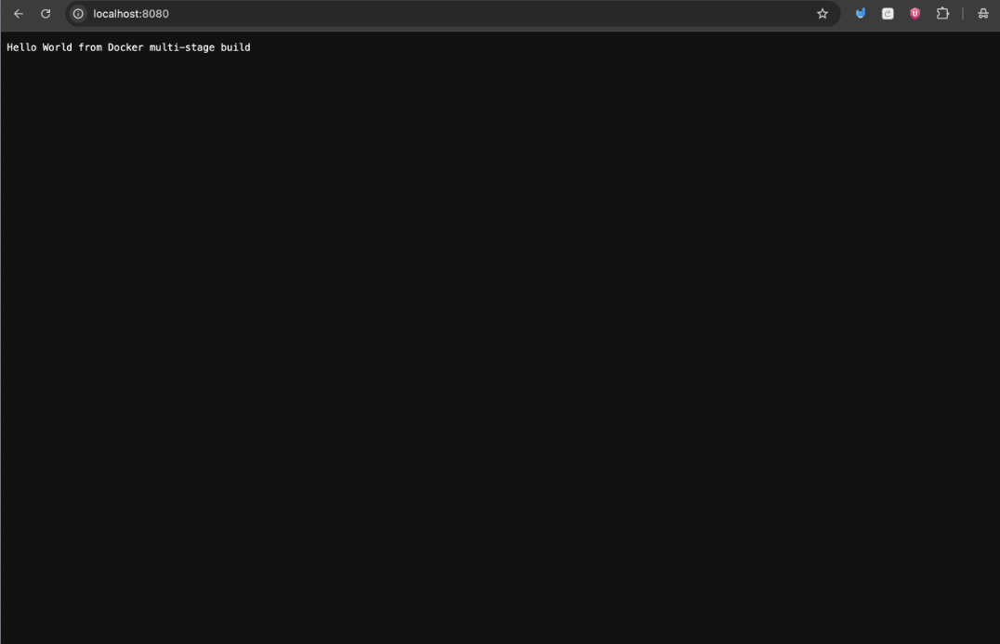
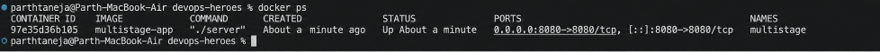
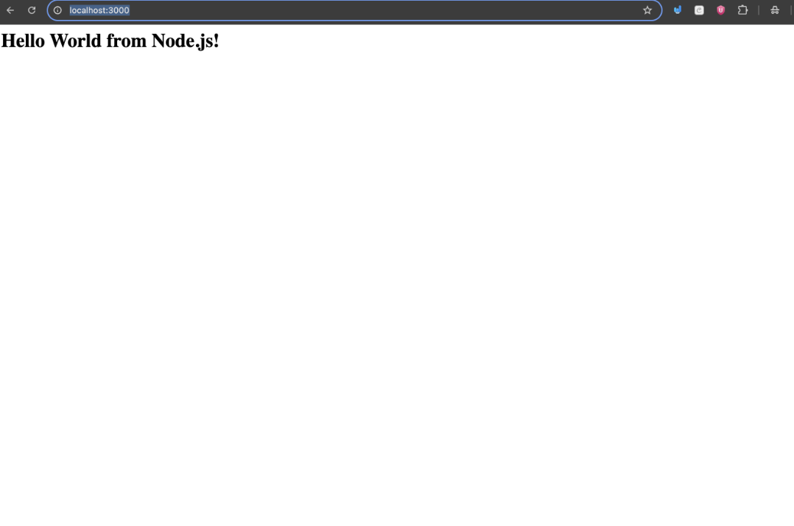
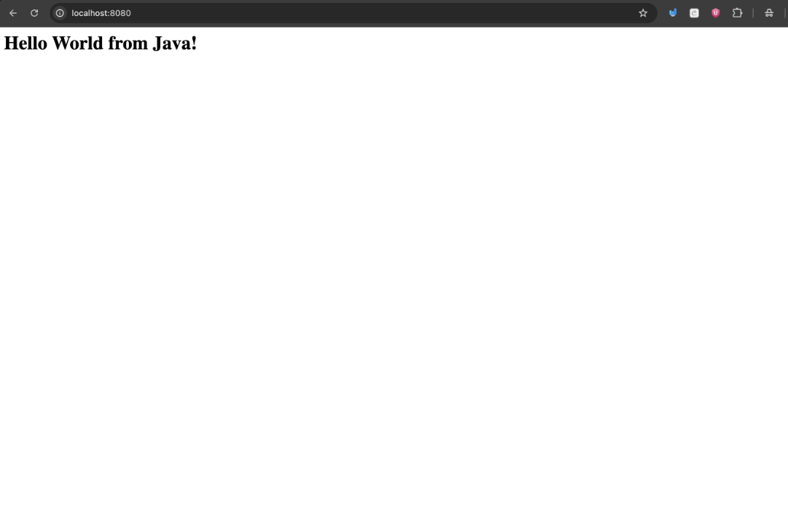

# Docker Multi-Stage Build - Homework

**Name:** Parth Taneja  
**Enrollment Number:** 24bcs10230  

---

## 🚀 Task 1: Multi-Stage Dockerfile Implementation

A **multi-stage Docker build** utilizes multiple `FROM` instructions within a single `Dockerfile`. The initial build stage compiles the source code using the complete toolchain (Go compiler), while the final stage copies *only* the compiled binary executable into a minimal runtime image (Alpine Linux). This strips away unnecessary build dependencies, drastically reducing the final image size and attack surface.

### 1. Application Source (`main.go`)
```go
package main

import (
	"fmt"
	"net/http"
)

func main() {
	http.HandleFunc("/", func(w http.ResponseWriter, r *http.Request) {
		fmt.Fprintln(w, "Hello World from Docker multi-stage build")
	})

	fmt.Println("Server listening on port 8080")
	http.ListenAndServe(":8080", nil)
}
```

### 2. Multi-Stage `Dockerfile`
```dockerfile
# ---- Stage 1: Build ----
# Use official Go image to compile the application into a static binary
FROM golang:1.23-alpine AS build

WORKDIR /app

# Copy source code
COPY main.go ./

# Compile a statically linked binary named "server"
RUN CGO_ENABLED=0 go build -o server main.go

# ---- Stage 2: Runtime ----
# Use minimal Alpine base image for deployment
FROM alpine:3.20

WORKDIR /app

# Copy ONLY the compiled binary from the build stage
COPY --from=build /app/server ./

# Expose port 8080
EXPOSE 8080

# Run the binary
CMD ["./server"]
```

---

### 3. Build & Execution Commands
```bash
# Build the multi-stage Docker image
docker build -t multistage-app .

# Run container in detached mode mapping host port 8080
docker run -d -p 8080:8080 --name multistage multistage-app
```

---

### 4. Verification & Testing

#### Test Endpoint with `curl`:
```bash
curl http://localhost:8080
```
**Output:**
```text
Hello World from Docker multi-stage build
```

#### Verify Running Container (`docker ps`):
```bash
docker ps
```
**Output:**
```text
NAMES        IMAGE            STATUS         PORTS
multistage   multistage-app   Up 2 seconds   0.0.0.0:8080->8080/tcp
```
> **Verification Result:** The application is running successfully on **port 8080**.

---

### 5. Multi-Stage Optimization Benefit
The final container image size is reduced to approximately **~25 MB** because the Go compiler, SDK, and temporary build artifacts remain in the temporary build stage, leaving only the compiled static binary inside the final Alpine image.

---

## 📸 Task 2: Multi-Stage Screenshots

- **Application running in browser / curl (port 8080):**  
  

- **`docker ps` container status output:**  
  

---

## 🛠️ Task 3: Docker Application Deployment Summary

Three distinct application stacks were containerized and deployed using Docker (see the `assignments/docker-fundamentals/` folder for full source code and Dockerfiles):

| Application | Language / Stack | Container Port | Sample Output |
|---|---|---|---|
| **Node.js** | Node.js (Built-in HTTP Server) | `3000` | `Hello World from Node.js!` |
| **Python** | Python 3.12 (Flask Framework) | `5000` | `Hello World from Python (Flask)!` |
| **Java** | Java 21 (Built-in HttpServer) | `8080` | `Hello World from Java!` |

### Build & Run Example (Node.js App):
```bash
cd ../docker-fundamentals/nodejs-app
docker build -t nodejs-app .
docker run -d -p 3000:3000 nodejs-app
# Access at: http://localhost:3000
```

### Application Screenshots:
- **Node.js App:** 
- **Python App:** 
- **Java App:** 