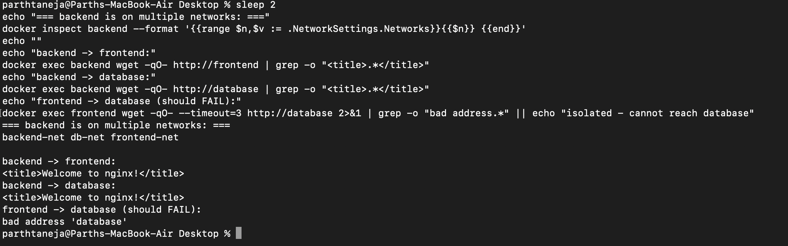
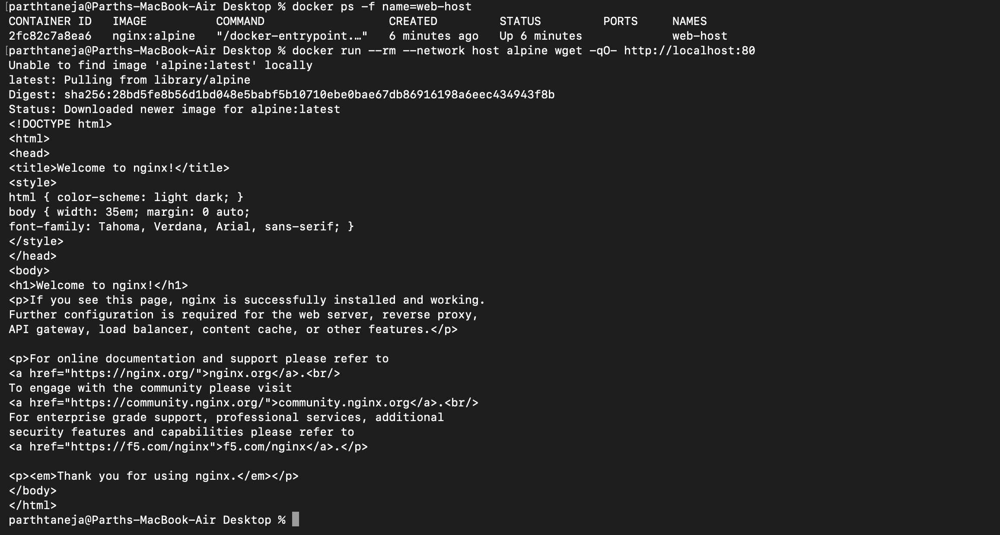
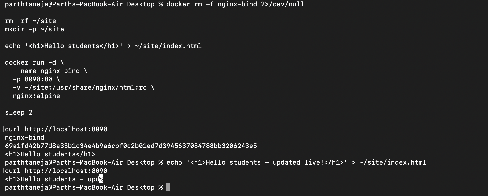

# Docker Networking & Volumes - Homework

Practice of Docker container networking, host network, bind mounts, and overlay networks.

## Task 1: Docker Container Networking

Created 3 containers (frontend, backend, database) across 3 networks, with the **backend
connected to multiple networks** so it can bridge the frontend and the database.

| Container | Image | Network(s) |
|---|---|---|
| frontend | nginx:alpine | frontend-net |
| backend | nginx:alpine | backend-net + frontend-net + db-net |
| database | nginx:alpine | db-net |

> Note: the database tier uses `nginx:alpine` as a lightweight stand-in (the VM disk was
> too small to pull the full `mysql:8.0` image). The networking behaviour being tested -
> multiple networks, DNS by container name, and isolation between networks - is identical.

### Create 3 networks
```bash
docker network create frontend-net
docker network create backend-net
docker network create db-net
docker network ls
```

### Create the 3 containers
```bash
docker run -d --name frontend --network frontend-net nginx:alpine
docker run -d --name database --network db-net -e MYSQL_ROOT_PASSWORD=rootpass mysql:8.0
docker run -d --name backend  --network backend-net nginx:alpine
```

### Add the backend to 2 more networks
```bash
docker network connect frontend-net backend
docker network connect db-net backend

# backend is on networks: backend-net db-net frontend-net
```

### Check connectivity
```bash
# backend -> frontend (shared frontend-net): SUCCESS
docker exec backend wget -qO- http://frontend        # returns nginx welcome page

# backend -> database (shared db-net): SUCCESS
docker exec backend nc -z database 3306              # port 3306 reachable

# frontend -> database (different networks): FAILS (isolated)
docker exec frontend nc -z database 3306             # nc: bad address 'database'
```

**What I understood:** Containers on the **same** Docker network can reach each other by
name (Docker provides built-in DNS). Containers on **different** networks are isolated. By
attaching the backend to multiple networks, it can talk to both the frontend and the
database, while the frontend still cannot reach the database directly - which is how a real
3-tier app keeps the database private.



## Task 2: Host Network

```bash
docker run -d --name web-host --network host nginx:alpine
docker ps          # note: host network shows NO port mapping
curl http://localhost:80    # returns the nginx welcome page
```

**What I understood:** With `--network host`, the container shares the host's network
directly - no port mapping (`-p`) is needed, and the service is available on the host's own
port 80.

> Note: `nginx:alpine` was used here instead of `httpd:2.4` because the VM disk was full.
> The host-network behaviour is the same - the web server is reachable on the host's own
> port 80 with no `-p` mapping. On a native Linux host this works directly at
> `http://localhost:80`; on Docker Desktop (Mac/Windows) host networking binds inside the
> Docker VM rather than the Mac's localhost.



## Task 3: Bind Mount

```bash
# Create a local folder and file
mkdir site
echo "<h1>Hello students</h1>" > site/index.html

# Bind mount the folder into Nginx
docker run -d --name nginx-bind -p 8090:80 -v "$(pwd)/site":/usr/share/nginx/html:ro nginx:alpine

# Access it
curl http://localhost:8090      # <h1>Hello students</h1>

# Modify the file WITHOUT restarting the container
echo "<h1>Hello students - content updated live!</h1>" > site/index.html
curl http://localhost:8090      # <h1>Hello students - content updated live!</h1>
```

**What I understood:** A bind mount links a folder on my machine directly into the
container. Any edit I make to the local file appears immediately inside the container - no
rebuild or restart needed. This is very useful during development.



## Task 4: Overlay Network (Research)

**What it is:** An overlay network connects containers running on **different Docker hosts**
(different physical/virtual machines) so they behave as if they are on one single network.

**How it works:** Docker creates a virtual network that spans multiple hosts. It encapsulates
container traffic (using VXLAN) and sends it over the physical network between the hosts, so
a container on Host A can talk to a container on Host B by name, without exposing ports on
each host. It requires a key-value store / cluster manager - in practice **Docker Swarm** (or
Kubernetes) provides this.

**Use cases:**
- Multi-host container communication in a cluster.
- Docker Swarm services that scale containers across many nodes.
- Microservices that run on different servers but need to talk to each other securely.

**Bridge vs Overlay:**
| | Bridge network | Overlay network |
|---|---|---|
| Scope | Single host | Multiple hosts |
| Use case | Containers on one machine | Containers across a cluster |
| Needs orchestrator | No | Yes (Swarm/Kubernetes) |

**Example (on a Swarm):**
```bash
docker swarm init
docker network create -d overlay my-overlay
docker service create --name web --network my-overlay nginx
```

## Cleanup commands used
```bash
docker rm -f frontend backend database apache-host nginx-bind
docker network rm frontend-net backend-net db-net
```