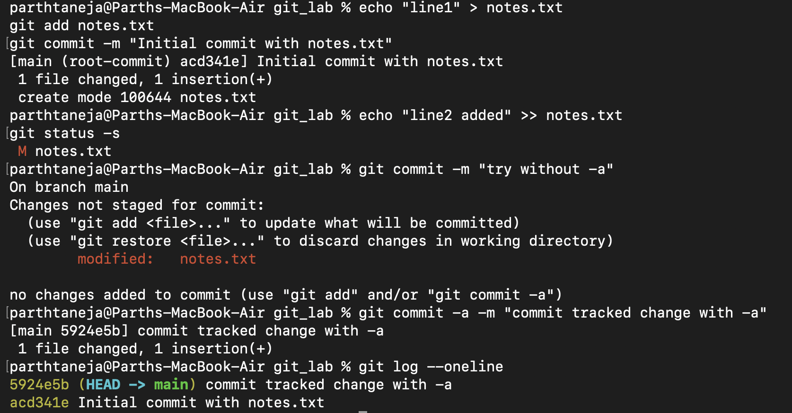
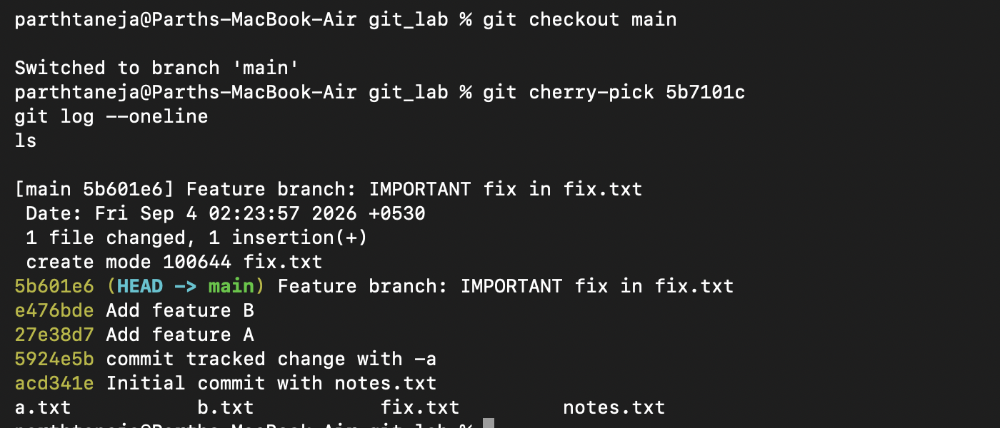

# Git Fundamentals - Homework

Hands-on practice and key concepts covering `git commit -a -m` vs `git commit -m` and selective commit integration using `git cherry-pick`.

---

## Task 1: `git commit -a -m` vs `git commit -m`

### 💡 The Difference

- **`git commit -m "message"`**: Commits **only the changes that are already staged** in the index (i.e., files added via `git add`).
- **`git commit -a -m "message"`**: Automatically **stages all modified and deleted tracked files** and commits them in a single step.  
  *(Note: The `-a` flag does **not** stage new, untracked files; brand-new files still require `git add` first).*

---

### 🛠️ Practical Test & Terminal Output

#### 1. Initialize tracked file and make a modification
```bash
echo "line1" > notes.txt
git add notes.txt
git commit -m "Initial commit with notes.txt"

# Append a new line to notes.txt
echo "line2 added" >> notes.txt
git status -s
```

**Output:**
```text
 M notes.txt
```

#### 2. Attempt to commit with `-m` alone (without `-a` or `git add`)
```bash
git commit -m "try without -a"
```

**Output:**
```text
On branch main
Changes not staged for commit:
  (use "git add <file>..." to update what will be committed)
  (use "git restore <file>..." to discard changes in working directory)
	modified:   notes.txt

no changes added to commit
```
> **Result:** Nothing was committed because the modified file was not staged in the index.

#### 3. Commit using `-a -m`
```bash
git commit -a -m "commit tracked change with -a"
```

**Output:**
```text
[main 2a47f0b] commit tracked change with -a
 1 file changed, 1 insertion(+)
```

#### 4. Verify commit history
```bash
git log --oneline
```

**Output:**
```text
2a47f0b commit tracked change with -a
b16997c Initial commit with notes.txt
```

**What I understood:**  
The `-a` flag acts as a shortcut to stage all modified tracked files before committing, saving the extra step of running `git add`. However, plain `git commit -m` only commits what has already been explicitly staged. Neither command will automatically pick up untracked files.

### Screenshot


---

## Task 2: `git cherry-pick`

### 💡 Core Concept
`git cherry-pick` allows you to copy a **single specific commit** from another branch and apply it directly onto your current branch, without merging the entire history of that branch.

---

### 🛠️ Step-by-Step Hands-on Practice

#### Step 1: Create initial commits on `main`
```bash
echo "featureA" > a.txt; git add a.txt; git commit -m "Add feature A"
echo "featureB" > b.txt; git add b.txt; git commit -m "Add feature B"
git log --oneline
```

**Output:**
```text
b536f04 Add feature B
5a40d21 Add feature A
2a47f0b commit tracked change with -a
b16997c Initial commit with notes.txt
```

#### Step 2: Create a feature branch and make multiple commits
```bash
git checkout -b feature
echo "x" > x.txt; git add x.txt; git commit -m "Feature branch: add x.txt"
echo "important fix" > fix.txt; git add fix.txt; git commit -m "Feature branch: IMPORTANT fix in fix.txt"
echo "y" > y.txt; git add y.txt; git commit -m "Feature branch: add y.txt"
git log --oneline
```

**Output:**
```text
7aa7fa8 Feature branch: add y.txt
48d103f Feature branch: IMPORTANT fix in fix.txt
92def40 Feature branch: add x.txt
b536f04 Add feature B
5a40d21 Add feature A
...
```

#### Step 3: Identify the target commit
The specific commit to bring over to `main` is the critical fix: **`48d103f`**.

#### Step 4: Cherry-pick the specific commit onto `main`
```bash
git checkout main
git cherry-pick 48d103f
```

**Output:**
```text
[main b7d3296] Feature branch: IMPORTANT fix in fix.txt
 1 file changed, 1 insertion(+)
 create mode 100644 fix.txt
```

#### Step 5: Verify working tree and history
```bash
git log --oneline
ls
```

**Output:**
```text
b7d3296 Feature branch: IMPORTANT fix in fix.txt
b536f04 Add feature B
5a40d21 Add feature A
2a47f0b commit tracked change with -a
b16997c Initial commit with notes.txt

a.txt  b.txt  fix.txt  notes.txt
```

**What I understood:**  
`fix.txt` is now present on `main`, but `x.txt` and `y.txt` are **not** present. This proves that `git cherry-pick` isolated and applied only the single target commit without merging the rest of the `feature` branch. This is ideal for backporting bug fixes without bringing along unreleased feature code.

### Screenshot

