# Session 10: Kubernetes Core Objects & Deployment Strategies

## 1. Pod Creation and Extended Inspection

Deploying a standard Pod manifest and analyzing runtime status, assigned IP address, node placement, and container logs using `kubectl get pods -o wide` and `kubectl describe`.

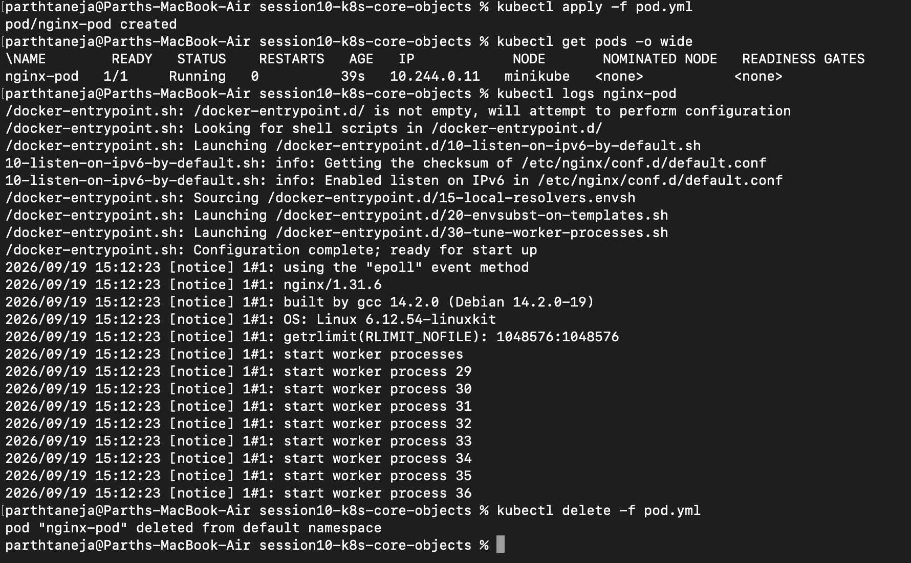

---

## 2. Simulating Container Failure States (`ErrImagePull` & `ImagePullBackOff`)

When a manifest referencing an invalid container image is submitted, the API object creation succeeds in `etcd`, but the container runtime fails during image retrieval. The container state transitions from `ErrImagePull` into `ImagePullBackOff`, where Kubernetes applies exponential backoff delays between pull attempts.

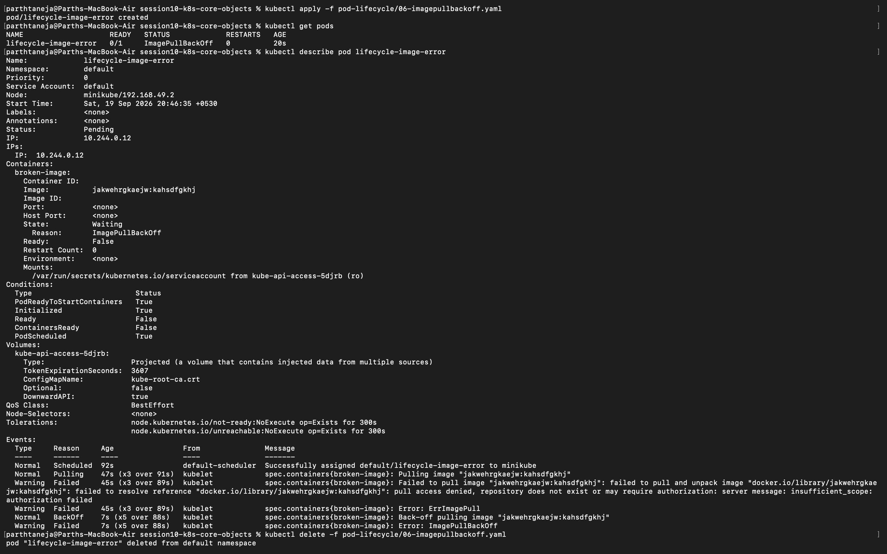

---

## 3. Capturing Pod Lifecycle Phases

Observing transient lifecycle stages of a short-lived batch container configured with `restartPolicy: Never`. The Pod transitions sequentially through `ContainerCreating` $\rightarrow$ `Running` $\rightarrow$ `Completed` (with an exit code of `0` in the `Succeeded` phase).

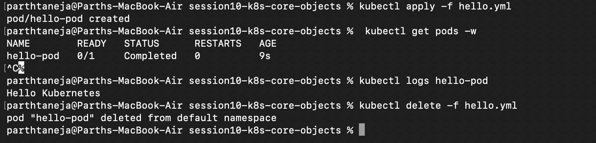

---

## 4. Zero-Downtime Rolling Updates

Demonstrating zero-downtime application updates using the `RollingUpdate` strategy configured with `maxSurge: 1` and `maxUnavailable: 0`. Kubernetes ensures new Pods achieve a `Ready` state before old Pods are terminated.

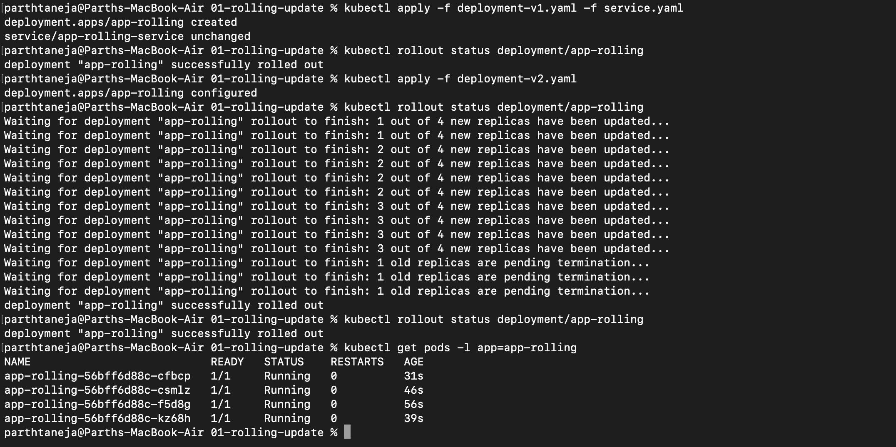

---

## 5. Deployment Rollbacks

Executing an immediate zero-downtime rollback to a previous healthy revision using `kubectl rollout undo` following an update failure or regression.

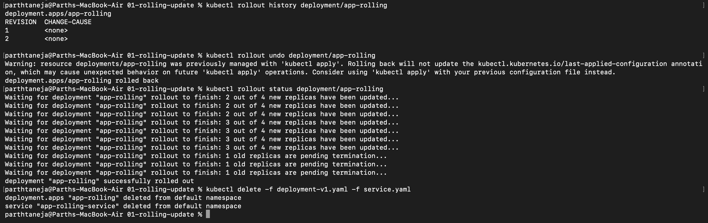

---

## 6. Blue-Green Deployment Strategy

In a Blue-Green deployment, both `Blue` (v1) and `Green` (v2) environments run simultaneously in isolation. Traffic cutover is achieved instantly by updating the Service `selector` (`slot: blue` $\rightarrow$ `slot: green`), enabling zero-downtime switches and instant rollbacks without pod churn.

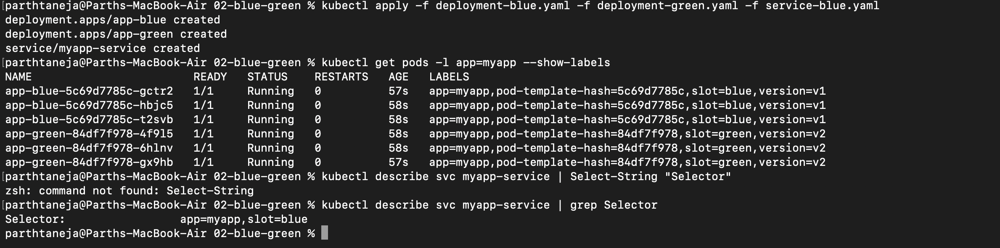
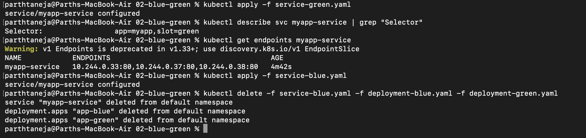

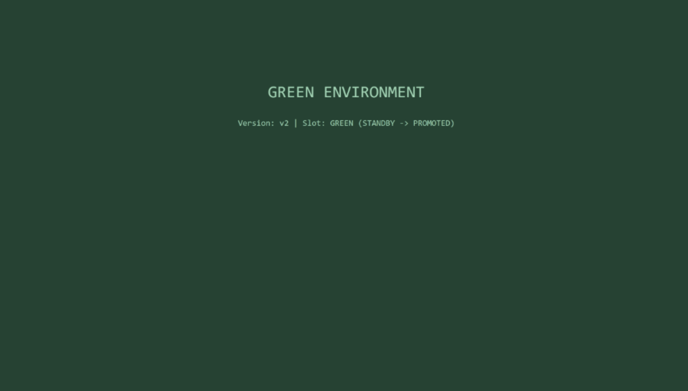

---

## 7. Canary Deployment Strategy

Canary releases deploy a small ratio of updated Pods alongside stable baseline Pods under a shared Service selector. For example, maintaining 9 stable Pods (v1) and 1 canary Pod (v2) splits incoming production traffic at approximately 90% / 10%.

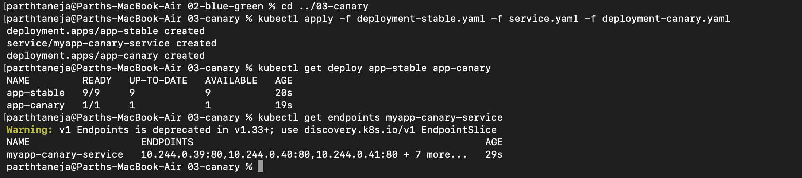

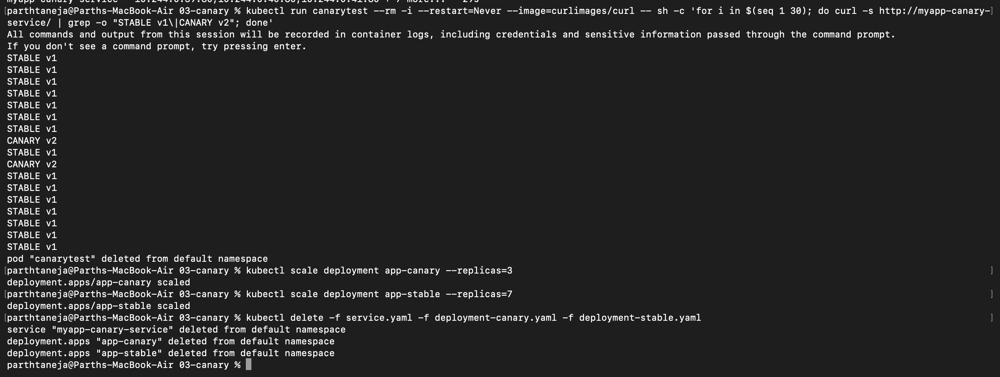

---

## 8. Recreate Deployment Strategy

The `Recreate` deployment strategy terminates **all existing Pods** simultaneously before creating new Pod instances. While this prevents version co-existence issues, it introduces an intentional service outage window during rollout.

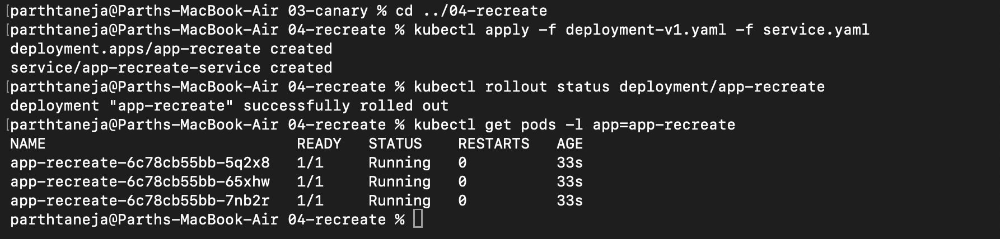
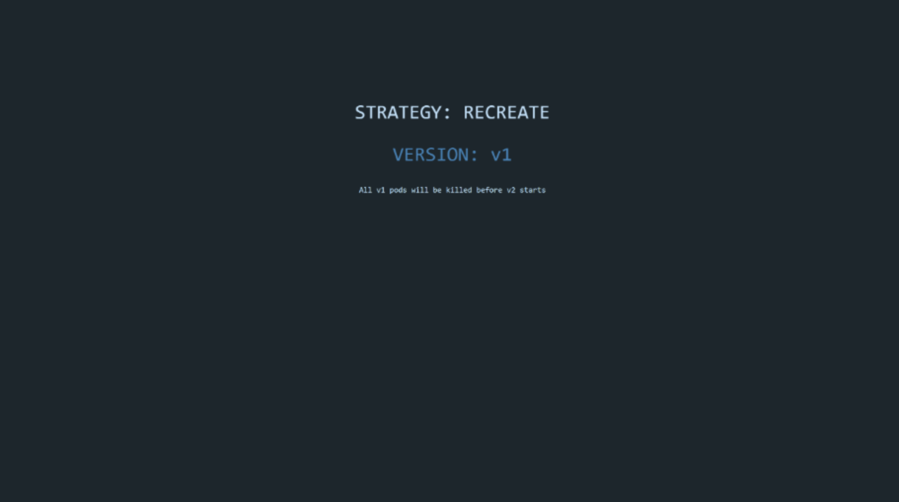
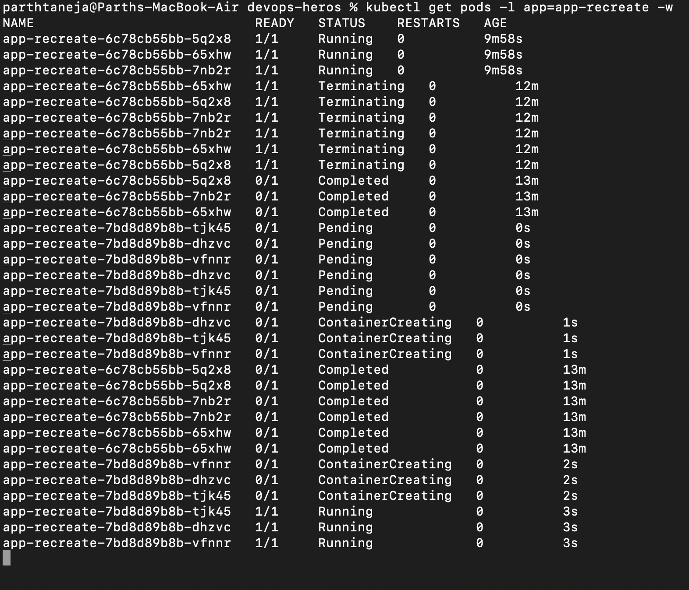

---

## 9. Architectural & Technical Deep Dive

### Deployment Strategies Matrix

| Deployment Strategy | Operating Mechanism | Service Downtime | Infrastructure Overhead |
|---|---|---|---|
| **RollingUpdate** | Incrementally replaces old Pods with new Pods | Zero Downtime | Minimal (`maxSurge` extra pods) |
| **Recreate** | Kills all old Pods simultaneously before launching new ones | Brief Outage Window | Low (1x capacity) |
| **Blue-Green** | Provisions 2 identical parallel environments; updates Service selector | Zero Downtime (Instant Cutover) | High (2x capacity required) |
| **Canary** | Introduces a small percentage of new Pods to split live traffic | Zero Downtime | Low (Progressive scaling) |

### Rolling Update Calculations (`maxSurge` & `maxUnavailable`)

For a Deployment specified with `replicas: 4`, `maxSurge: 1`, and `maxUnavailable: 0`:

- **Maximum Allowed Pods during rollout:** $\text{replicas} + \text{maxSurge} = 4 + 1 = 5 \text{ pods}$
- **Minimum Available Pods during rollout:** $\text{replicas} - \text{maxUnavailable} = 4 - 0 = 4 \text{ pods}$ *(Guarantees 100% capacity throughout)*

### Kubernetes Port Mapping Architecture

| Port Field | Location | Technical Purpose |
|---|---|---|
| `containerPort` | `Pod.spec.containers` | Port opened inside the container process (informational documentation). |
| `targetPort` | `Service.spec.ports` | Target port on backend Pods where traffic is forwarded. |
| `port` | `Service.spec.ports` | Internal virtual IP (ClusterIP) port exposed by the Service. |
| `nodePort` | `Service.spec.ports` | High port (`30000–32767`) exposed on every node's external IP interface. |

$$\text{Traffic Path: } \text{Client} \longrightarrow \text{nodePort} \longrightarrow \text{port (ClusterIP)} \longrightarrow \text{targetPort} \longrightarrow \text{containerPort}$$

### Labels vs. Selectors
- **Labels:** Arbitrary key-value metadata attached to Kubernetes objects (e.g., `app: payment-api`, `env: production`).
- **Selectors:** Query mechanisms used by controllers (Deployments, Services) to dynamically discover, group, and route traffic to matching Pods.

### Resource Allocation: Requests vs. Limits
- **Requests:** Guaranteed minimum CPU/Memory allocated by the `kube-scheduler` when placing Pods onto worker nodes.
- **Limits:** Hard resource boundary enforced by Linux cgroups. Exceeding CPU limits results in CPU throttling; exceeding Memory limits triggers an OOM (Out Of Memory) container kill.
- **Memory Units:** Binary IEC units are used (`1 GiB = 2^{30} \text{ bytes} = 1,024 \text{ MiB}`), distinct from decimal SI units (`1 GB = 10^9 \text{ bytes}`).

---