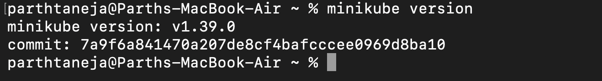
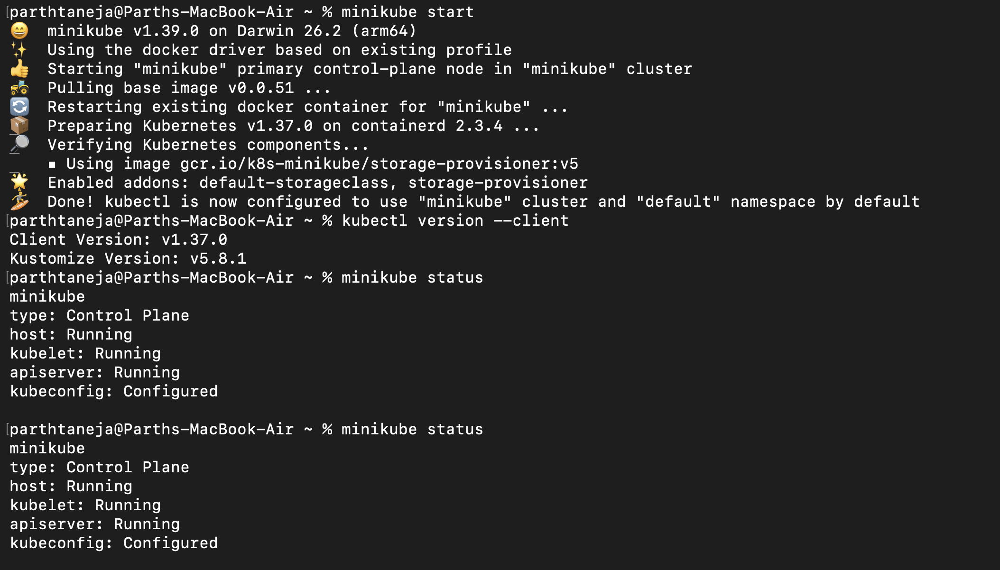
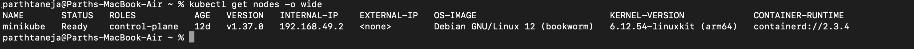
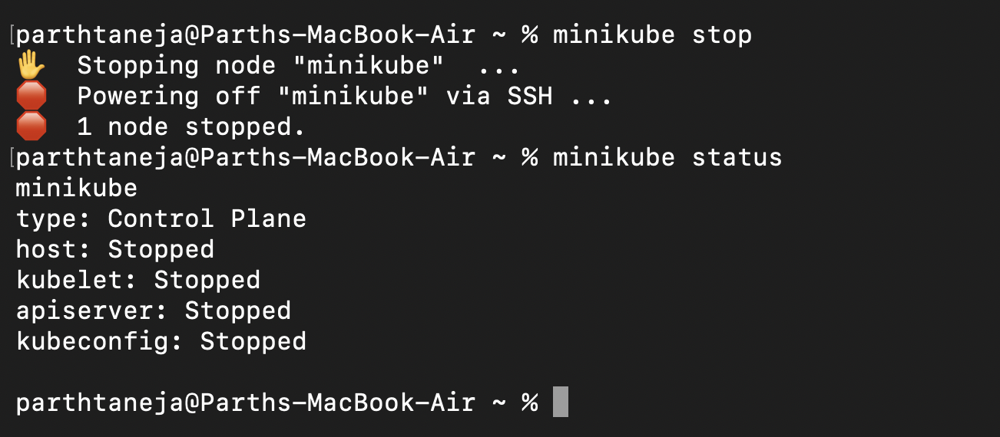

# Session 9: Kubernetes Fundamentals & Minikube Setup

## 1. Minikube & Kubernetes CLI Installation Verification

Verifying that both `minikube` and `kubectl` are properly installed and accessible on the host machine.



---

## 2. Initializing the Minikube Kubernetes Cluster

Starting a local single-node Kubernetes cluster using the Docker container driver.



---

## 3. Verifying Cluster Status & Node Readiness

Inspecting the control plane status and verifying that worker nodes are in a `Ready` state using `minikube status` and `kubectl get nodes`.



---

## 4. Graceful Cluster Termination

Stopping the local Minikube clusterVM/container cleanly to free up host machine computing resources.



---

## 5. Kubernetes Architecture & Core Component Analysis

A Kubernetes cluster relies on a decoupled architecture split into a **Control Plane** (which manages cluster state and scheduling) and **Worker Nodes** (which execute application workloads).

```
+-------------------------------------------------------------------------------+
|                               CONTROL PLANE (MASTER)                          |
|                                                                               |
|   +-------------------+       +--------------------+       +--------------+   |
|   |       etcd        |<----->|  kube-apiserver    |<----->|kube-scheduler|   |
|   | (State Store)     |       |    (Front Door)    |       +--------------+   |
|   +-------------------+       +---------+----------+                          |
|                                         |                                     |
|                                         v                                     |
|                             +------------------------+                        |
|                             | kube-controller-manager|                        |
|                             +------------------------+                        |
+-----------------------------------------+-------------------------------------+
                                          |
                        +-----------------+-----------------+
                        |                                   |
                        v                                   v
+------------------------------------+ +------------------------------------+
|            WORKER NODE 1           | |            WORKER NODE 2           |
|                                    | |                                    |
|   +------------+  +------------+   | |   +------------+  +------------+   |
|   |  kubelet   |  | kube-proxy |   | |   |  kubelet   |  | kube-proxy |   |
|   +-----+------+  +-----+------+   | |   +-----+------+  +-----+------+   |
|         |               |          | |         |               |          |
|         v               v          | |         v               v          |
|   +----------------------------+   | |   +----------------------------+   |
|   | CRI (containerd runtime)   |   | |   | CRI (containerd runtime)   |   |
|   +----------------------------+   | |   +----------------------------+   |
|         |                          | |         |                          |
|         v                          | |         v                          |
|   +------------+  +------------+   | |   +------------+  +------------+   |
|   |   Pod 1    |  |   Pod 2    |   | |   |   Pod 3    |  |   Pod 4    |   |
|   +------------+  +------------+   | |   +------------+  +------------+   |
+------------------------------------+ +------------------------------------+
```

### Control Plane (Master Node) Components

- **`kube-apiserver`:** The centralized REST API gateway for the entire cluster. All administrative commands via `kubectl`, internal controllers, and node components communicate strictly through the API server.
- **`etcd`:** A high-availability, distributed key-value database that maintains the authoritative state, metadata, specifications, and secrets of the cluster.
- **`kube-scheduler`:** The resource placement engine that continuously monitors unassigned Pods and evaluates node capacity, resource requests, taints, and affinity rules to select the best worker node.
- **`kube-controller-manager`:** Runs reconciliation loops (e.g., Node Controller, ReplicaSet Controller, EndpointSlice Controller) to ensure the **actual state** of the cluster constantly matches the **desired state**.

### Worker Node Components

- **`kubelet`:** The primary node agent that receives `PodSpec` declarations from the API server, interfaces with the container runtime to start/stop containers, and periodically reports node health.
- **`kube-proxy`:** Maintains network routing rules (`iptables` / `IPVS`) on each node to enable service abstraction and pod-to-pod load balancing across the cluster.
- **`Container Runtime (CRI)`:** The underlying container software (such as `containerd` or `CRI-O`) responsible for fetching container images and executing runtime processes.
- **`Pod`:** The fundamental, atomic deployable unit in Kubernetes. A Pod encapsulates one or more co-located containers sharing a network namespace (IP/ports) and storage volumes.

---