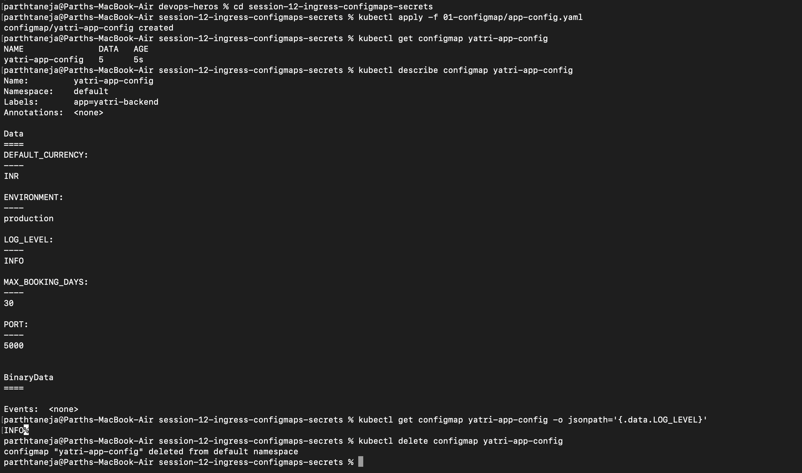
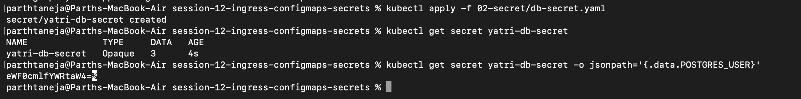
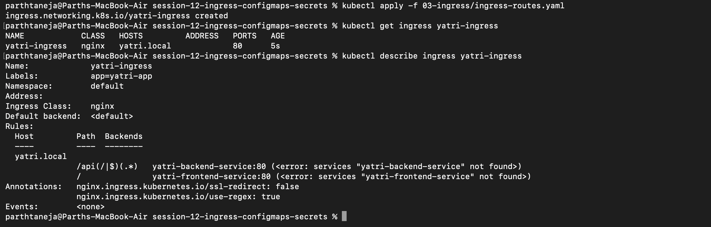

# Session 12: Ingress, ConfigMaps, and Secrets

## 1. Non-Sensitive Configuration Decoupling via ConfigMaps

A `ConfigMap` decouples environment-specific configuration parameters (log levels, database ports, environment flags) from application container images as key-value pairs. This enables the same immutable container image to be deployed across development, staging, and production environments with distinct settings.

---

## 2. Sensitive Data Isolation via Kubernetes Secrets

A `Secret` isolates sensitive credentials (passwords, TLS certificates, API tokens) from application code. Key values inside native Kubernetes Secret manifests are **Base64 encoded**—not encrypted. Anyone with RBAC read access can decode Base64 strings using `base64 --decode`.

---

## 3. Layer 7 Traffic Routing via Kubernetes Ingress

An `Ingress` resource manages external HTTP/HTTPS traffic routing to internal cluster Services based on request hostnames and URL paths. Instead of provisioning an expensive cloud LoadBalancer for every internal service, a single unified Ingress Controller (such as NGINX Ingress) multiplexes external traffic to dozens of internal `ClusterIP` services.

*(Note: The NGINX Ingress Controller addon must be enabled first via `minikube addons enable ingress` before applying Ingress routing rules.)*

---

## 4. Architectural Comparison: ConfigMap vs. Secret

| Feature Metric | ConfigMap | Secret |
|---|---|---|
| **Primary Data Type** | Non-sensitive configuration (urls, ports, flags) | Sensitive credentials (passwords, tokens, keys) |
| **Storage Format** | Unencoded plain text | Base64 encoded (not encrypted) |
| **Object Size Limit** | 1 MiB | 1 MiB |
| **Pod Consumption Method** | Environment variables or mounted files/volumes | Environment variables or mounted files/volumes |

### Enterprise Security Best Practices & DevSecOps Notes

- **Base64 is NOT Encryption:** Base64 is an encoding mechanism for binary data streams, not a security control. Complete protection requires enabling **Encryption at Rest** in `etcd`, enforcing strict Kubernetes RBAC policy permissions, or integrating external secret stores.
- **External Secret Management:** Production DevSecOps pipelines avoid committing Base64 secrets directly to Git repositories. Tools like **External Secrets Operator (ESO)** or **HashiCorp Vault Agent Injector** dynamically sync credentials from AWS Secrets Manager, Azure Key Vault, or Vault directly into ephemeral Kubernetes cluster secrets.

---
