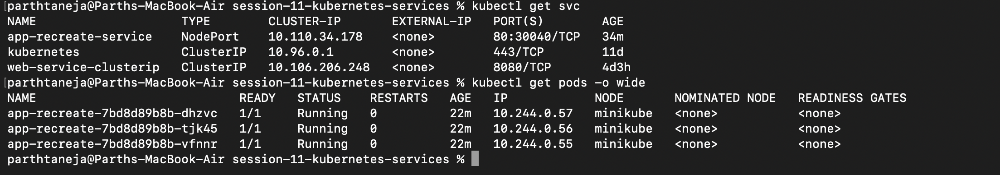
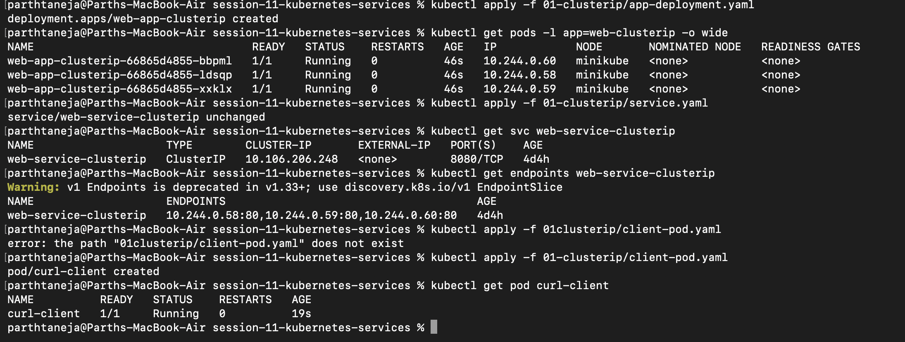
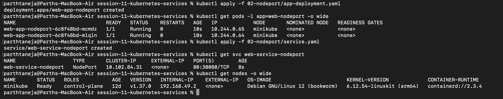
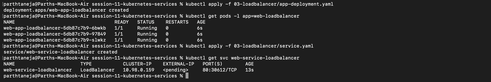
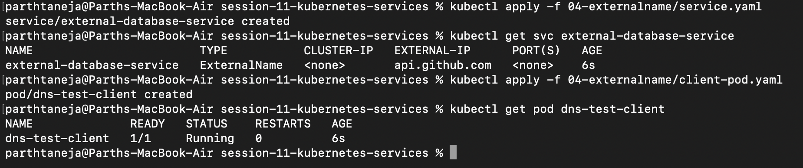
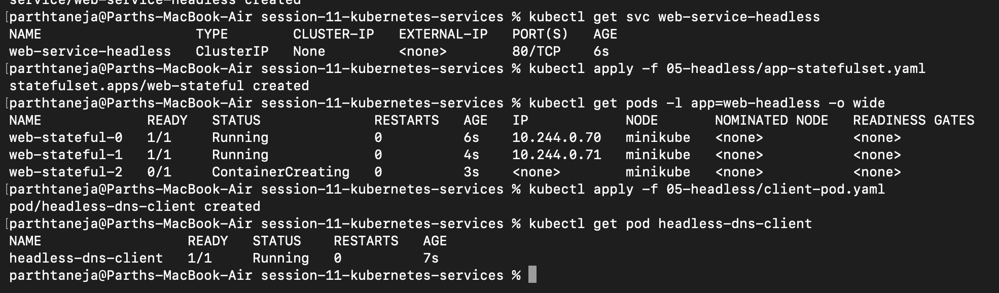

# Session 11: Kubernetes Networking & Service Types

## All Services and Pods Baseline Overview

Inspecting the active cluster status showing deployed microservice workloads, internal IP allocations, and exposed Service definitions using `kubectl get pods,svc -o wide`.

---

## 1. Type 1: ClusterIP Service (Internal Microservice Networking)

`ClusterIP` is the default Kubernetes service type. It assigns an immutable virtual IP (VIP) accessible strictly within the internal cluster network. CoreDNS automatically binds the service name to this VIP, and `kube-proxy` load-balances requests across matching Pod endpoints.

---

## 2. Type 2: NodePort Service (External Host Access)

`NodePort` builds upon `ClusterIP` by allocating a high-range static port (`30000–32767`) across every worker node's external IP interface. Incoming traffic hitting `<NodeIP>:<NodePort>` is automatically proxied down to the target service and backend Pods.

---

## 3. Type 3: LoadBalancer Service (Cloud Ingress Integration)

`LoadBalancer` integrates with cloud providers (AWS, GCP, Azure) to automatically provision a external load balancer. It automatically configures underlying `NodePort` and `ClusterIP` layers. When running locally on Minikube without cloud APIs, the `EXTERNAL-IP` stays `<pending>` until `minikube tunnel` is executed.

---

## 4. Type 4: ExternalName Service (DNS CNAME Redirection)

`ExternalName` services map internal cluster DNS names to third-party external hostnames (e.g., `api.github.com` or external database endpoints) via CoreDNS CNAME records. They do not maintain label selectors, virtual IPs, or internal Pod endpoints.

---

## 5. Type 5: Headless Service (`clusterIP: None` for Stateful Workloads)

By explicitly setting `clusterIP: None`, a Headless Service bypasses virtual IP allocation and `kube-proxy` load balancing. CoreDNS responds to queries by returning direct `A` records containing individual Pod IP addresses, enabling direct per-pod network addressing for stateful applications like StatefulSets.

---

## 6. Kubernetes Service Types Summary Matrix

| Service Type | Virtual IP (ClusterIP) | Network Accessibility Boundary | Primary Production Use Cases |
|---|---|---|---|
| **ClusterIP** | Allocated | Internal to cluster only | Inter-microservice communication, internal APIs, backend databases |
| **NodePort** | Allocated | Accessible via Node IP on high ports (`30000-32767`) | Development, staging environments, on-premise ingress |
| **LoadBalancer** | Allocated | Exposed publicly via Cloud Provider IP | Public-facing web apps and cloud production entry points |
| **ExternalName** | None | Resolves via CNAME alias to external FQDN | Referencing external third-party APIs or off-cluster databases |
| **Headless** | `None` | Direct Pod IPs returned via CoreDNS lookup | StatefulSet workloads (Kafka, Cassandra, MongoDB) |

---

## 7. Minikube Docker Driver Networking Gotcha & Resolution

When using Minikube on macOS or Windows with the Docker driver (`--driver=docker`), worker nodes run inside an isolated Docker bridge container network (`docker0`). As a result, direct connections to `<NodeIP>:<NodePort>` from the host system will time out.

### Resolution Options:
1. **`minikube service <service-name> --url`:** Spawns a host loopback tunnel that maps a local `127.0.0.1` port directly to the cluster service port.
2. **`minikube tunnel`:** Runs a background Layer 3 routing daemon that modifies host routing tables to assign accessible IP addresses to `LoadBalancer` services.

---
