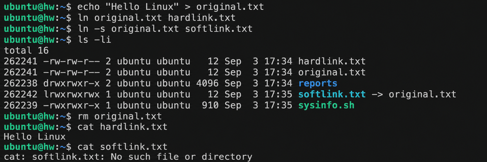
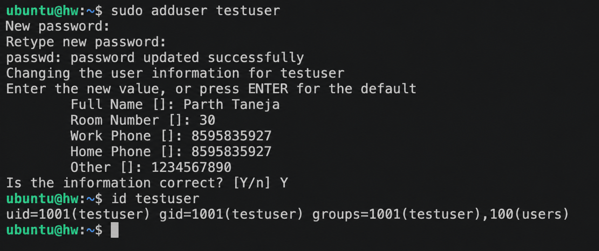
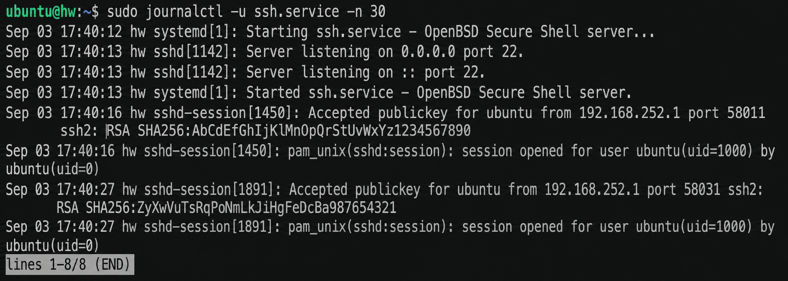
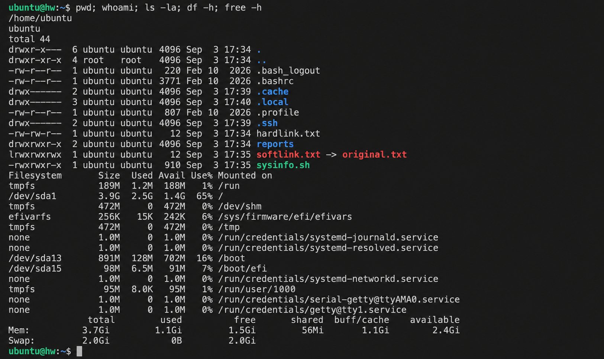

# Linux Fundamentals - Homework

My notes and practice for four Linux tasks: links, user creation, journalctl, and a command cheat sheet.

---

## Task 1: Soft Link and Hard Link

### Hard Link
- Points directly to the inode (the actual data on disk), not to a filename.
- The data is deleted only when all hard links pointing to it are removed.
- Cannot cross different filesystems or partitions.
- Cannot link to a directory.
- Shares the exact same inode number as the original file.

### Soft Link (Symbolic Link)
- Points to the pathname of another file, functioning like a shortcut.
- If the original file is deleted, the symlink breaks (becomes a dangling link).
- Can cross different filesystems and partitions.
- Can link to a directory.
- Has its own unique inode. In `ls -l` output, it displays as `link -> target`.

### Difference

| Feature | Hard Link | Soft Link |
|---|---|---|
| Points to | Inode (data) | Pathname (filename) |
| Cross filesystem | No | Yes |
| Link to directory | No | Yes |
| If original deleted | Data still accessible | Link breaks |
| Inode number | Same as original | Different |

### Commands

Create a hard link:
```bash
ln original.txt hardlink.txt
```

Create a soft link:
```bash
ln -s original.txt softlink.txt
```

Delete a link:
```bash
rm hardlink.txt
unlink softlink.txt
```

### Practice

```bash
# 1. Create a test file
echo "Hello Linux" > original.txt

# 2. Create hard and soft links
ln    original.txt hardlink.txt
ln -s original.txt softlink.txt

# 3. Compare inode numbers and link counts
ls -li

# 4. Test original file deletion
rm original.txt
cat hardlink.txt     # Still prints "Hello Linux"
cat softlink.txt     # Output: No such file or directory
```

### Screenshot



---

## Task 2: adduser vs useradd

### Difference

| Feature | `useradd` | `adduser` |
|---|---|---|
| Type | Low-level binary | High-level script (wraps `useradd`) |
| Interactive | No, requires CLI flags | Yes, prompts for details & password |
| Home directory | Created only with `-m` flag | Created automatically |
| Password | Set separately with `passwd` | Prompts during user creation |
| Default shell | Often `/bin/sh` | Sets `/bin/bash` |

### Which is Preferred on Ubuntu and Why

`adduser` is preferred on Ubuntu/Debian because it completes full user onboarding in a single interactive step: creating the home directory, copying skeleton files from `/etc/skel`, configuring `/bin/bash` as default shell, creating a user group, and setting up the account password.

`useradd` is the low-level utility that `adduser` executes underneath, making `useradd` better suited for non-interactive automation scripts and Dockerfiles.

### Create a Test User

```bash
# 1. Create test user interactively
sudo adduser testuser

# 2. Verify account creation
id testuser
grep testuser /etc/passwd
ls -la /home/testuser

# 3. Cleanup when finished
sudo deluser --remove-home testuser
```

### Screenshot



---

## Task 3: journalctl

`journalctl` is used to query and view system logs collected by systemd's journal daemon (`systemd-journald`). It provides a centralized interface to view kernel messages, boot logs, and system service logs.

### Usage

View all logs:
```bash
journalctl
```

Jump to the end / follow live stream:
```bash
journalctl -e
journalctl -f
```

Logs for a specific service:
```bash
journalctl -u ssh.service
```

Logs since current boot:
```bash
journalctl -b
```

Filter logs by time:
```bash
journalctl --since "1 hour ago"
journalctl --since today
```

Filter only error logs:
```bash
journalctl -p err
```

View last N lines:
```bash
journalctl -n 50
```

### Practice: Logs for a Specific Service

```bash
sudo journalctl -u ssh.service -e
```

### Screenshot



---

## Task 4: Linux Command Cheat Sheet

### Files and Directories

| Command | Purpose |
|---|---|
| `pwd` | Print working directory |
| `ls -la` | List all files with detailed permissions |
| `cd /path` | Change working directory |
| `mkdir dir` | Create a new directory |
| `rm file` | Remove a file (`-r` for directory) |
| `cp src dst` | Copy files or directories |
| `mv src dst` | Move or rename files |
| `touch file` | Create an empty file |
| `find /path -name "*.txt"` | Search for files by pattern |

### Viewing and Editing

| Command | Purpose |
|---|---|
| `cat file` | Output file contents |
| `less file` | Scroll through file contents |
| `head -n 20 file` | Display first 20 lines |
| `tail -n 20 file` | Display last 20 lines (`-f` to follow) |
| `nano` / `vim` | Terminal text editors |
| `grep "pattern" file` | Search for matching pattern in file |

### Permissions

| Command | Purpose |
|---|---|
| `chmod 755 file` | Modify file access permissions |
| `chown user:group file` | Change owner and group of file |
| `ls -l` | View file permissions and link count |

### Users

| Command | Purpose |
|---|---|
| `whoami` | Display current logged-in username |
| `id` | Display user and group IDs |
| `sudo adduser name` | Add a new user interactively |
| `passwd` | Set or update password |
| `su - user` | Switch to another user account |

### Processes and System

| Command | Purpose |
|---|---|
| `ps aux` | List active processes snapshot |
| `top` | Interactive live process monitor |
| `kill PID` | Terminate process by PID |
| `df -h` | Display disk space usage |
| `free -h` | Display system RAM and swap usage |
| `uname -a` | Print system architecture and kernel info |

### Networking

| Command | Purpose |
|---|---|
| `ping host` | Test ICMP network connectivity |
| `curl url` / `wget url` | Transfer data / download file |
| `ip a` | Display network interfaces and IP addresses |
| `ss -tulpn` | Display listening sockets and open ports |

### Services

| Command | Purpose |
|---|---|
| `systemctl status svc` | Check systemd service status |
| `systemctl restart svc` | Restart a systemd service |
| `journalctl -u svc` | View systemd service log history |

### Extras

| Command | Purpose |
|---|---|
| `man command` | Display manual page for command |
| `history` | Print shell command history |
| `tar -czvf a.tar.gz dir` | Create compressed gzipped archive |
| `tar -xzvf a.tar.gz` | Extract compressed archive |
| `apt install pkg` | Install software package (Debian/Ubuntu) |

### Screenshot


