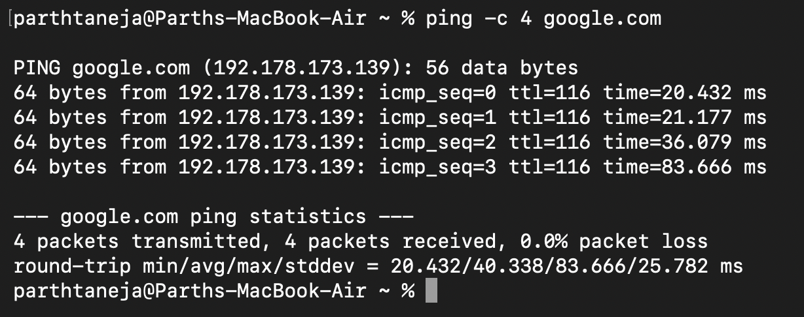
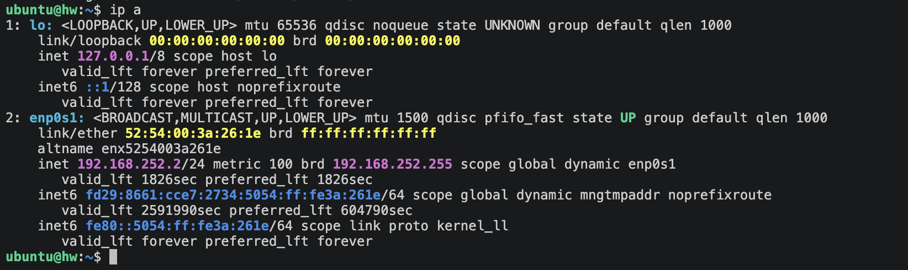
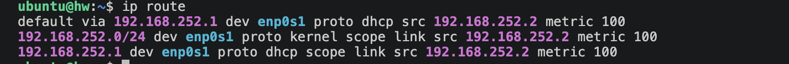
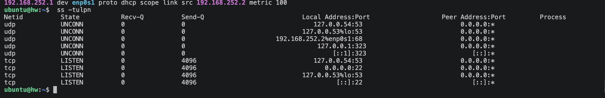
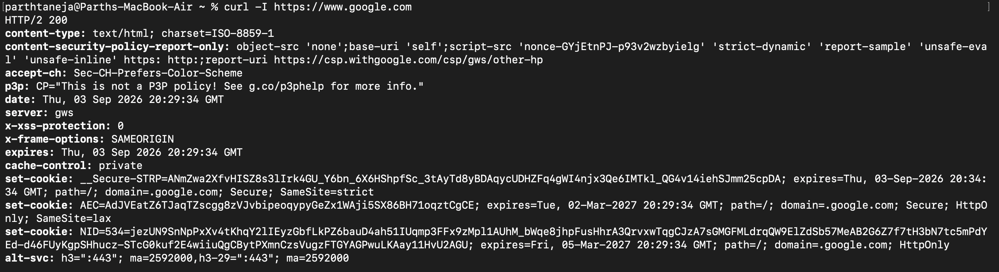
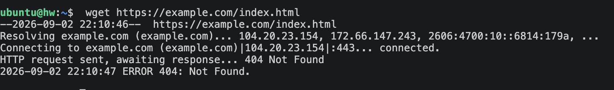
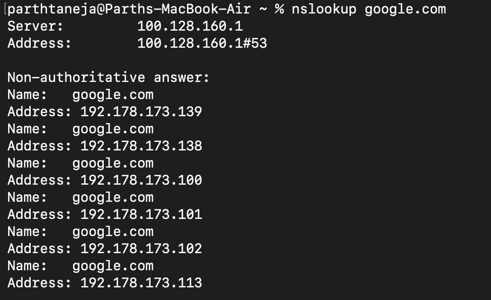
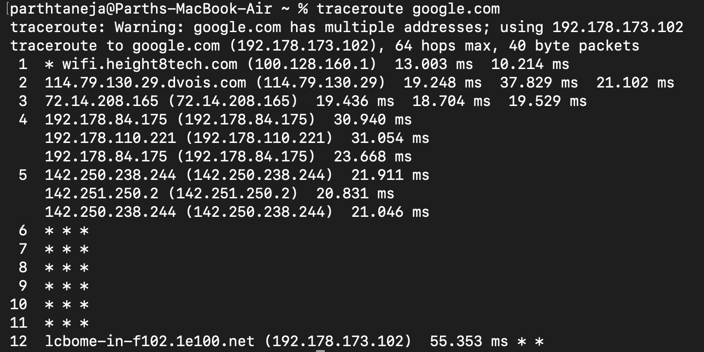

# Networking Fundamentals - Homework

Hands-on practice and notes on standard Linux networking commands, including usage syntax, descriptions, practical takeaways, and terminal outputs.

---

## 1. `ping`
```bash
ping -c 4 google.com
```
Sends ICMP Echo Request packets to a target host to test reachability, network latency, and packet loss. The `-c 4` flag limits the test to four packets.

**What I understood:** `ping` verifies whether a remote host is active and measures connection response time. Packet loss or timeout indicates network connectivity or DNS issues.



---

## 2. `ip a` (ip address)
```bash
ip a
```
Displays all network interfaces on the system along with assigned IPv4/IPv6 addresses, MAC addresses, and operational status (`UP`/`DOWN`). It is the modern replacement for `ifconfig`.

**What I understood:** `ip a` is used to find the system's local IP address and view active network interfaces (such as `eth0`, `wlan0`, or `lo` loopback).



---

## 3. `ip route`
```bash
ip route
```
Displays the system routing table and default gateway settings that direct network traffic to external networks and the internet.

**What I understood:** `ip route` reveals the network path packets follow to exit the local subnet. The `default via` entry represents the router/gateway IP.



---

## 4. `ss` (Socket Statistics)
```bash
ss -tulpn
```
Lists active network sockets, listening ports, and associated process IDs. `ss` is the modern, faster replacement for `netstat`. 
- `-t`: TCP sockets
- `-u`: UDP sockets
- `-l`: Listening sockets
- `-p`: Show process name/PID
- `-n`: Show numeric ports instead of service names

**What I understood:** `ss -tulpn` identifies open ports on the server and checks if background daemons (such as SSH on port 22 or HTTP on port 80) are actively listening.



---

## 5. `curl`
```bash
curl -I https://www.google.com
```
Transfers data to or from a server via supported protocols (HTTP, HTTPS, FTP, etc.). The `-I` flag fetches HTTP response headers without downloading the full body.

**What I understood:** `curl` tests web server responsiveness directly from the CLI. The HTTP headers provide response status codes (e.g., `200 OK`, `301 Moved Permanently`) and server metadata.



---

## 6. `wget`
```bash
wget https://example.com/index.html
```
Non-interactive network downloader that retrieves files over HTTP, HTTPS, or FTP and automatically saves them to the current directory.

**What I understood:** Unlike `curl` (which outputs content to terminal by default), `wget` is designed specifically for downloading files directly to disk.



---

## 7. `nslookup` / `dig`
```bash
nslookup google.com
```
Queries DNS (Domain Name System) servers to resolve human-readable domain names into IP addresses and vice versa.

**What I understood:** `nslookup` verifies DNS hostname resolution. If `nslookup` fails to return an IP address, domain resolution is broken.



---

## 8. `traceroute`
```bash
traceroute google.com
```
Traces the route packets take to reach a destination host, displaying each router hop along with round-trip response times.

**What I understood:** `traceroute` maps the full path between my machine and a target server, helping identify where network bottlenecks or connection drops occur.



---

## 9. `hostname`
```bash
hostname
hostname -I
```
Displays the system's configured network hostname. The `-I` flag outputs all host IP addresses assigned to network interfaces.

**What I understood:** Provides a quick check of the machine's network name and local IP addresses.


