# Session 13: Storage, HPA, and Probes

## 1. Kubernetes Volumes

Container storage is ephemeral by default—any data written directly inside a container is permanently lost when that container terminates or restarts. Kubernetes **Volumes** solve this by providing a dedicated storage volume attached to the Pod lifecycle.

| Storage Type | Location | Survives Pod Deletion? | Typical Use Cases |
| :--- | :--- | :--- | :--- |
| **`emptyDir`** | Temporary directory created on the host node | ❌ **No** | Scratch space, cache, temporary processing files |
| **`hostPath`** | Specific directory mounted from the host node's filesystem | ✅ **Yes** (on the same host node) | Host-level monitoring tools, single-node local testing |

### Executing an `emptyDir` Pod

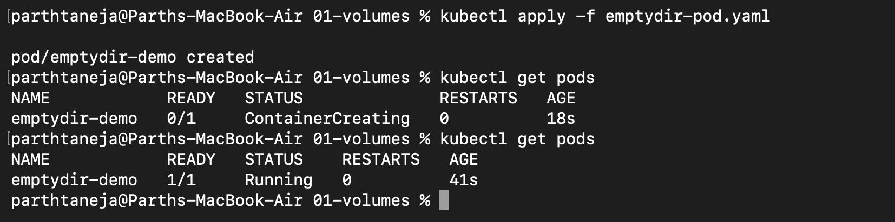

### Creating Data Inside the Volume

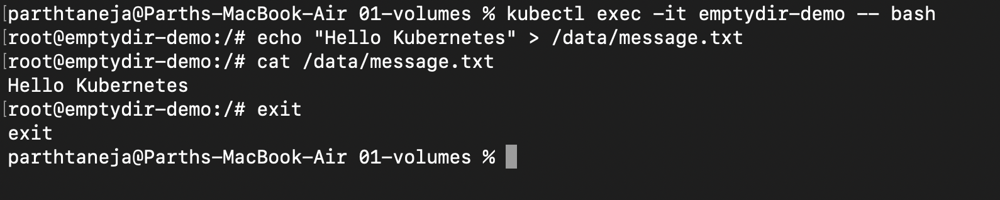

### Verifying Ephemeral Nature on Pod Deletion

When the Pod is deleted, the attached `emptyDir` volume is deleted along with it.

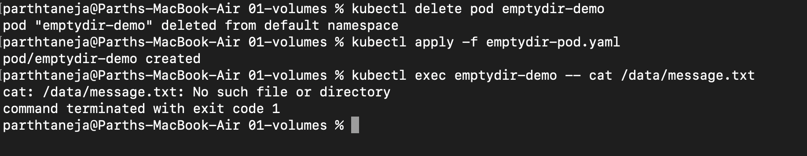

---

## 2. PersistentVolumes (PV) and PersistentVolumeClaims (PVC)

For production applications, storage must persist independently of the Pod lifecycle:

- **PersistentVolume (PV):** A piece of storage in the cluster provisioned by an administrator or dynamically provisioned by a StorageClass.
- **PersistentVolumeClaim (PVC):** A request for storage by a user/Pod. Pods consume PVC resources, not PVs directly.
- **Binding:** When a matching PV satisfies a PVC's requirements, the status updates to `Bound`.
- **Persistence:** Storage outlives the Pod. Deleting a Pod does not erase the underlying PV data.

```text
Pod  ──►  PersistentVolumeClaim (PVC)  ──►  PersistentVolume (PV)  ──►  Physical Storage
```

### Provisioning PV, PVC, and Pod

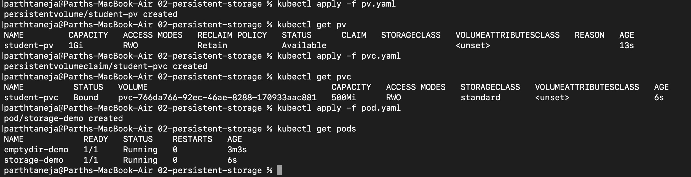

### Testing Persistent Storage

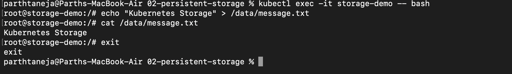

### Verifying Persistence Across Pod Lifecycle

Deleting the Pod leaves the underlying PV intact. A new Pod attached to the same PVC retains full access to the stored data.

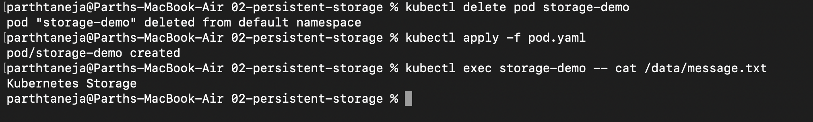

---

## 3. StorageClass & Dynamic Provisioning

- A **StorageClass** provides a way for administrators to describe the "classes" of storage they offer.
- It enables **Dynamic Provisioning**: when a PVC specifies a StorageClass, a matching PV is created automatically on demand.
- Minikube provides a default StorageClass named `standard`.
- PVCs created without an explicit `storageClassName` default to the cluster's default StorageClass.

```text
PVC Created  ──►  StorageClass Intercepts  ──►  PV Provisioned Dynamically  ──►  PVC Bound
```

### Inspecting StorageClasses in Cluster

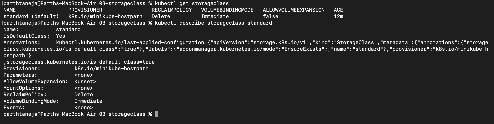

### Dynamic PVC Binding

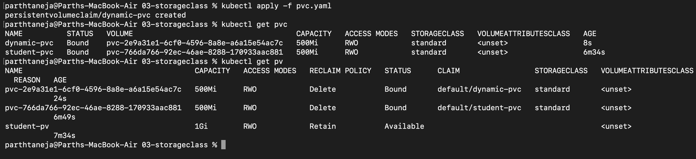

---

## 4. Horizontal Pod Autoscaler (HPA)

The **Horizontal Pod Autoscaler (HPA)** automatically updates a workload resource (like a Deployment) to scale out or scale in matching demand based on targeted metrics (e.g., CPU utilization).

- **Prerequisites:** Requires the **Metrics Server** running in the cluster and explicit `resources.requests.cpu` defined on container specs.
- **Scaling Behavior:** Scale-out occurs rapidly upon load spikes, whereas scale-in includes a stabilization window (~5 minutes) to prevent flapping.

### Deploying Workload & Service

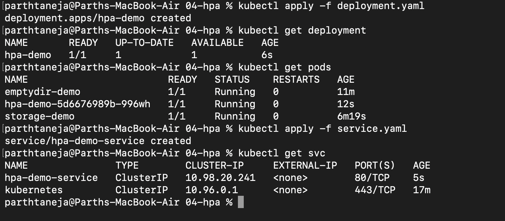

### Verifying Metrics Server Availability

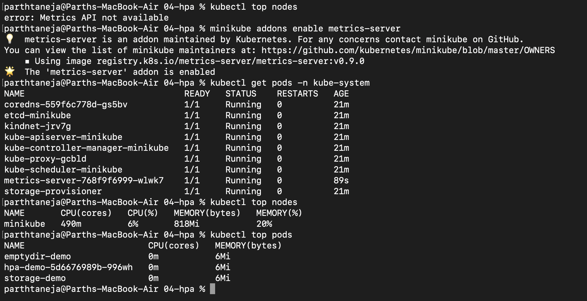

### Configuring the HPA Resource

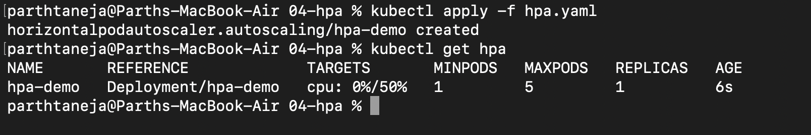

### Simulating CPU Load

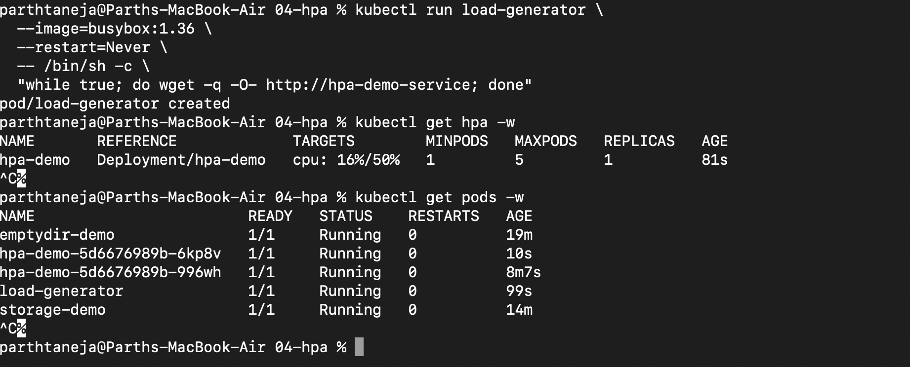

### Observing Scale-In After Load Relates

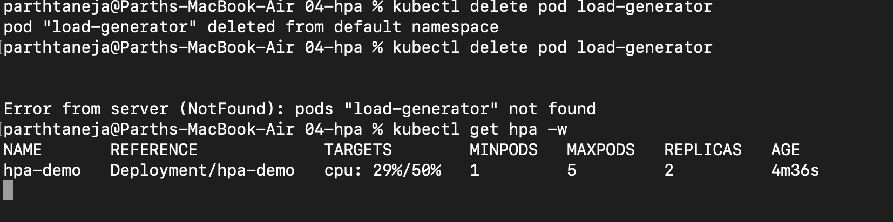

---

## 5. Container Health Probes

A Pod reported as `Running` by Kubernetes only guarantees the container process started, not that the application inside is functional. **Probes** perform active diagnostic checks on the containerized app.

| Probe Type | Primary Responsibility | Action On Failure |
| :--- | :--- | :--- |
| **Startup Probe** | Verifies if the container application has fully booted up. | Kubelet kills container and enforces restart policy. |
| **Readiness Probe** | Verifies if the container is ready to accept user network traffic. | Pod IP removed from matching Service Endpoints (no restart). |
| **Liveness Probe** | Verifies if the container application is still healthy and running. | Kubelet kills container and triggers restart. |

### Liveness Probe Configuration

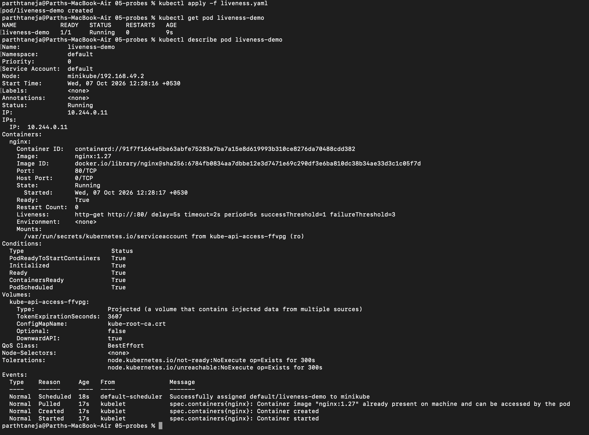

### Readiness Probe Configuration

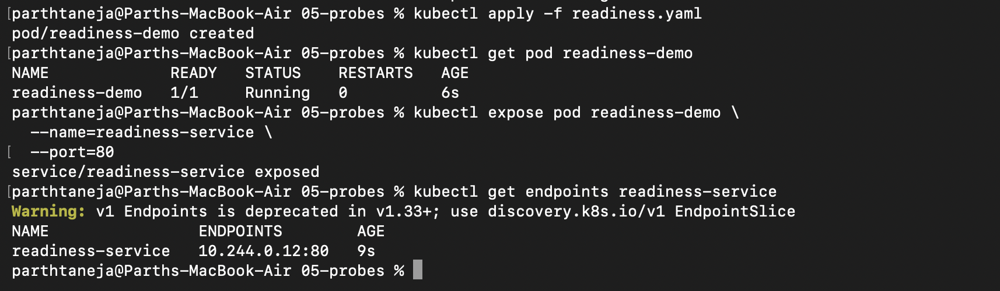

### Startup Probe Configuration

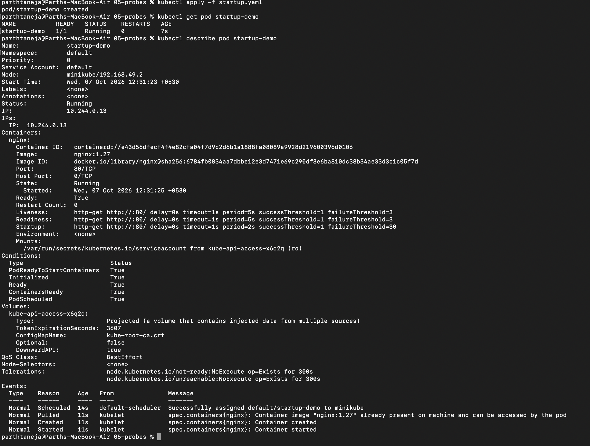

### Simulating Readiness Failure

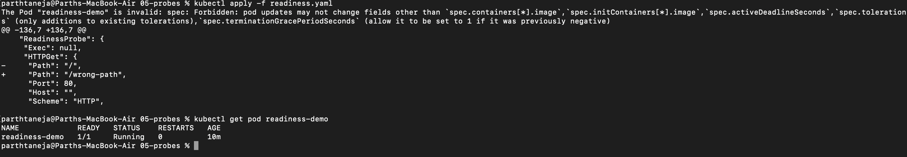

### Simulating Liveness Failure

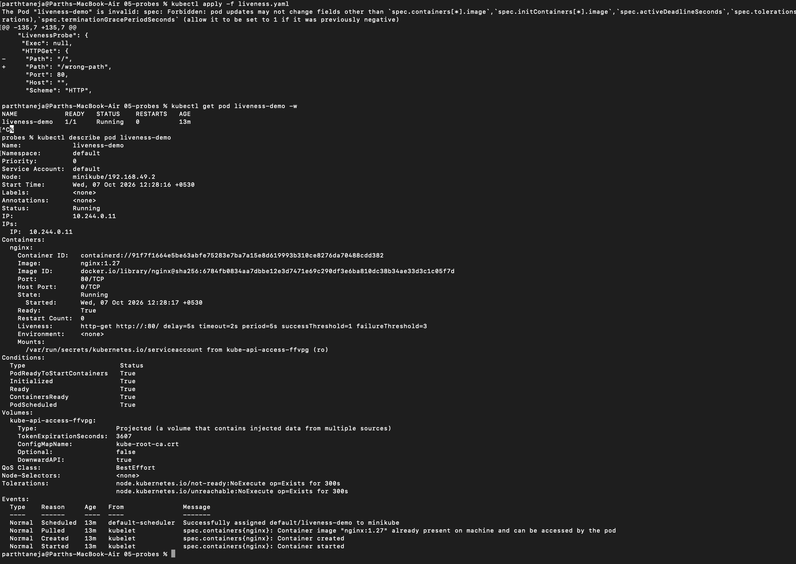

---

## 6. Mini Project: End-to-End Production Setup

Deploying a resilient web application in the `production-webapp` namespace combining persistent storage, automatic scaling, and health monitoring.

| Module | Implementation Specifications |
| :--- | :--- |
| **Storage** | PVC `web-data`, requesting `500Mi`, mounted at path `/data` |
| **Scaling** | HPA scaling between 2 to 5 replicas target at 50% CPU threshold |
| **Health Check** | Integrated Startup, Readiness, and Liveness probes |

### Applying Deployment Spec

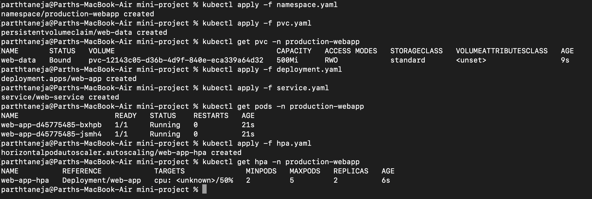

### Confirming Storage Persistence

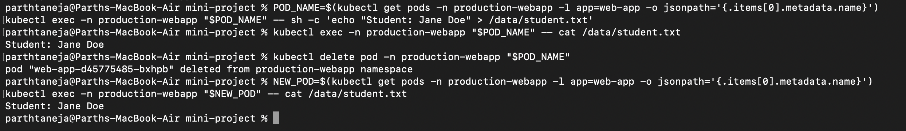

### Validating Service Endpoints

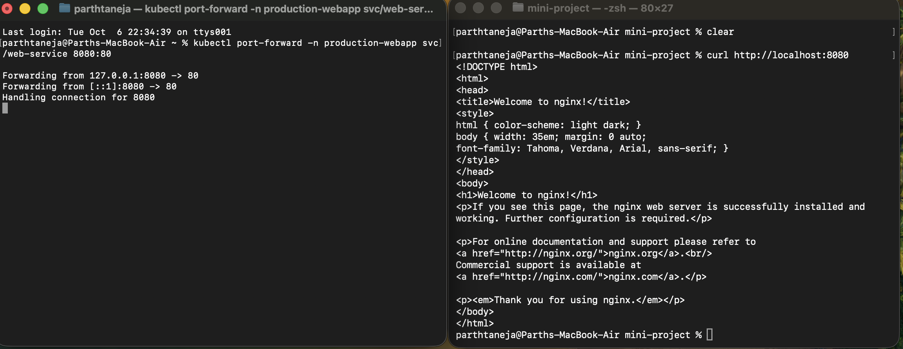

### Testing HPA Auto-Scaling Under Load

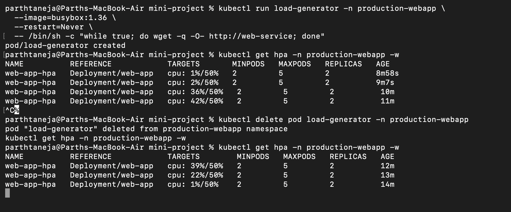

---

## Summary & Key Takeaways

- **`emptyDir` vs PVC:** `emptyDir` lifecycle is tied to the Pod, whereas **PVCs** ensure data outlives Pod restarts and deletions.
- **Dynamic Storage:** **StorageClass** automates PV creation, eliminating manual volume administration.
- **Automated Scaling:** **HPA** dynamically adjusts replica counts based on real-time CPU/memory metrics.
- **Traffic vs Restarts:** **Readiness probes** manage traffic routing at the Service level, while **Liveness/Startup probes** govern container lifecycle restarts.