# Session 15: Helm — The Kubernetes Package Manager

**Helm** is the standard package manager for Kubernetes. It allows developers and DevOps engineers to package, version, configure, and deploy applications across multiple environments (Dev, Staging, Production) using reusable template charts and values files.

| Concept | Description |
| :--- | :--- |
| **Chart** | A packaged bundle of Kubernetes resource templates (the deployment blueprint). |
| **Release** | An instance of a chart deployed into a Kubernetes cluster with a specific configuration. |
| **Values** | Configuration parameters passed into templates to customize deployment settings. |

> ℹ️ **Helm Architecture:** Helm 3+ operates as a client-only CLI tool without Tiller (in-cluster server). Release state is stored securely inside Kubernetes Secrets within the target namespace.

---

## 1. Introduction to Helm

### Verifying Helm Version & Listing Active Releases

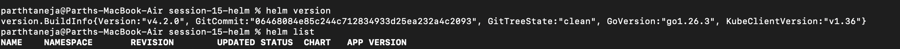

### Installing a Public Helm Chart

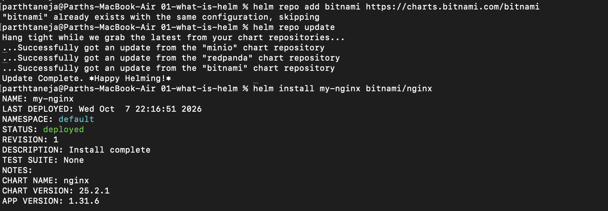

### Inspecting & Uninstalling a Release

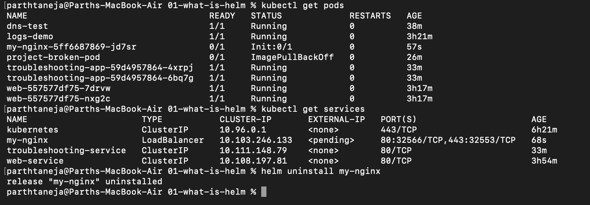

---

## 2. Working with Helm Charts

- **`helm create <chart_name>`:** Generates a standardized directory structure and chart scaffolding.
- **`helm template <chart_name>`:** Renders chart templates into raw Kubernetes YAML manifests locally without applying them to the cluster (ideal for syntax checking and CI validation).
- **`helm uninstall <release_name>`:** Removes all cluster resources created by the specified release.

### Scaffold a New Chart Directory

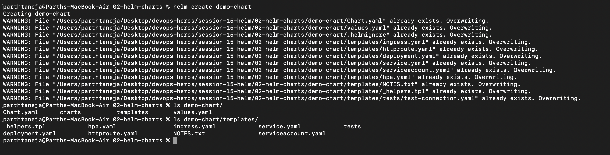

### Rendering Template Output Locally

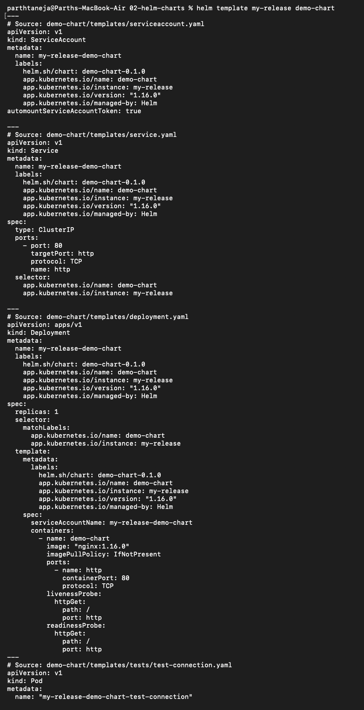

### Managing Release Lifecycle (Install, List, Uninstall)

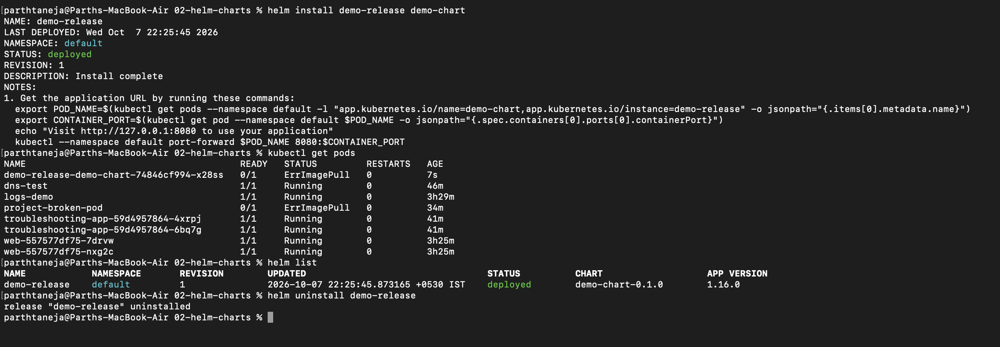

---

## 3. Helm Chart File Structure

```text
simple-chart/
├── Chart.yaml      # Metadata defining chart name, version, and dependencies
├── values.yaml     # Default configuration variables
└── templates/      # Kubernetes YAML manifests with Go template syntax
```

Go template parameters inject release context (e.g., `{{ .Release.Name }}`) and values defined in `values.yaml` (e.g., `{{ .Values.replicaCount }}`).

### Rendering Custom Templates

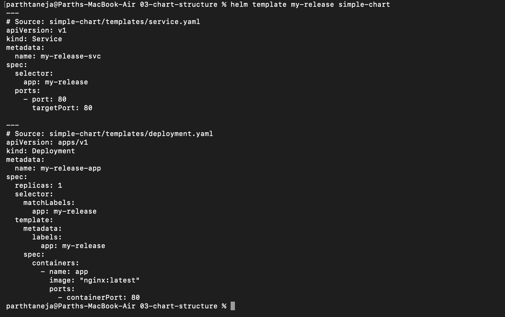

### Installing the Custom Chart

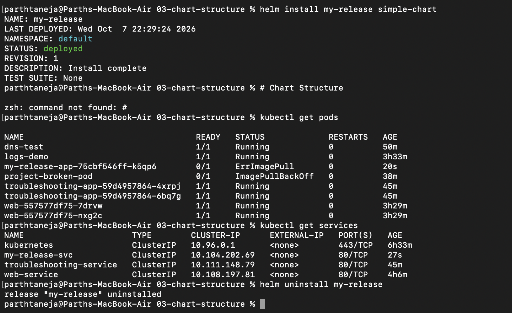

---

## 4. Deep Dive: `Chart.yaml` Metadata

| Field | Purpose |
| :--- | :--- |
| `apiVersion: v2` | Mandatory schema version for Helm 3 charts. |
| `version` | The semantic version of the Helm **chart itself** (incremented when templates/defaults change). |
| `appVersion` | The version of the **application being deployed** (typically matches container image tag). |
| `type` | Chart classification: `application` (deployable workload) or `library` (shared helper templates). |

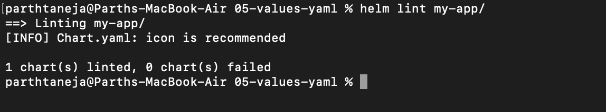

---

## 5. Managing Configuration via `values.yaml`

Default values set in `values.yaml` can be overridden during installation or upgrade using multiple layers.

### Configuration Precedence Order (Lowest ──► Highest)

```text
values.yaml  ──►  -f custom-values.yaml  ──►  --set key=value  (highest priority)
```

- **`-f / --values`:** Uses environment-specific files (e.g., `values-prod.yaml`), tracked in Git repositories.
- **`--set`:** Overrides individual parameters on the command line for quick testing.

### Overriding Parameters at Deployment Time

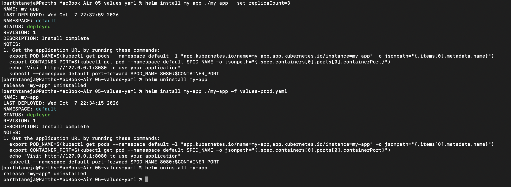

### Inspecting Computed Release Values

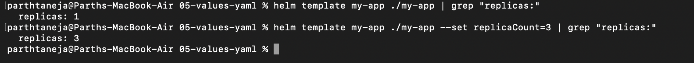

---

## 6. Template Logic & Control Structures

Helm templates utilize Go template logic. Conditional blocks like `{{- if .Values.service.enabled }}` ... `{{- end }}` dynamically include or exclude manifest blocks based on configuration flags.

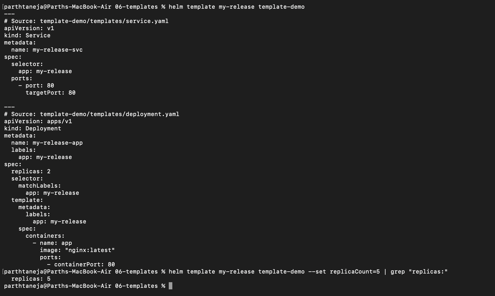

---

## 7. Deploying & Upgrading Releases

Every `install`, `upgrade`, or `rollback` command creates an incremental **Revision** in the release history, providing full auditability and safe rollbacks.

| Command | Execution Behavior |
| :--- | :--- |
| **`helm install`** | Creates a new release; fails if a release with the same name already exists. |
| **`helm upgrade`** | Updates an existing release; fails if the release does not exist. |
| **`helm upgrade --install`** | Installs the chart if it doesn't exist, or upgrades it if it does (**Recommended for CI/CD Pipelines**). |

### Executing Initial Installation

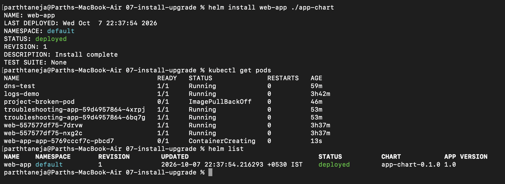

### Upgrading Workload Replicas

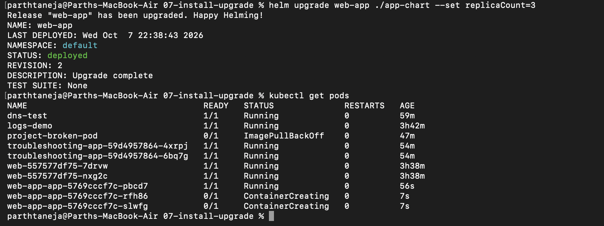

### Idempotent Deployments with `--install`

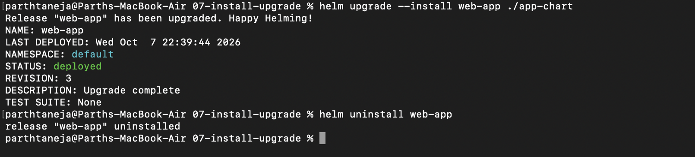

---

## 8. Release History & Rollback Mechanisms

- **`helm history <release>`:** Displays all historical revisions for a release.
- **`helm rollback <release> <revision>`:** Reverts the release state to a specific revision and creates a new revision entry.
- **`--atomic`:** Automatically triggers a rollback if an upgrade fails to reach a healthy state within the timeout.

### Simulating a Failed Upgrade

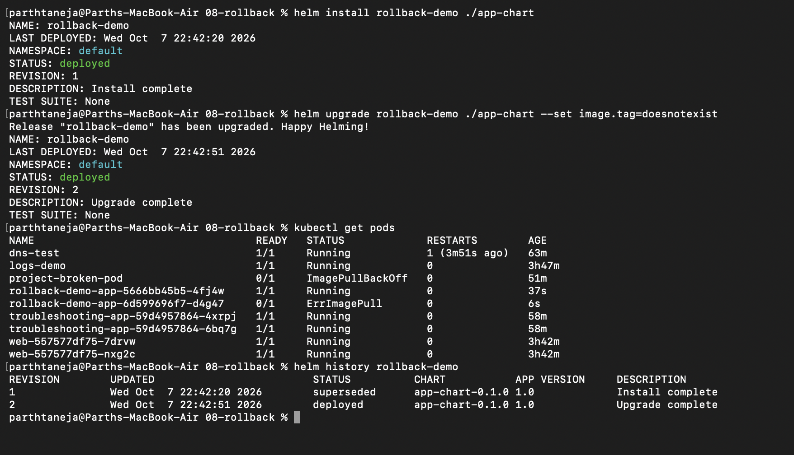

### Rolling Back to a Healthy Revision

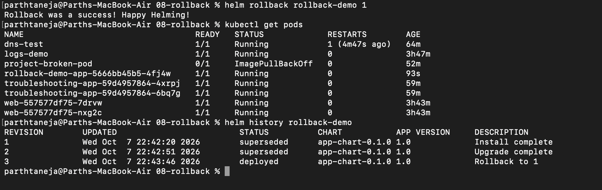

### Enabling Automatic Failure Rollbacks (`--atomic`)

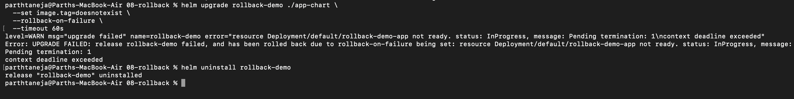

---

## 9. End-to-End Application Deployment Lifecycle

Complete deployment cycle for a guestbook web app featuring a Deployment, NodePort Service, and ConfigMap:

```text
helm lint  ──►  helm template  ──►  helm install  ──►  helm upgrade  ──►  helm history  ──►  helm rollback  ──►  helm uninstall
```

### Linting and Template Validation

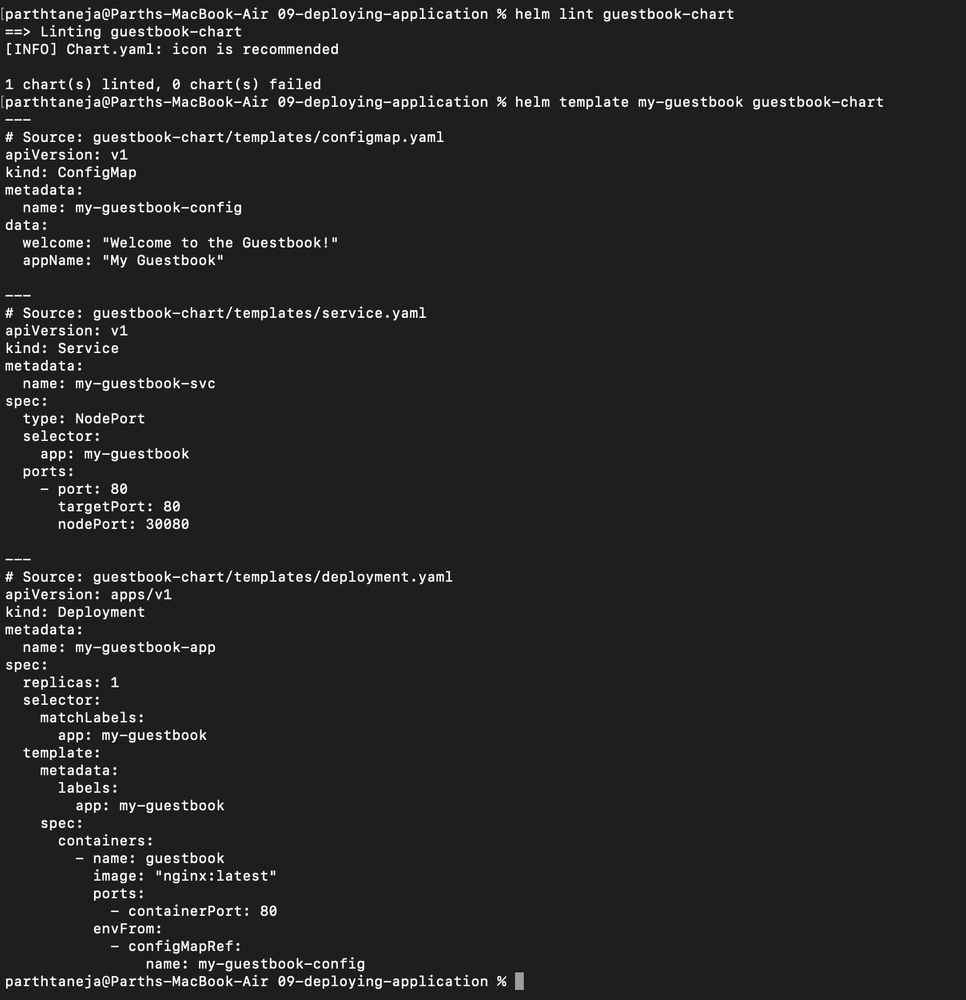

### Installing and Verifying Release

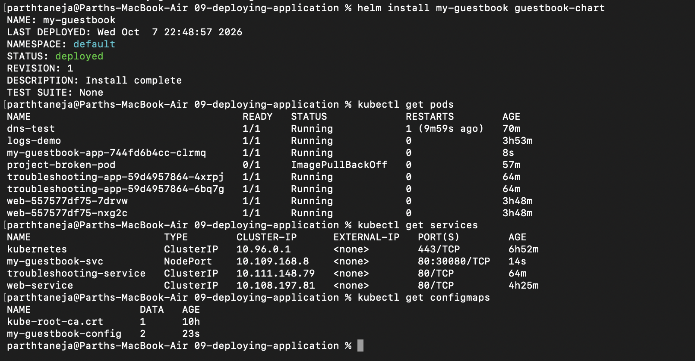

### Upgrading and Inspecting History

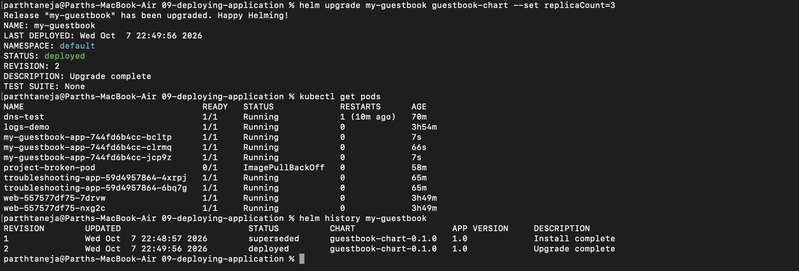

### Rolling Back & Cleaning Up Resources

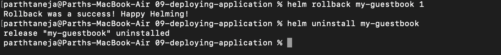

---

## 10. Mini Project: Notes Web Application Chart

Packaging and deploying a `notes-chart` application with multi-environment values (`values.yaml` for Development vs. `values-prod.yaml` for Production).

### Chart Validation & Rendering

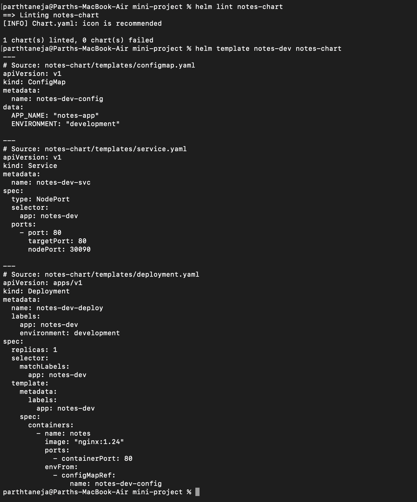

### Deploying Development Environment (`values.yaml`)

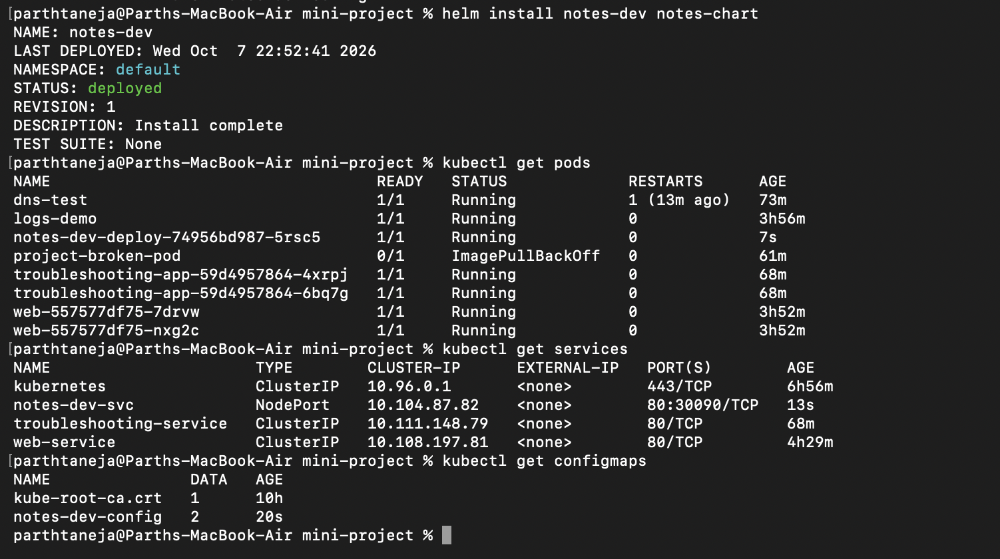

### Upgrading to Production Environment (`values-prod.yaml`)

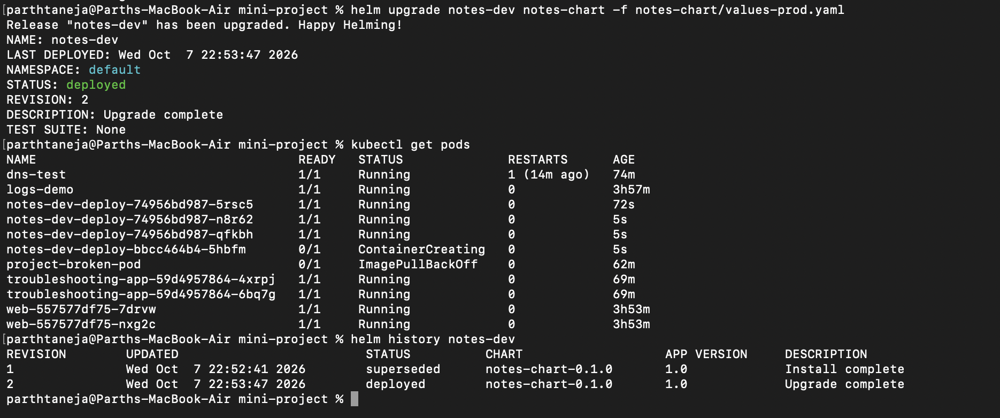

### Simulating Faulty Deployment

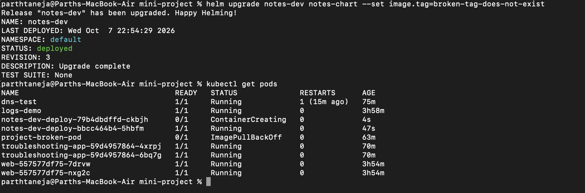

### Executing Revision Rollback

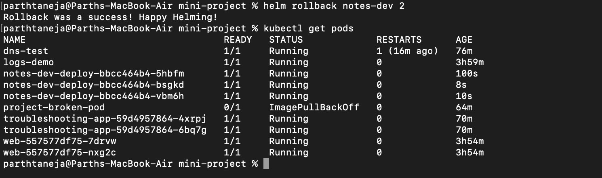

### Uninstalling and Cleaning Up Project

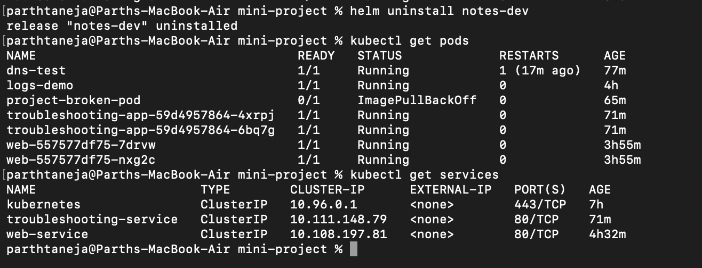

---

## Key Takeaways

- **Reusability:** **Charts** define standard resource templates, while **Values** adapt configurations per environment.
- **Pre-flight Validation:** Always validate charts with `helm lint` and `helm template` before deploying to clusters.
- **Versioned Operations:** Every lifecycle operation is tracked as a numbered **Revision**.
- **Automated Recovery:** Failed deployments can be instantly recovered using single-command `helm rollback` or automated `--atomic` flags.