# Session 16: CI/CD and GitHub Actions

Hands-on assignment covering CI/CD concepts and GitHub Actions. All workflows live in this repo's root `.github/workflows/` and run against the project code in [`session-16-github-actions/session-16-github-actions/`](../../session-16-github-actions/session-16-github-actions).

---

## 1. CI vs CD

| | CI (Continuous Integration) | CD (Continuous Delivery) | CD (Continuous Deployment) |
|:---|:---|:---|:---|
| What it does | Automatically builds and tests every code push | Keeps every passing build ready to release | Automatically releases every passing build to production |
| Trigger | `git push` / pull request | After CI passes | After CI passes |
| Human approval | Not needed | Needed before release | Not needed |
| Goal | Catch bugs early | Always have a deployable build | Zero-touch release |

---

## 2. CI/CD Pipeline

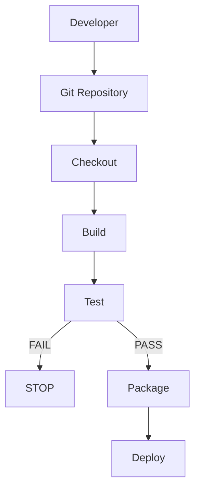

---

## 3. Running the Project Locally

The project is a small Python calculator with tests and a build script (`10-final-cicd-pipeline/`).

```bash
cd session-16-github-actions/session-16-github-actions/10-final-cicd-pipeline
```

**Run the application** (interactive, type `q` to quit)

```bash
python3 app/calculator.py
```

```text
Calculator Application
----------------------
Available operations: +, -, *, /
Type 'q' or 'quit' to exit.

Enter calculation (e.g., 10 + 5): Result: 15.0
Enter calculation (e.g., 10 + 5): Result: 5.0
Enter calculation (e.g., 10 + 5): Result: 50.0
Enter calculation (e.g., 10 + 5): Result: 2.0
Enter calculation (e.g., 10 + 5): Goodbye!
```

**Install dependencies** (inside a virtual environment, since macOS Python blocks system-wide `pip install`)

```bash
python3 -m venv .venv
source .venv/bin/activate
python3 -m pip install -r requirements.txt
```

**Run tests**

```bash
pytest -v
```

```text
tests/test_calculator.py::test_add PASSED                                [ 20%]
tests/test_calculator.py::test_subtract PASSED                           [ 40%]
tests/test_calculator.py::test_multiply PASSED                           [ 60%]
tests/test_calculator.py::test_divide PASSED                             [ 80%]
tests/test_calculator.py::test_divide_by_zero PASSED                     [100%]

============================== 5 passed in 0.01s ===============================
```

**Build**

```bash
chmod +x build.sh
./build.sh
```

```text
=================================
Starting Application Build
=================================

Build files:
-rw-r--r--  build-info.txt
-rw-r--r--  calculator.py

Build completed successfully.
```

---

## 4. Pushing to GitHub

Workflows only run once the code and `.github/workflows/` are on GitHub.

```bash
git add .
git commit -m "session 16: add github actions workflows"
git push origin main
```

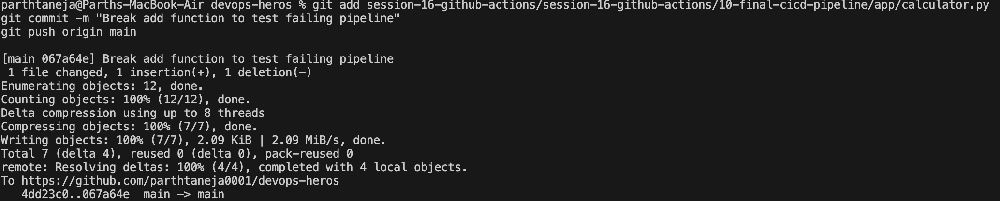

> **Note:** GitHub only runs workflows from the repo-root `.github/workflows/`. Since this is a multi-session repo, each workflow uses `defaults.run.working-directory` to run inside the session-16 project folder, and `paths:` filters so it triggers only when that project changes.

---

## 5. GitHub Actions

GitHub Actions is an automation platform built into GitHub. It builds, tests, packages, and deploys code automatically.

```text
Workflow
└── Job
    └── Step
        └── Action / Command
```

**First workflow:** [`s16-03-hello-actions.yml`](../../.github/workflows/s16-03-hello-actions.yml)

```yaml
name: S16-03 Hello GitHub Actions
on:
  workflow_dispatch:
jobs:
  hello:
    runs-on: ubuntu-latest
    steps:
      - name: Print message
        run: echo "Hello from GitHub Actions!"
```

Triggered manually from **Actions → S16-03 Hello GitHub Actions → Run workflow**.

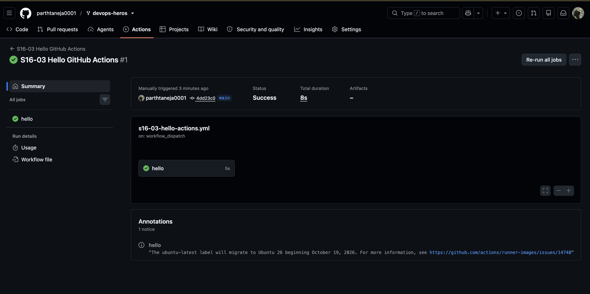

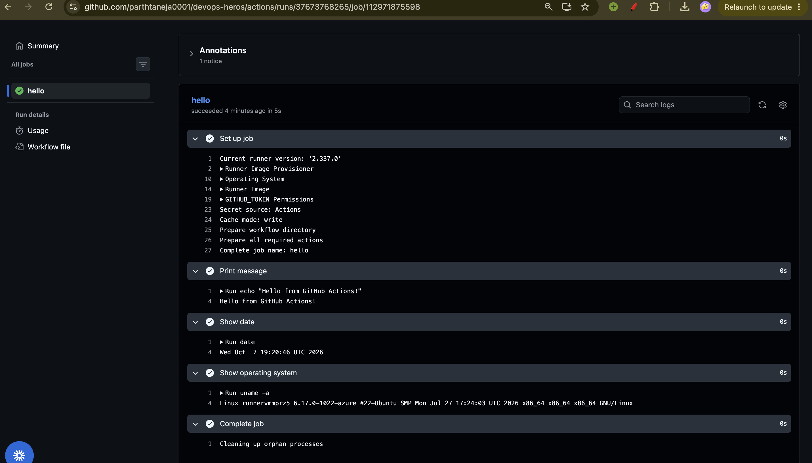

---

## 6. Workflows

A workflow is a YAML file in `.github/workflows/` that defines an automated process. It has a **name**, a **trigger** (`on:`), and one or more **jobs**.

| Trigger | When it runs |
|:---|:---|
| `push` | On every push |
| `pull_request` | When a PR is opened or updated |
| `schedule` | On a cron schedule |
| `workflow_dispatch` | Manually from the GitHub UI |

**Workflow:** [`s16-04-workflow-demo.yml`](../../.github/workflows/s16-04-workflow-demo.yml)

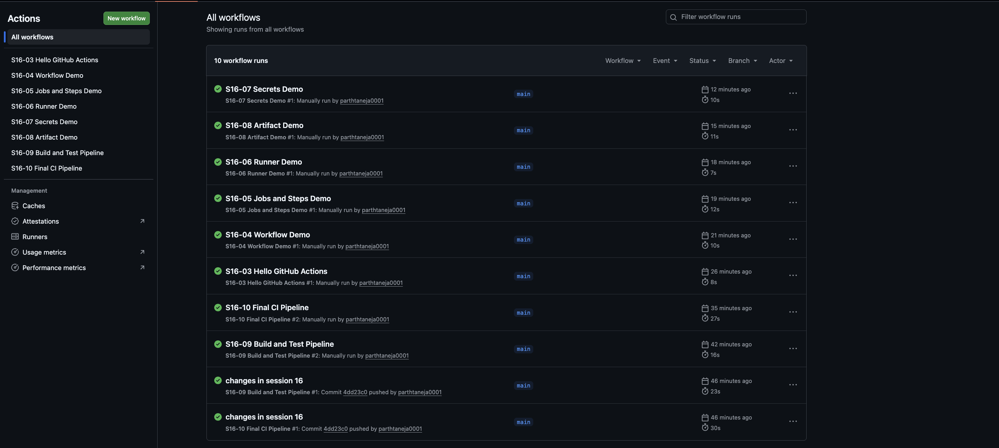

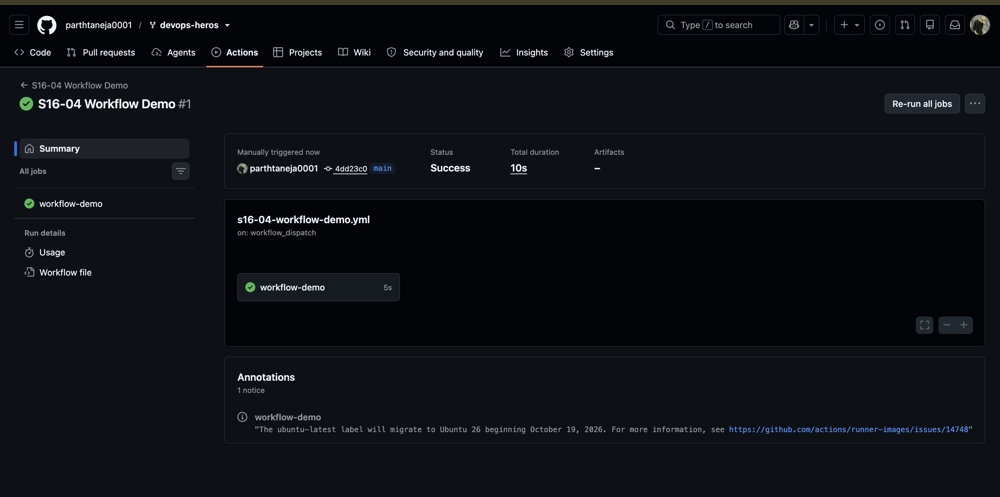

---

## 7. Jobs and Steps

**Workflow:** [`s16-05-jobs-steps.yml`](../../.github/workflows/s16-05-jobs-steps.yml) has two jobs, `build` and `test`.

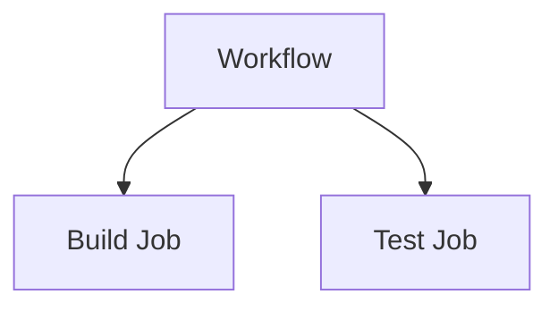

| Job | Step |
|:---|:---|
| Larger unit | Smaller unit |
| Contains steps | Executes one task |
| Has its own runner | Runs inside a job |
| Can depend on another job (`needs`) | Executes in order |

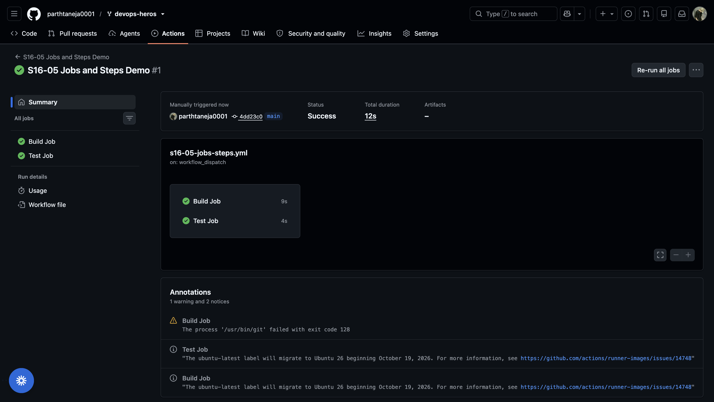

---

## 8. Runners

A runner is the machine that executes a job. GitHub provides a fresh virtual machine for every job.

```yaml
runs-on: ubuntu-latest
```

**Workflow:** [`s16-06-runner-demo.yml`](../../.github/workflows/s16-06-runner-demo.yml) prints `hostname`, `uname -a`, `pwd`, `ls -la`, and the Python version of the runner.

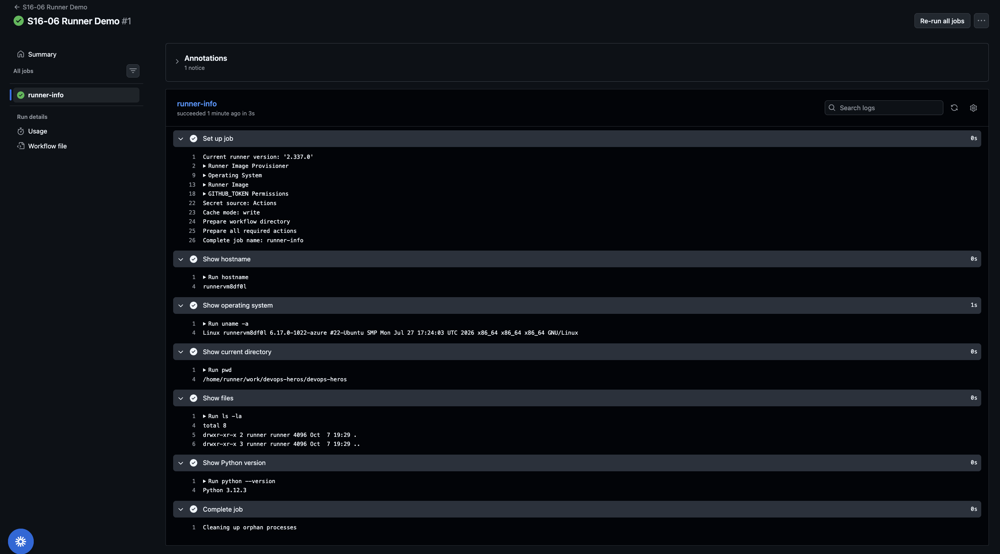

---

## 9. Secrets

Secrets store sensitive values such as passwords and tokens, encrypted and masked in logs. They are never hardcoded in workflow files.

**Create the secret:** Repository → **Settings** → **Secrets and variables** → **Actions** → **New repository secret**

- Name: `DEMO_SECRET`
- Value: a fake demo value

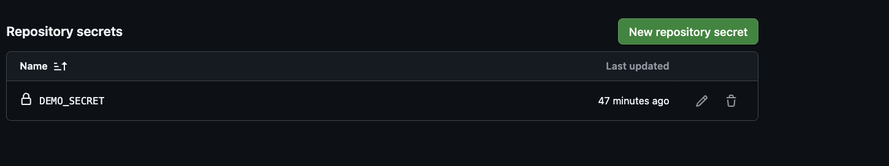

**Workflow:** [`s16-07-secrets-demo.yml`](../../.github/workflows/s16-07-secrets-demo.yml)

```yaml
env:
  DEMO_SECRET: ${{ secrets.DEMO_SECRET }}
```

The step only checks that the secret exists and never prints it.

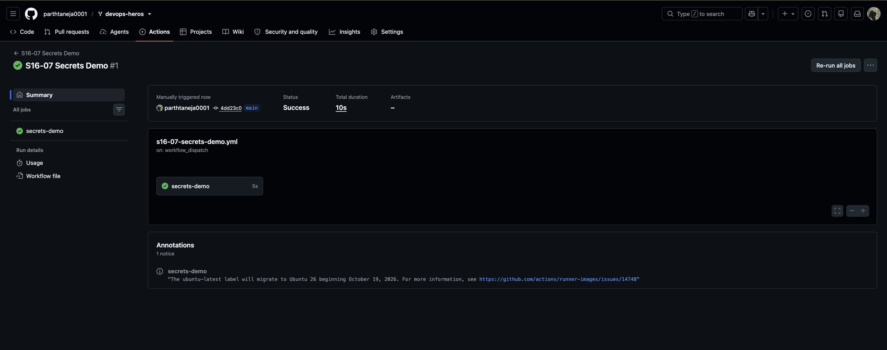

---

## 10. Artifacts

An artifact is a file or folder produced by a workflow that is stored after the job finishes, such as the `build/` output.

**Workflow:** [`s16-08-artifact-demo.yml`](../../.github/workflows/s16-08-artifact-demo.yml)

```yaml
- name: Upload artifact
  uses: actions/upload-artifact@v4
  with:
    name: session16-build
    path: session-16-github-actions/session-16-github-actions/08-artifacts/build/
```

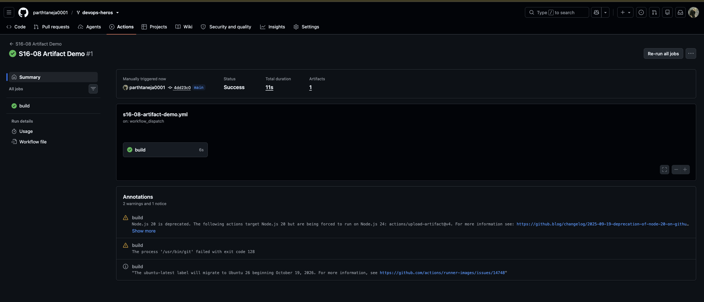

**Download the artifact** from the run summary page:

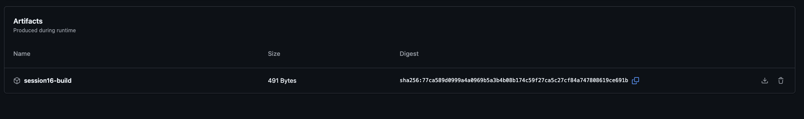

---

## 11. Build and Test Pipeline

A single job that checks out the code, sets up Python, installs dependencies, runs tests, builds, and uploads the artifact.

**Workflow:** [`s16-09-build-and-test.yml`](../../.github/workflows/s16-09-build-and-test.yml)

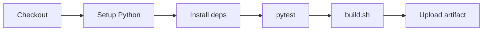

Triggers: push to `main` touching `09-build-and-test/**`, or manual run.

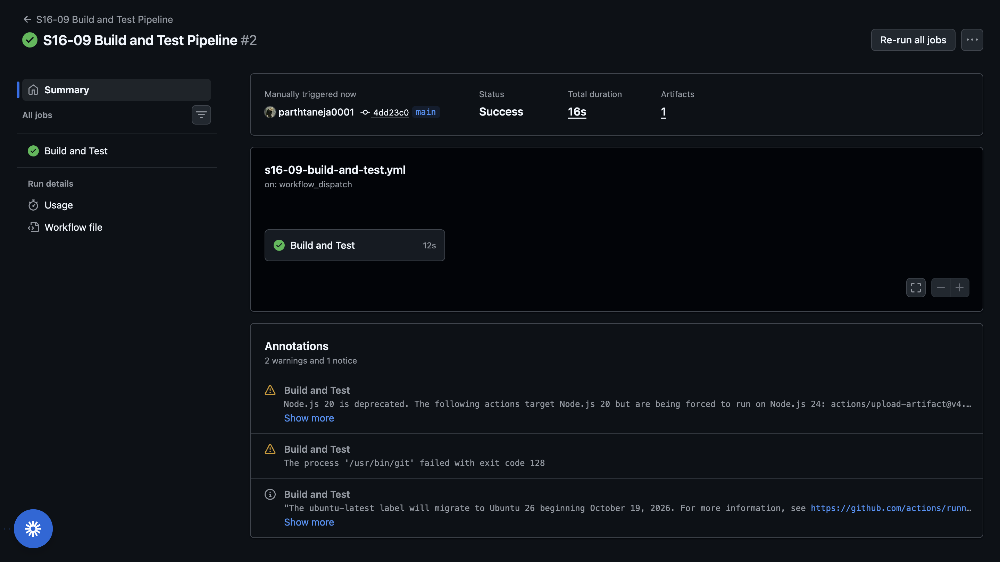

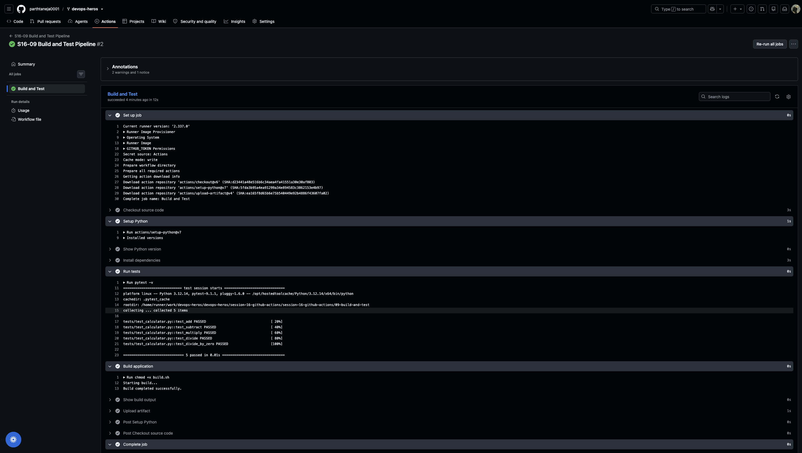

---

## 12. Final CI/CD Pipeline

Three jobs: `test`, then `build` and `security-check` (both `needs: test`).

**Workflow:** [`s16-10-final-cicd-pipeline.yml`](../../.github/workflows/s16-10-final-cicd-pipeline.yml)

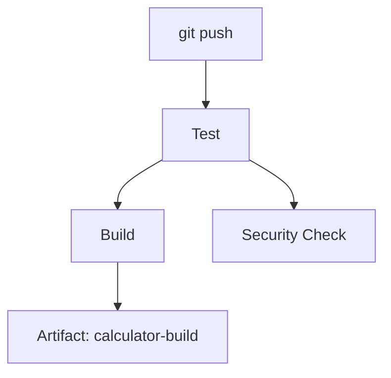

### Test case 1: success

All tests pass, so all three jobs run and the artifact is uploaded.

```text
✓ Test Application
✓ Security Check
✓ Build Application
   └── ✓ Upload build artifact
```

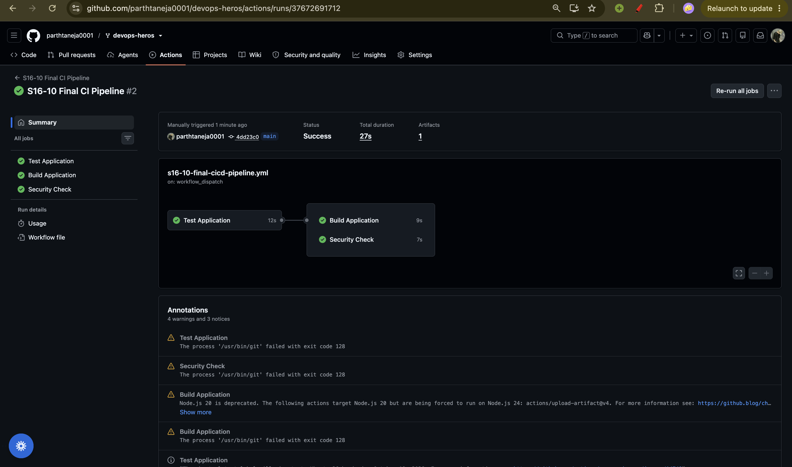

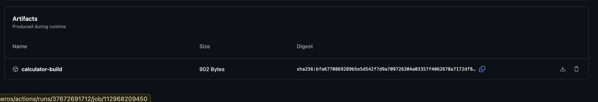

### Test case 2: failure

Break the app on purpose in `app/calculator.py`:

```python
def add(a, b):
    return a + b + 1
```

`pytest` fails. After the push, `test` fails and `build` and `security-check` are skipped because of `needs: test`.

```text
✗ Test Application
- Build Application      (skipped)
- Security Check         (skipped)
```

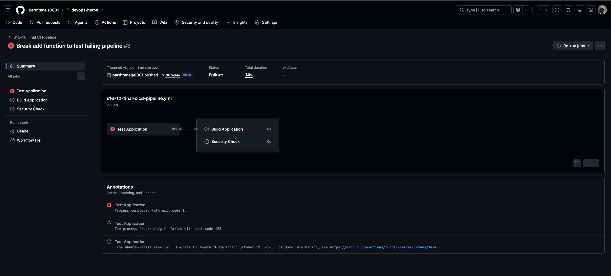

### Fix

Restore `return a + b`, then commit and push:

```bash
git add .
git commit -m "Fix application"
git push
```

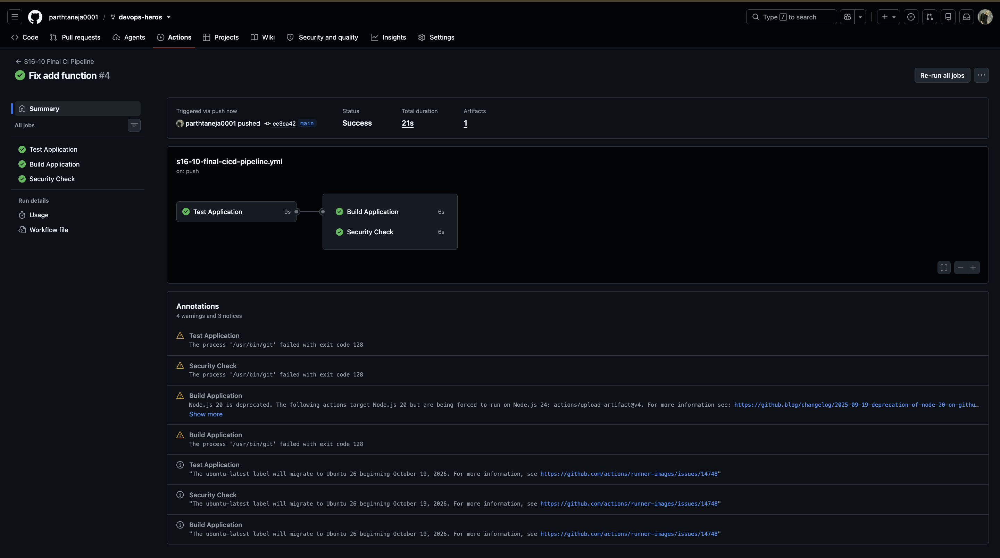

---

## Key Learnings

1. **CI/CD automates the path from commit to release.** Every push is built and tested without manual work.
2. **Workflow → Jobs → Steps.** A workflow holds jobs, jobs run on runners, and steps run commands or actions.
3. **`needs` controls order.** A failed `test` job stops `build` from running, so broken code is never packaged.
4. **Secrets and artifacts.** Credentials go in GitHub Secrets, never in YAML, and build outputs are kept as downloadable artifacts.
