# Session 17: DevSecOps

Hands-on assignment on adding security checks to a CI/CD pipeline ("shift left"): unit tests, SAST, SCA, secret scanning, container image scanning, a registry push, and a Kubernetes deploy, with each stage acting as a gate for the next.

- App and manifests: [`session-17-devsecops/demo/`](../../session-17-devsecops/demo)
- Workflow: [`.github/workflows/s17-devsecops.yml`](../../.github/workflows/s17-devsecops.yml) (GitHub only runs workflows from the repo-root `.github/workflows/`, so it uses `working-directory` and `paths:` filters to target the demo folder)

---

## 1. What is DevSecOps?

DevSecOps builds security into every stage of the pipeline instead of checking it at the end. Every commit is scanned before it can be deployed.

| Scan | What it checks | Tool used |
|:---|:---|:---|
| Unit tests | Code behaves as expected | pytest + pytest-cov |
| SAST (Static Application Security Testing) | Our source code | GitHub CodeQL |
| SCA (Software Composition Analysis) | Third-party dependencies | pip-audit |
| Secret scanning | Leaked credentials | GitHub Secret Scanning |
| Container image scanning | OS and library packages in the final image | Trivy |

---

## 2. Pipeline Flow

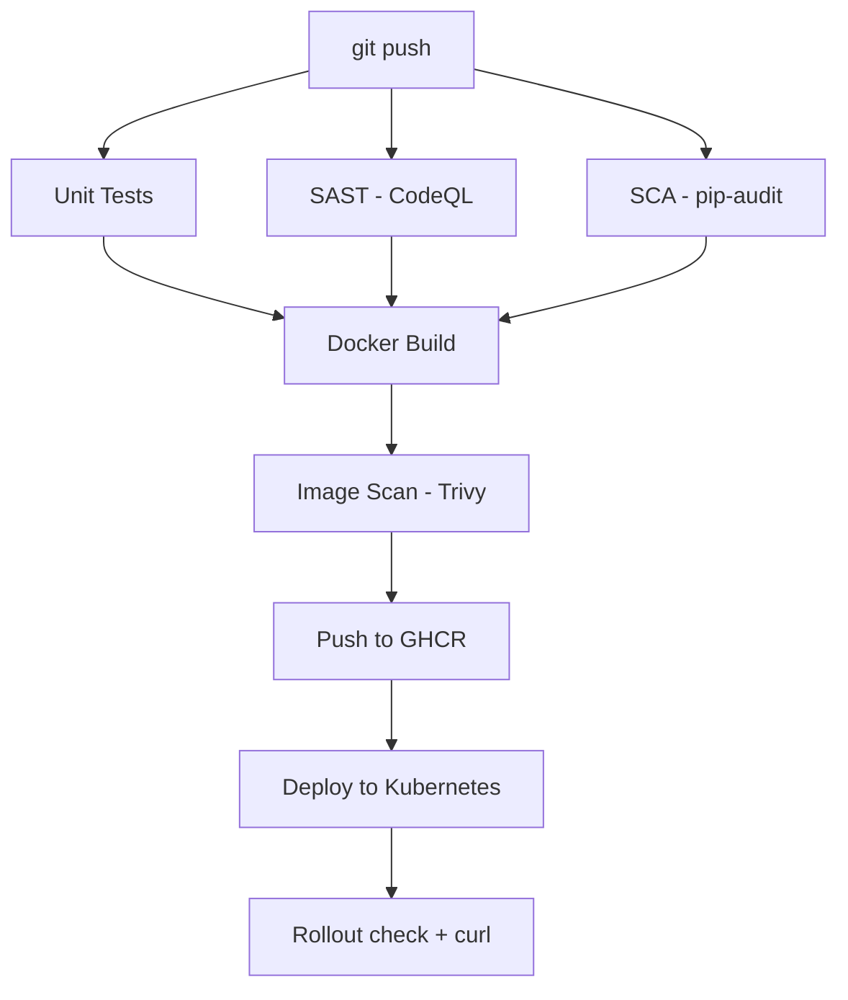
```mermaid
flowchart TD
    A[git push] --> B[Unit Tests]
    A --> C[SAST - CodeQL]
    A --> D[SCA - pip-audit]
    B --> E[Docker Build]
    C --> E
    D --> E
    E --> F[Image Scan - Trivy]
    F --> G[Push to GHCR]
    G --> H[Deploy to Kubernetes]
    H --> I[Rollout check + curl]
```

`test`, `sast` and `sca` run in parallel. `docker-build` has `needs: [test, sast, sca]`, so a failure in any of them stops everything after it. That is the **security gate**.

---

## 3. The Application

A small Flask dashboard (`/`, `/health`, `/api/status`, `/api/greet/<name>`, `/api/add`, `/api/calculate`).

```text
demo/
├── app/                # Flask app, templates, static files
├── tests/test_app.py   # 8 unit tests
├── k8s/                # deployment.yaml, service.yaml
├── Dockerfile
├── requirements.txt
└── requirements-dev.txt
```

---

## 4. Running the Project Locally

```bash
cd session-17-devsecops/demo
python3 -m venv .venv
source .venv/bin/activate
pip install -r requirements-dev.txt
```

### Unit tests with coverage

```bash
pytest --cov=app --cov-report=term-missing
```

```text
Name              Stmts   Miss  Cover   Missing
-----------------------------------------------
app/__init__.py       0      0   100%
app/app.py          102     32    69%   94, 104-105, 121, 128, ...
-----------------------------------------------
TOTAL               102     32    69%

======================== 8 passed ========================
```

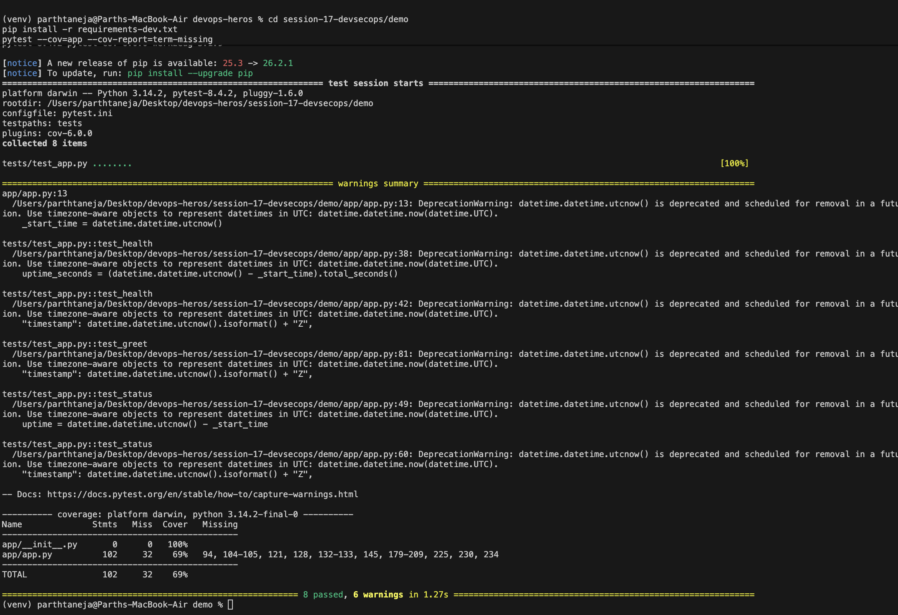

### Dependency scan (SCA) locally

```bash
pip install pip-audit
pip-audit -r requirements.txt
```

```text
No known vulnerabilities found
```

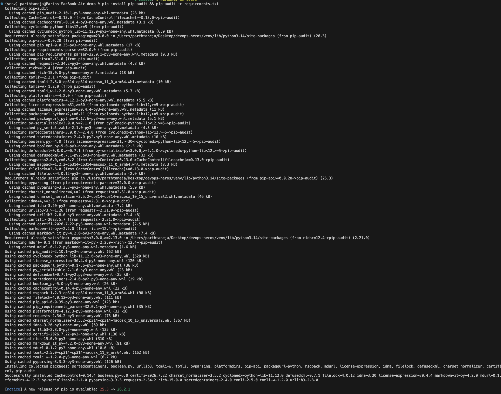

### Docker build and run

```bash
docker build -t session17-python:1.0 .
docker run -p 5001:5001 session17-python:1.0
```

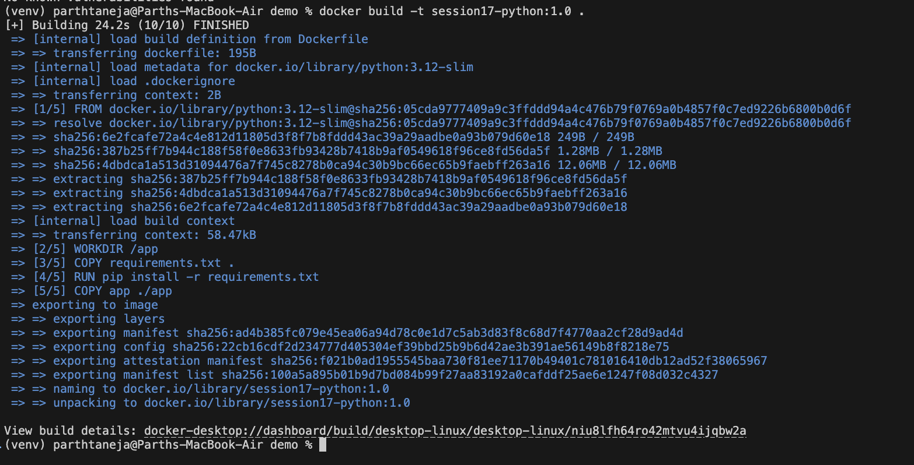

Open `http://localhost:5001`:

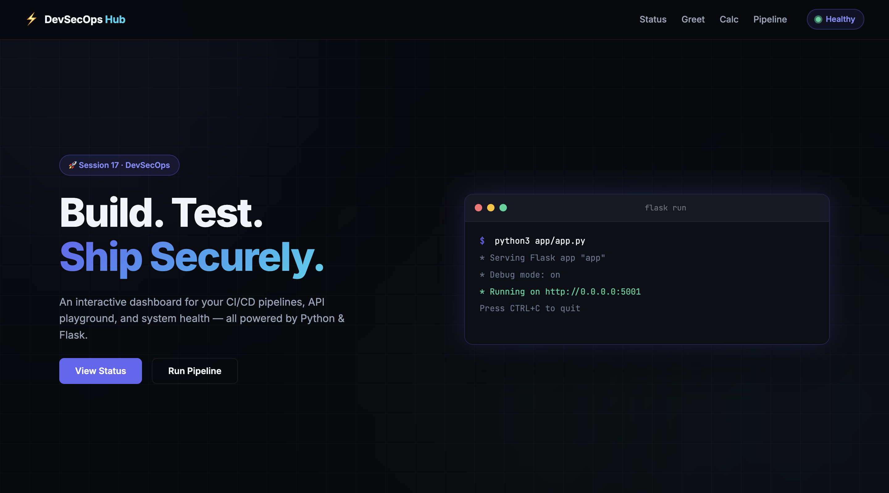

---

## 5. Pushing to GitHub and Triggering the Pipeline

```bash
git add .
git commit -m "session 17: devsecops pipeline"
git push origin main
```

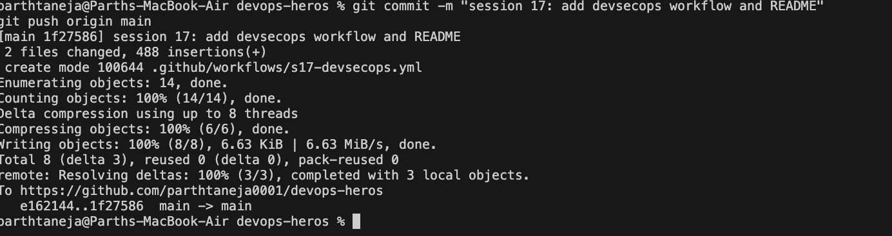

The workflow runs on a push to `main` that touches `session-17-devsecops/demo/**`, or manually from **Actions → S17 DevSecOps Pipeline → Run workflow**.

**Job graph** (Actions → the run → Summary):

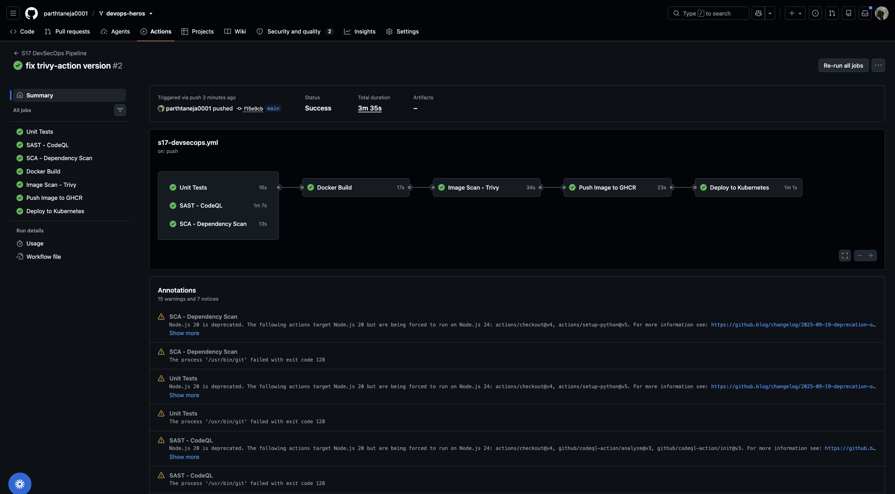

---

## 6. Unit Tests (Step 1)

```yaml
- name: Run tests
  run: pytest --cov=app --cov-report=term-missing
```

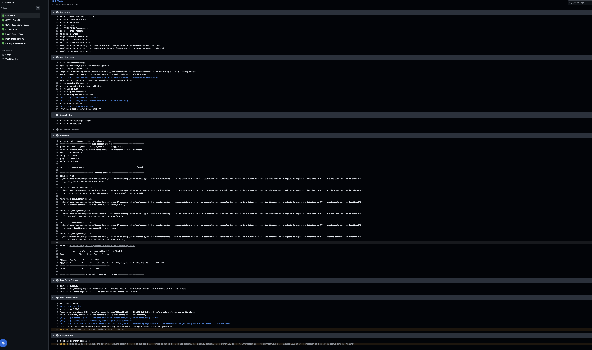

---

## 7. SAST with CodeQL (Step 2)

SAST analyses source code without running it.

```yaml
permissions:
  contents: read
  security-events: write
steps:
  - uses: github/codeql-action/init@v3
    with:
      languages: python
  - uses: github/codeql-action/analyze@v3
```

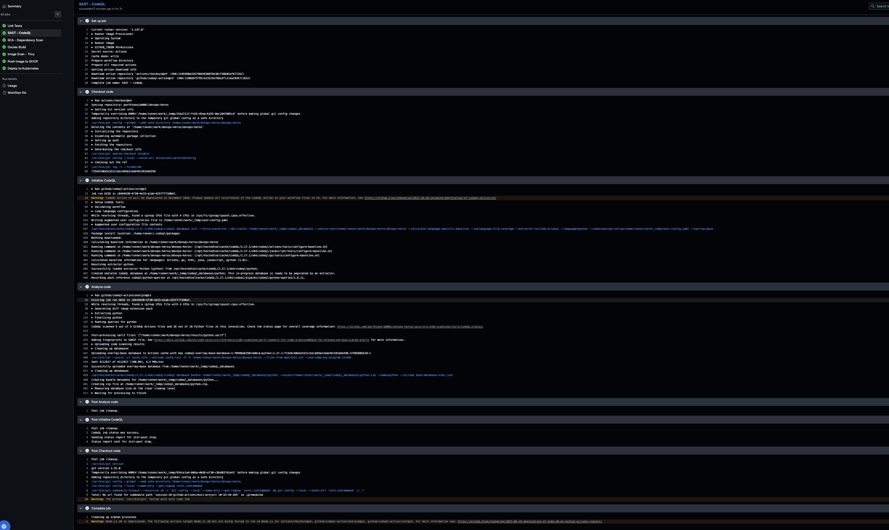

Results appear in the repository's **Security → Code scanning** page:

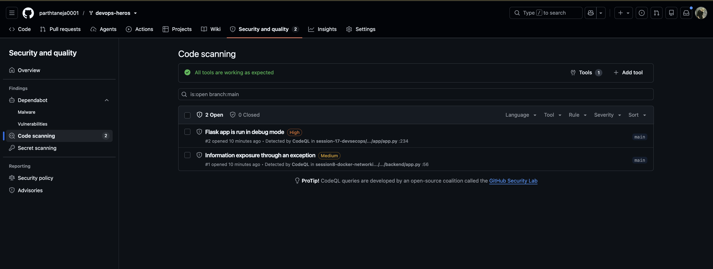

---

## 8. SCA with pip-audit (Step 3)

SCA checks third-party packages (here, `Flask`) for known vulnerabilities.

```yaml
- run: |
    pip install -r requirements.txt
    pip install pip-audit
- run: pip-audit
```

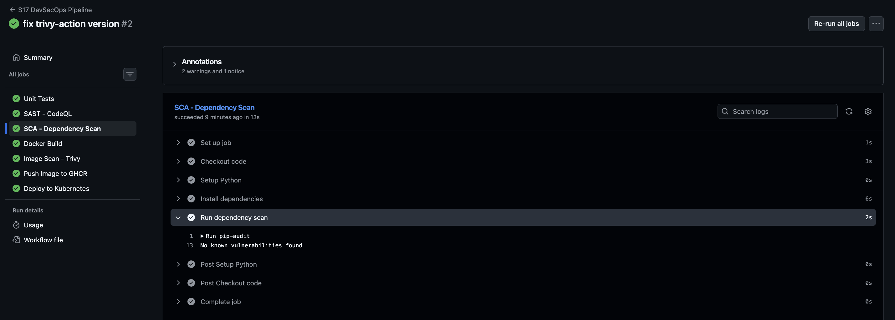

| SAST | SCA |
|:---|:---|
| Scans **our code** | Scans **our dependencies** |
| CodeQL | pip-audit |

---

## 9. Secret Scanning

Credentials must never be committed. Real secrets belong in **Settings → Secrets and variables → Actions** and are referenced as `${{ secrets.NAME }}`. GitHub Secret Scanning detects supported credential patterns in the repo, and push protection can block them before they are pushed.

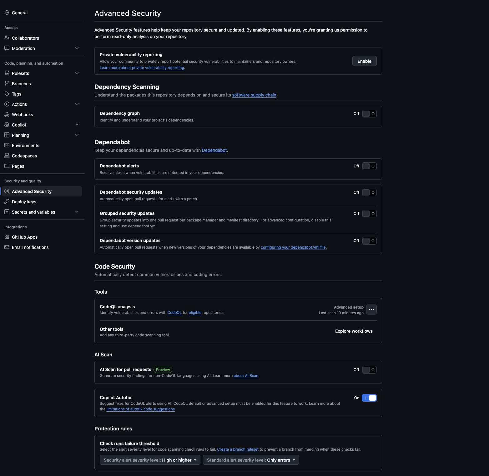

> If a real secret is ever pushed, deleting the line is not enough. Revoke or rotate the credential, because it is already compromised.

---

## 10. Docker Build and Trivy Image Scan (Steps 4 and 5)

The source can be clean while the final image still contains vulnerable OS packages, so the built image is scanned too.

```yaml
- name: Build Docker image
  run: docker build -t session17-python:${{ github.sha }} .

- name: Scan image with Trivy
  uses: aquasecurity/trivy-action@v0.36.0
  with:
    image-ref: session17-python:${{ github.sha }}
    severity: HIGH,CRITICAL
    exit-code: "0"
```

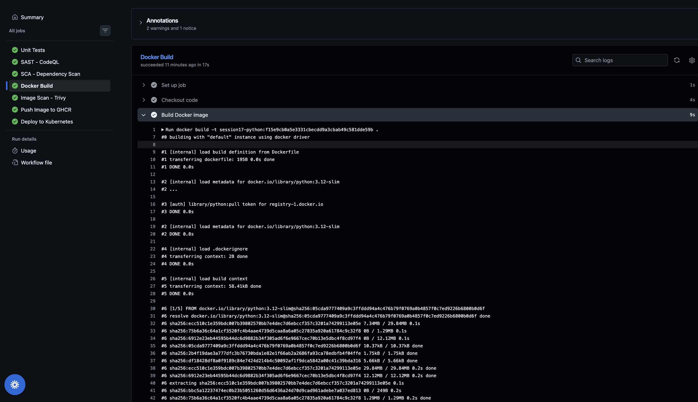

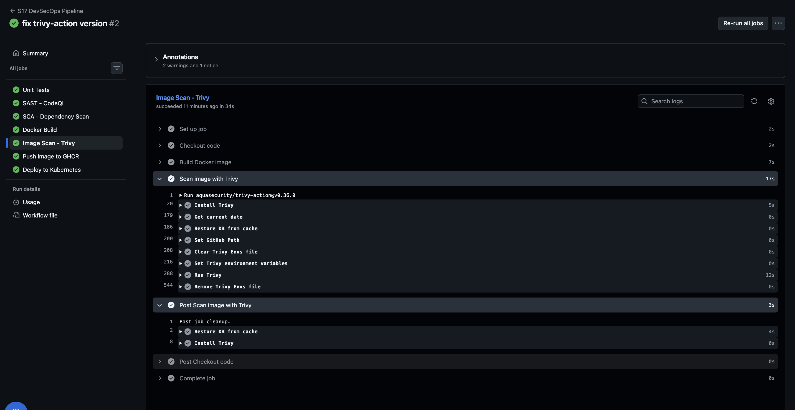

> `exit-code: "0"` makes Trivy report only. Setting it to `"1"` turns the scan into a hard gate that fails the pipeline on HIGH or CRITICAL findings.

---

## 11. Push to GitHub Container Registry (Step 6)

The image is published to GHCR using the built-in `GITHUB_TOKEN`, so no extra secret is needed.

```yaml
permissions:
  contents: read
  packages: write
steps:
  - uses: docker/login-action@v3
    with:
      registry: ghcr.io
      username: ${{ github.actor }}
      password: ${{ secrets.GITHUB_TOKEN }}
```

The image is tagged with both the commit SHA and `latest`.

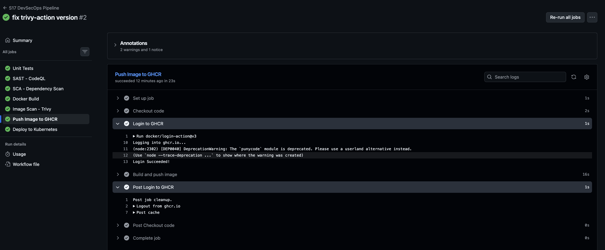

The package appears under the repository's **Packages** section:

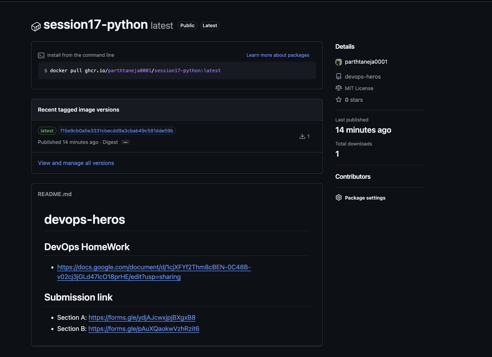

---

## 12. Deploy to Kubernetes and Verify (Step 7)

GitHub-hosted runners cannot reach a cluster on a laptop, so the pipeline creates a temporary **Kind** cluster inside the runner and deploys there. The job:

1. Creates the Kind cluster.
2. Gives the cluster a pull secret for GHCR.
3. Replaces the image in `k8s/deployment.yaml` with the exact SHA tag just pushed.
4. Runs `kubectl apply`, then `kubectl rollout status`.
5. Port-forwards the Service and `curl`s `/health` and `/api/status`.

```bash
kubectl apply -f k8s/deployment.yaml
kubectl apply -f k8s/service.yaml
kubectl rollout status deployment/session17-python --timeout=120s
```

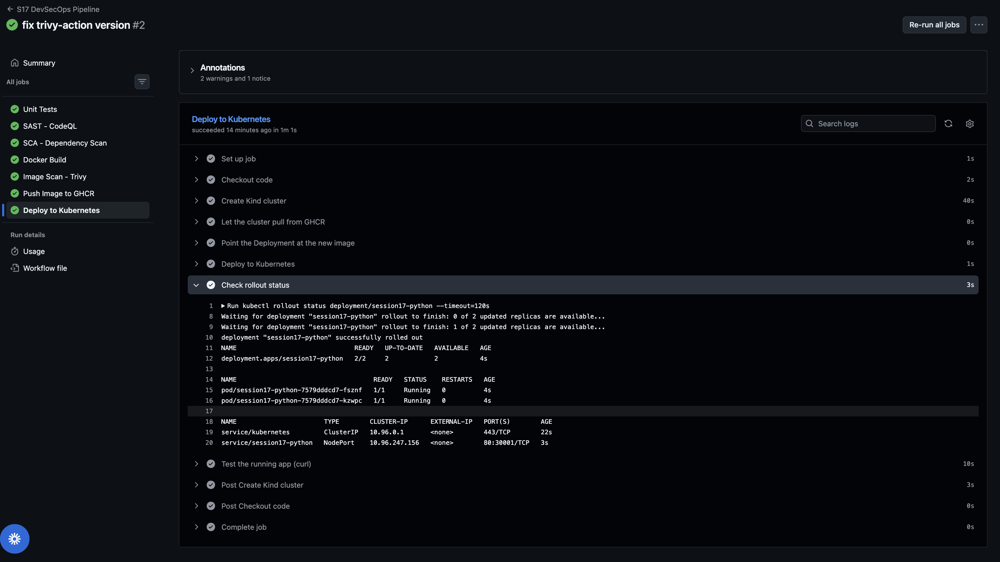

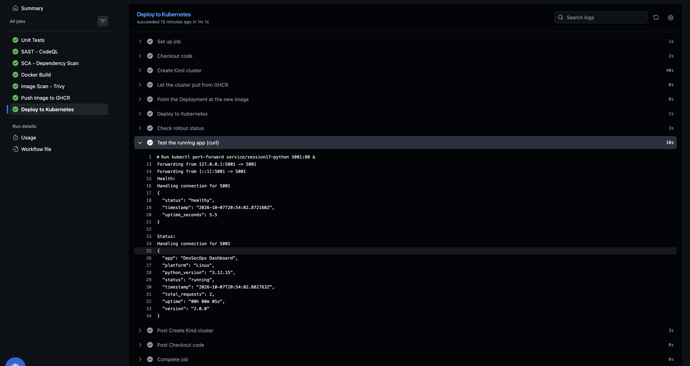

---

## 13. Security Gate in Action

To prove the gates work, break a test on purpose. In `tests/test_app.py`, change the health test to expect a wrong status code:

```python
assert response.status_code == 201   # was 200
```

After the push, `test` fails, so `docker-build`, `image-scan`, `push` and `deploy` are **skipped**. Nothing unsafe reaches the registry or the cluster.

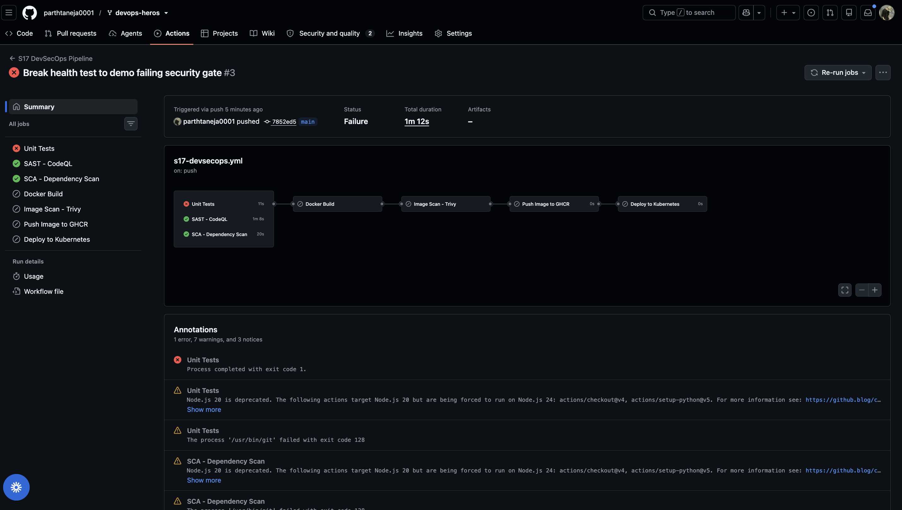

Restoring `200` and pushing again turns the pipeline green.

---

## Key Learnings

1. **Shift security left.** Every push is tested and scanned automatically, before anything is deployed.
2. **Each scan covers a different layer.** SAST covers code, SCA covers dependencies, secret scanning covers credentials, and Trivy covers the container image. A clean result from one does not make the whole app secure.
3. **A scan only finds problems, and a gate acts on them.** `needs:` makes a failed check stop the build, push and deploy jobs.
4. **Publish and deploy only what passed.** The same commit SHA ties the tested code, the image in GHCR and the running Deployment together.
