# Session 19: Cloud Fundamentals & AWS VPC Infrastructure with Terraform

This session covers fundamental cloud computing concepts and demonstrates how to provision a complete, secure AWS network architecture—including Virtual Private Clouds (VPC), Subnets, Internet Gateways, Route Tables, and Security Groups—using **Terraform Infrastructure as Code (IaC)**.

---

## 1. Cloud Service Models & Shared Responsibility

Cloud computing services are categorized into three primary service models based on the level of management provided by the cloud vendor versus the customer:

| Service Model | Customer Manages | Cloud Provider Manages | Popular AWS Examples |
| :--- | :--- | :--- | :--- |
| **IaaS** (Infrastructure as a Service) | OS, Middleware, Runtime, Applications, Data | Physical Hardware, Networking, Virtualization | AWS EC2, EBS, VPC |
| **PaaS** (Platform as a Service) | Application Code, Data Configurations | OS, Runtime, Patching, Virtualization, Hardware | AWS Elastic Beanstalk, RDS |
| **SaaS** (Software as a Service) | Application Consumption & User Management | Entire Infrastructure & Application Stack | Gmail, Microsoft 365, Slack |

---

## 2. AWS Global Infrastructure: Regions & Availability Zones (AZ)

- **AWS Region:** A physical geographic location in the world containing multiple isolated data centers (e.g. `ap-south-1` in Mumbai).
- **Availability Zone (AZ):** One or more discrete data centers with redundant power, networking, and connectivity within an AWS Region (e.g. `ap-south-1a`, `ap-south-1b`).
- **High Availability (HA):** Deploying application workloads across multiple AZs ensures fault tolerance and business continuity if an entire data center experiences an outage.

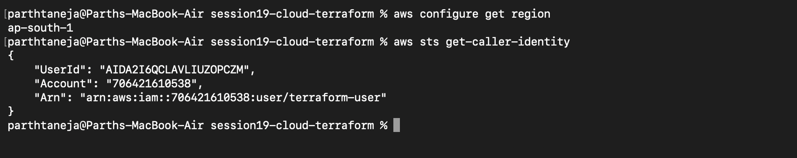

---

## 3. Amazon VPC & Subnet Architecture

- **Virtual Private Cloud (VPC):** An isolated virtual network logically dedicated to your AWS account. It is defined using an IPv4 CIDR block (e.g., `10.0.0.0/16` providing 65,536 private IP addresses).
- **Subnet:** A designated range of IP addresses within a VPC attached to a specific Availability Zone (e.g., `10.0.1.0/24` providing 256 IP addresses).
  - **Public Subnet:** Direct route to an Internet Gateway (`0.0.0.0/0`), allowing resources to send and receive public internet traffic.
  - **Private Subnet:** No direct route to the Internet Gateway; used for sensitive back-end resources (databases, internal microservices).

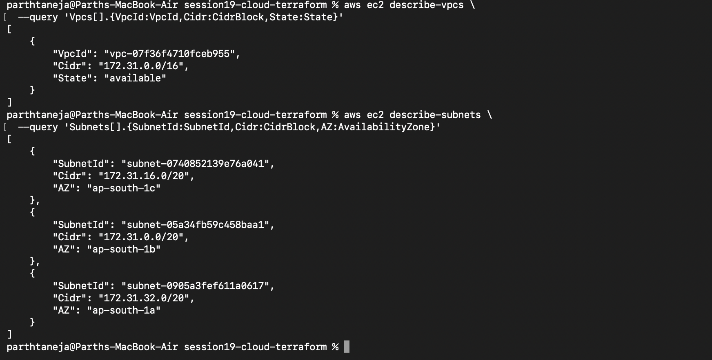

---

## 4. Route Tables & Internet Gateways (IGW)

- **Internet Gateway (IGW):** A horizontally scaled, highly available VPC component that enables communication between resources in your VPC and the public internet.
- **Route Table:** A set of rules (routes) used to determine where network traffic from your subnet is directed.
- **Public Subnet Criteria:** A subnet is classified as *public* when its associated route table includes an explicit route directing `0.0.0.0/0` (all IPv4 internet traffic) to the attached Internet Gateway.

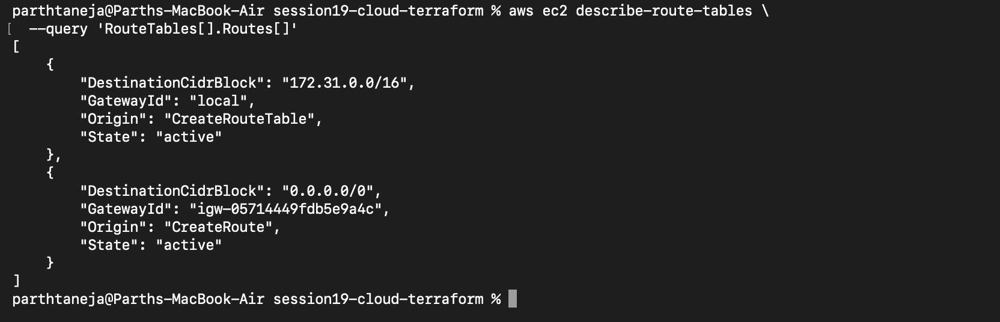

---

## 5. Network Security: Security Groups

A **Security Group** acts as a virtual **stateful firewall** controlling inbound and outbound network traffic at the resource level (Elastic Network Interface - ENI).

> 🔒 **Security Best Practice:** Security groups operate on a *deny-by-default* policy. Never expose administrative ports like SSH (port 22) to `0.0.0.0/0` in production environments.

| Network Feature | Route Table | Security Group |
| :--- | :--- | :--- |
| **Primary Function** | Directs network traffic destination routes | Filters allowed inbound/outbound traffic |
| **Attachment Level** | Attached at the **Subnet** level | Attached at the **Resource / ENI** level |
| **State Behavior** | Stateless route matching | **Stateful** (return traffic automatically allowed) |

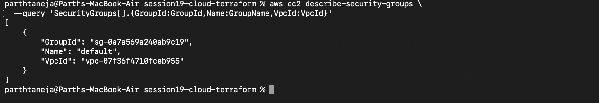

---

## 6. Hands-On Lab: Automated VPC Provisioning via Terraform

In this lab, Terraform provisions a complete AWS network infrastructure containing a VPC, Public Subnet, Internet Gateway, Custom Route Table, Route Table Association, and a Web Security Group (allowing HTTP port 80 and HTTPS port 443).

```text
Public Internet  ──►  Internet Gateway  ──►  Route Table (0.0.0.0/0)  ──►  Public Subnet 10.0.1.0/24  (VPC 10.0.0.0/16)
```

### Initializing & Running Execution Plan

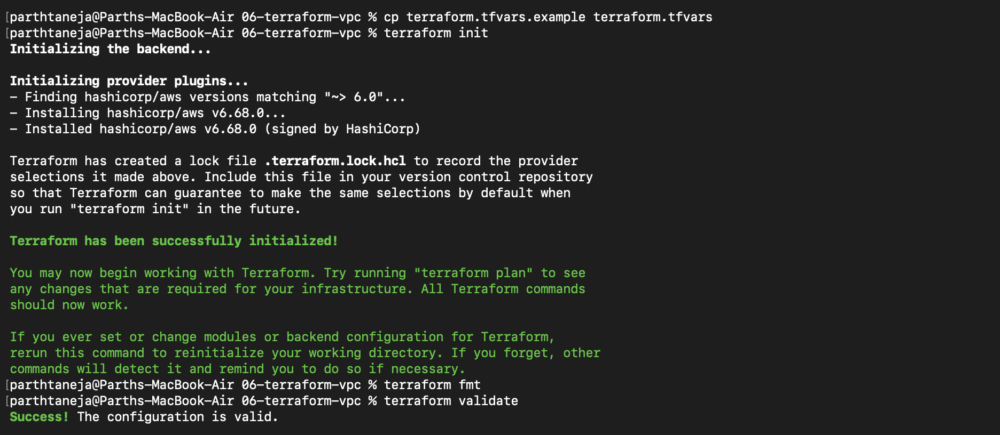

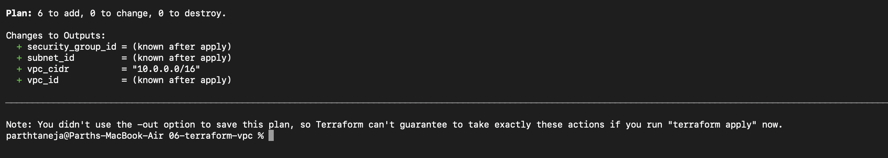

### Applying Network Infrastructure

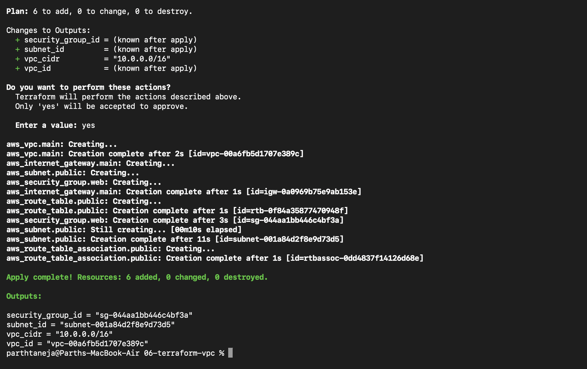

### Inspecting State & Output Variables

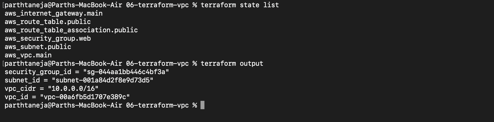

### Verifying AWS Infrastructure via AWS CLI

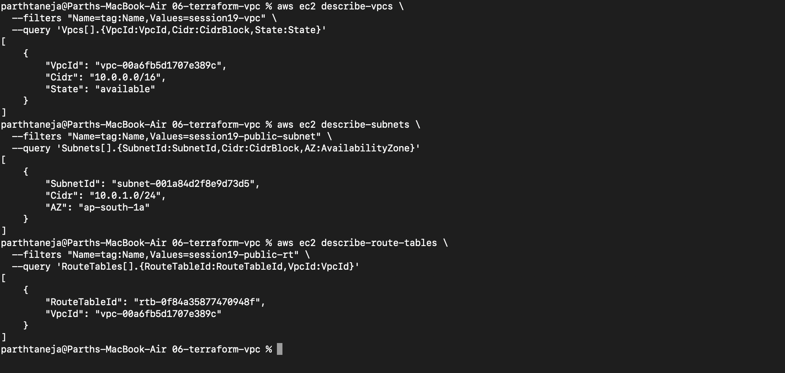

### Immutable Updates: Modifying VPC CIDR (`-/+` Replacement)

Modifying fundamental network parameters like a VPC's primary CIDR block cannot be performed in-place. Terraform identifies this constraint and plans a destructive **replacement (`-/+`)**, destroying dependent subnets and recreating the network.

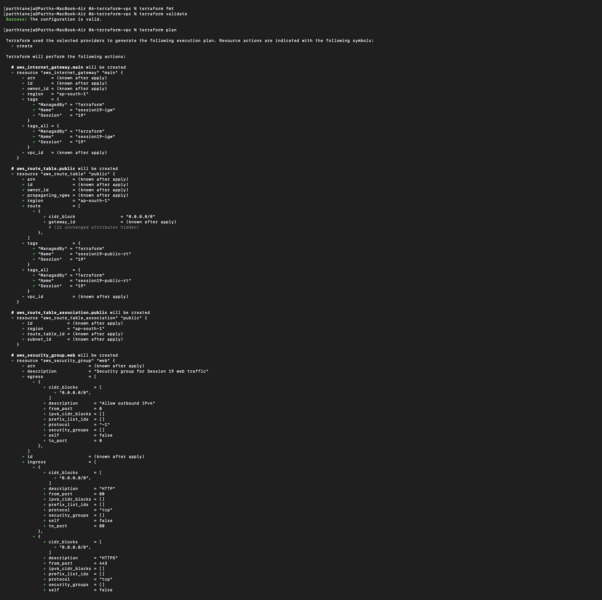

### Lab Teardown & Resource Destruction

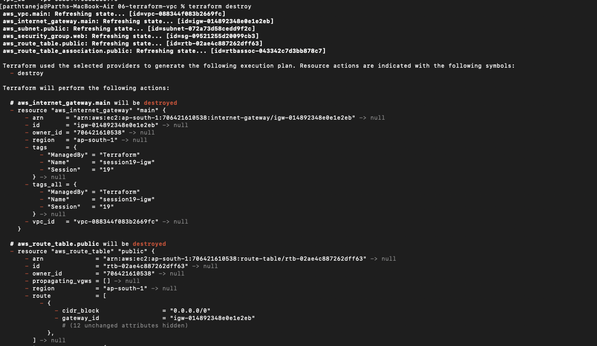

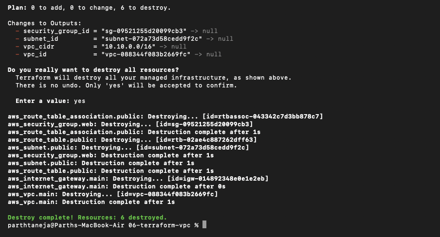

---

## 7. The Standard Infrastructure Lifecycle Workflow

```text
terraform init ──► terraform fmt ──► terraform validate ──► terraform plan ──► terraform apply ──► terraform state list ──► terraform destroy
```

### Workflow Execution Verification

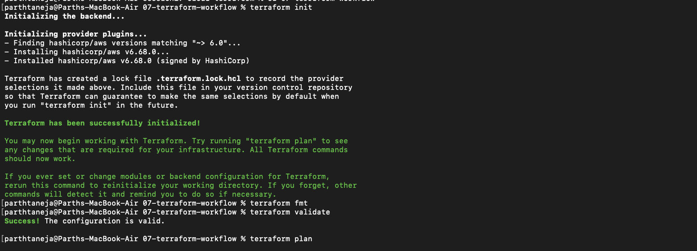

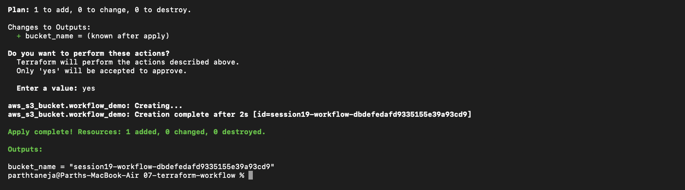

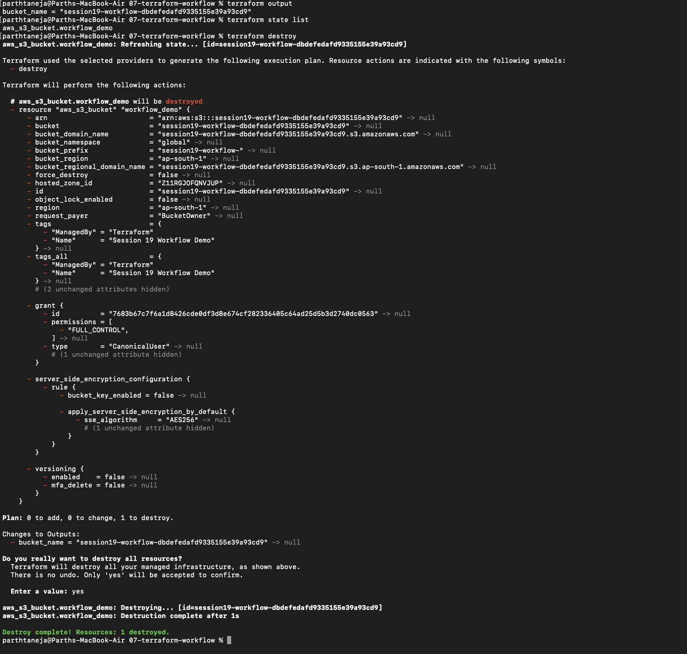

---

## 8. Mini Project: Isolated Production VPC (`10.20.0.0/16`)

A standalone project building an isolated production network with a `10.20.0.0/16` VPC CIDR block and a `10.20.1.0/24` public subnet.

### Initializing & Execution Plan

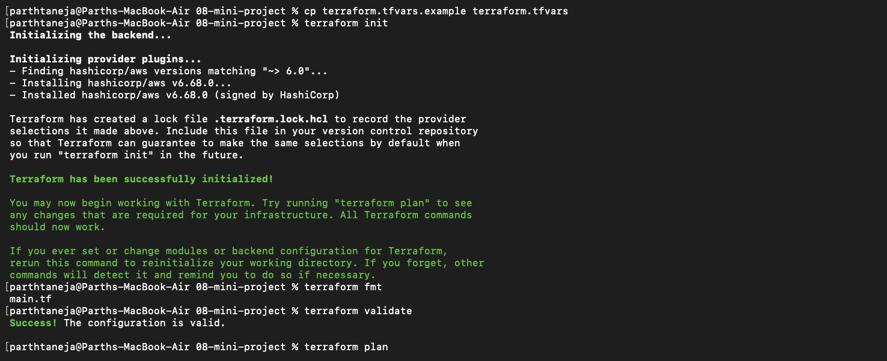

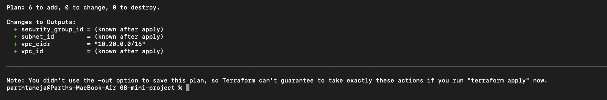

### Applying Configuration & Verification

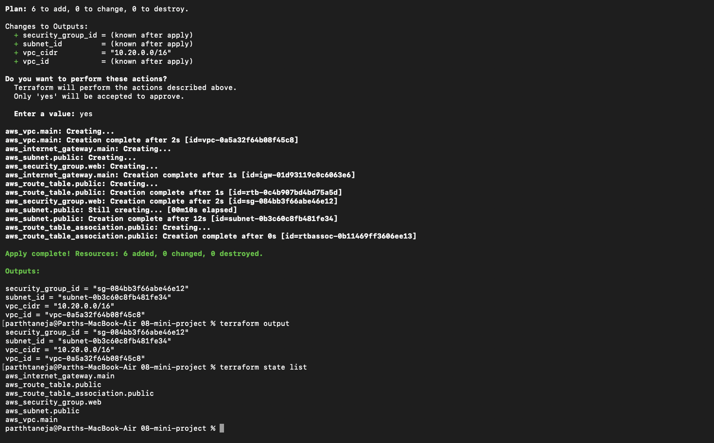

### AWS CLI Verification of Mini Project Network

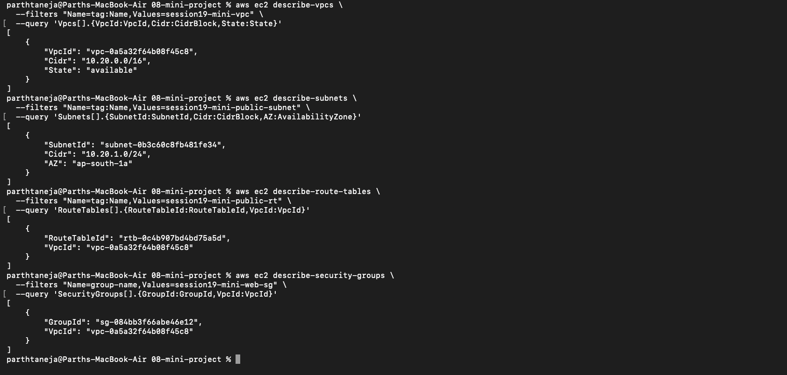

### Environment Teardown & Cleanup

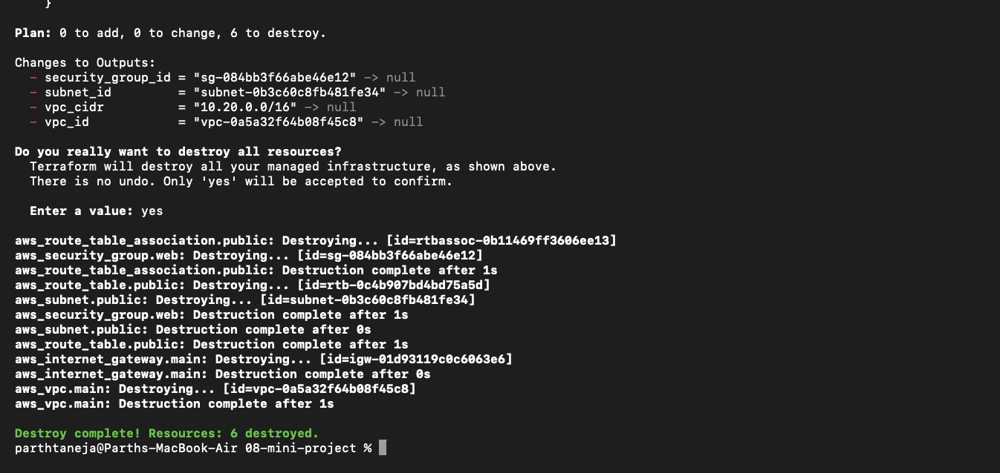

---

## Summary & Key Takeaways

- **Cloud Service Taxonomy:** **IaaS** gives full OS/network control, **PaaS** abstracts runtime infrastructure, and **SaaS** provides ready-to-use software.
- **AWS Hierarchy:** **Region ──► Availability Zone ──► VPC ──► Subnet**. Route tables and Internet Gateways dictate subnet public vs. private accessibility.
- **Traffic Routing vs. Filtering:** **Route Tables** direct where traffic travels, whereas **Security Groups** filter which traffic is allowed to enter or leave instances.
- **IaC Automation:** Terraform provisions interconnected cloud networking components declaratively in a single `apply` and tears them down cleanly with `destroy`.