# Session 20: Monitoring, Observability, and GitOps Continuous Delivery

This session covers the foundations of system observability (Monitoring vs. Observability, Metrics, Logs, and Traces), metric collection with **Prometheus**, real-time visualization with **Grafana**, and declarative continuous deployment using **GitOps and Argo CD**.

---

## 1. Monitoring vs. Observability

| Paradigm | Primary Focus | Key Question Answered | Characteristic |
| :--- | :--- | :--- | :--- |
| **Monitoring** | Tracks pre-defined metrics and system alerts | *"Is the system working right now?"* | Black-box checking of known failure modes |
| **Observability** | Infers internal system health from telemetry outputs | *"Why is the system behaving this way?"* | Exploration of unknown system states via telemetry |

### Demo Application Cluster Setup

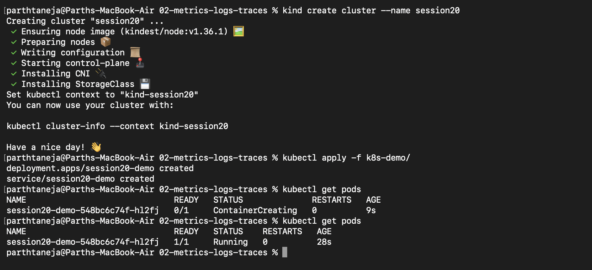

### Log Inspection & Resource Description

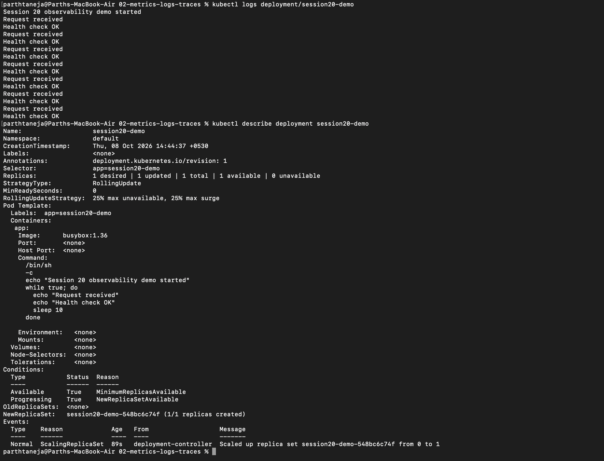

### Cluster Teardown & Environment Cleanup

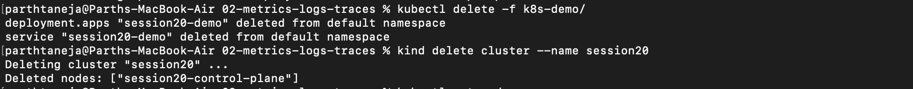

---

## 2. Telemetry Signals: Metrics, Logs, and Traces

Observability relies on three distinct types of telemetry signals:

| Telemetry Signal | Description | Example |
| :--- | :--- | :--- |
| **Metrics** | Numerical time-series data aggregated over time | CPU utilization (80%), HTTP throughput (200 req/s) |
| **Logs** | Immutable, timestamped textual event records | `2026-10-08 15:00:00 [INFO] Database connection established` |
| **Traces** | End-to-end request lifecycle paths across microservices | API Gateway ──► Auth Service ──► DB Query (Span ID) |

---

## 3. Prometheus — Time-Series Metrics Scraper

**Prometheus** is an open-source time-series monitoring system that actively **pulls (scrapes)** metrics from HTTP `/metrics` endpoints exposed by target workloads.

- **PromQL (Prometheus Query Language):** Powerful query language used to compute rates, quantiles, and aggregations (e.g., `up == 1` confirms a target is active).
- **Target Scraping:** Collects numerical metrics at periodic intervals.

### Launching Prometheus Container

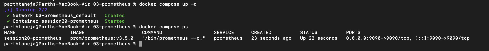

### Querying Target Health (`up`) via PromQL

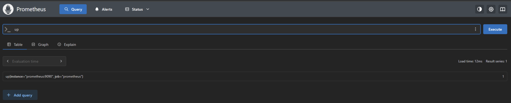

### Stopping Prometheus Service

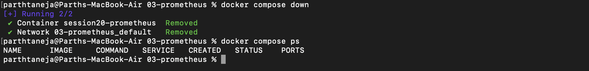

---

## 4. Grafana — Visual Dashboarding Platform

**Grafana** is a visualization platform that queries metrics from datasources like Prometheus and renders interactive dashboards.

- **Datasource Connection:** Configured to read Prometheus metrics via internal network URLs (e.g. `http://prometheus:9090`).
- **Panels & Dashboards:** Transforms raw PromQL queries into real-time graphs, gauges, and status indicators.

### Launching Prometheus & Grafana via Docker Compose

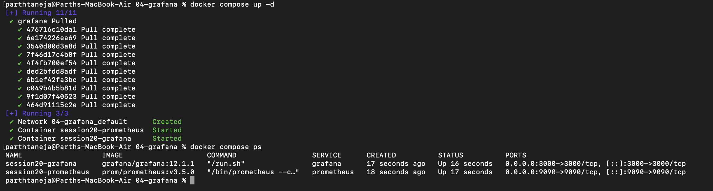

### Adding Prometheus Datasource in Grafana

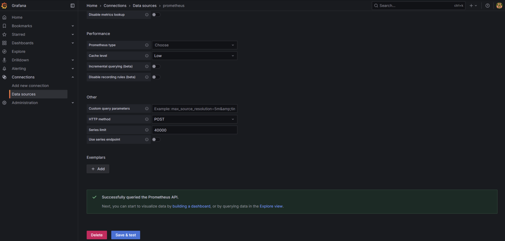

### Creating Custom Metrics Panel & Dashboard

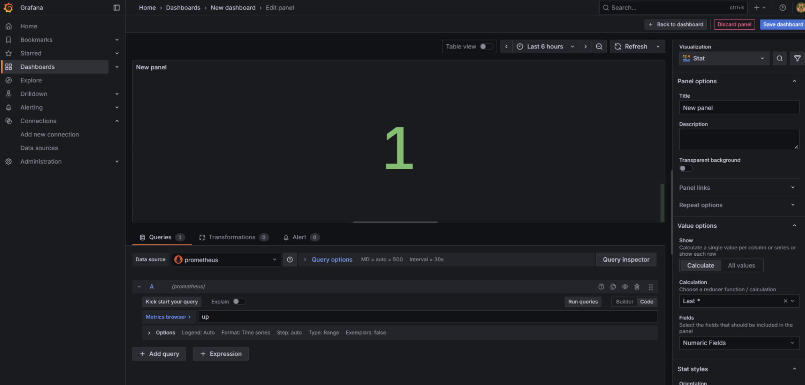

### Stopping Monitoring Stack

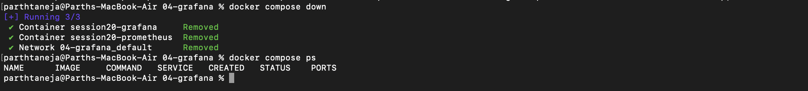

---

## 5. Introduction to GitOps

**GitOps** is an operational model that applies DevOps best practices (version control, pull requests, CI/CD) to infrastructure and application management.

| Traditional Ops | GitOps Model |
| :--- | :--- |
| Engineers run manual `kubectl apply` commands | GitOps controller reconciles cluster automatically |
| Cluster state drifts over time without audit trails | **Git is the Single Source of Truth**; drift is auto-reverted |
| Difficult to audit changes or rollback failures | Every change is a versioned, peer-reviewed Git commit |

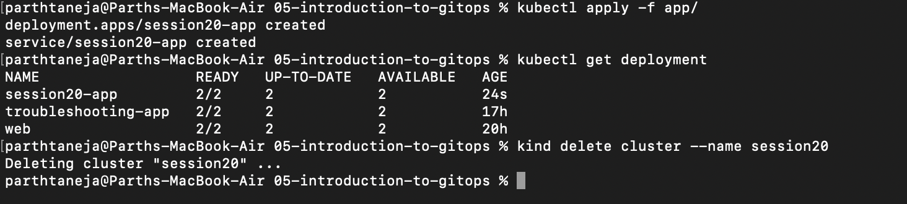

---

## 6. Git as the Single Source of Truth

With GitOps, modifying system state requires making a commit to a Git repository rather than manually editing live cluster resources.

### Initializing the Manifest Repository

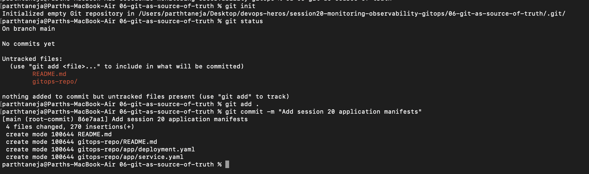

### Updating Desired State via Git Commit

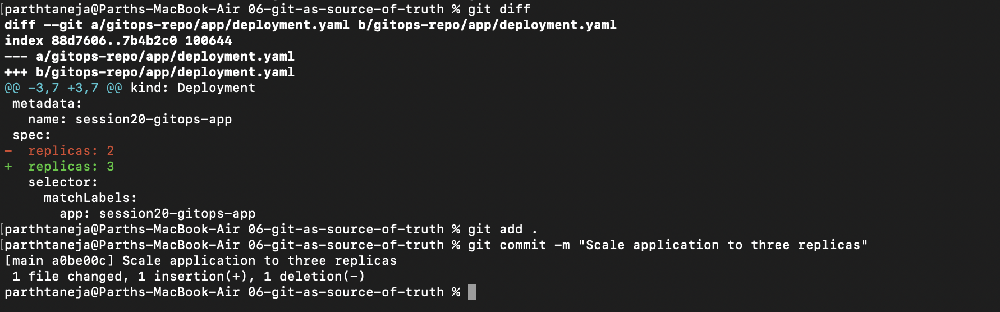

---

## 7. Declarative CD with Argo CD

**Argo CD** is a Kubernetes-native GitOps continuous delivery tool that monitors Git repositories and synchronizes cluster resources to match the desired state.

- **Sync Policy Features:**
  - **Prune:** Deletes cluster resources removed from Git.
  - **Self-Heal:** Overwrites manual out-of-band `kubectl` edits to match Git state.

```text
Developer Git Push ──► GitHub Repository ──► Argo CD Controller ──► Kubernetes Cluster Updated
```

### Checking Cluster Readiness

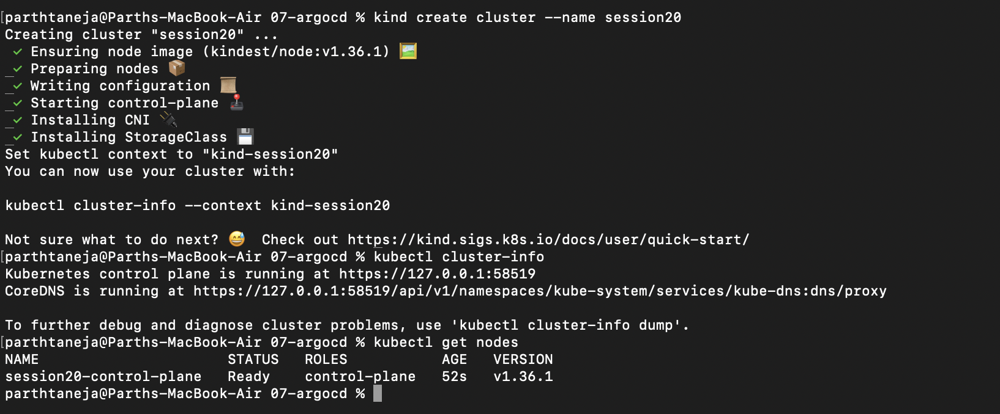

### Installing Argo CD Controller Manifests

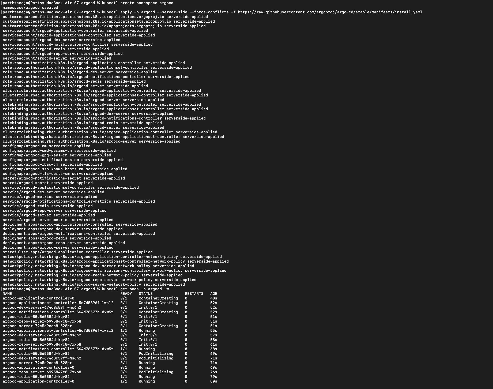

### Accessing Argo CD Web UI

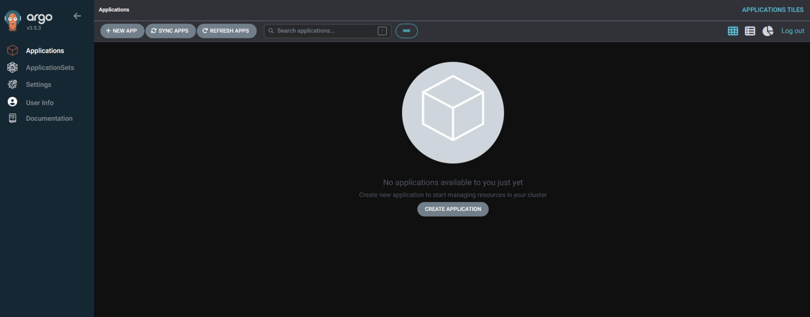

### Registering Application in Argo CD

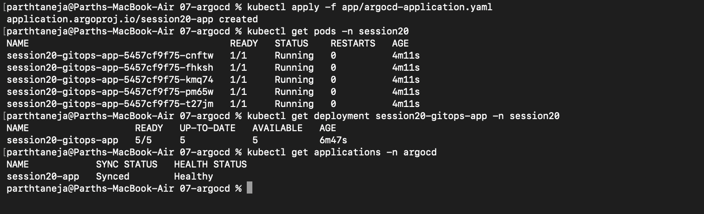

### Verifying Synced Application State

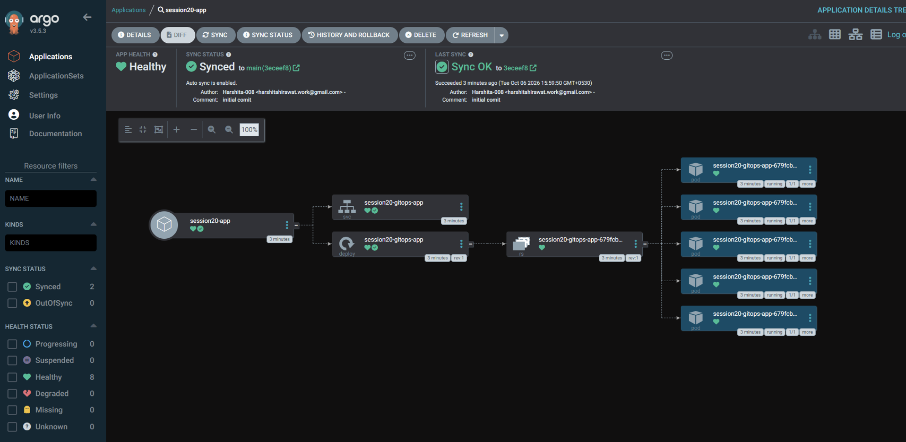

### Inspecting Running Application Pods

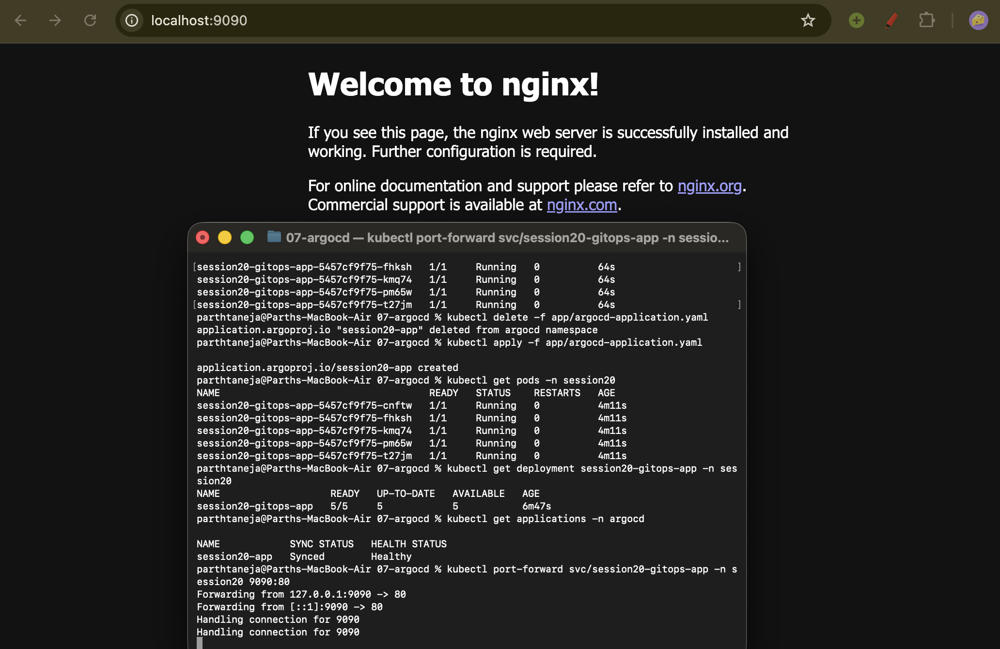

### Scaling to 2 Replicas via Git Commit

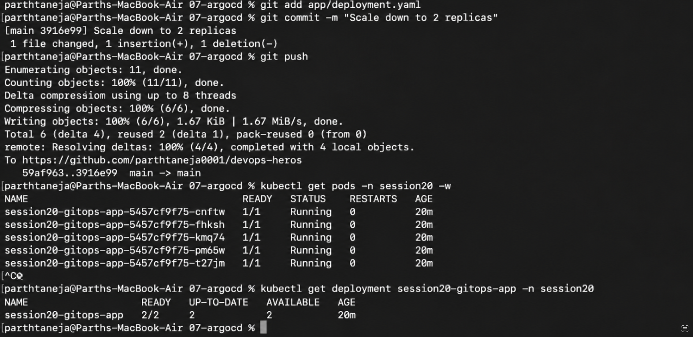

### Scaling to 3 Replicas via Git Commit

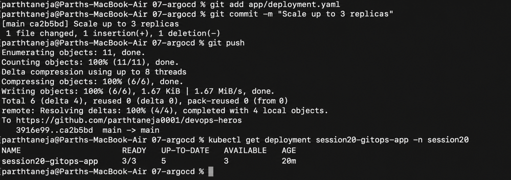

### Cleaning Up Release Resources

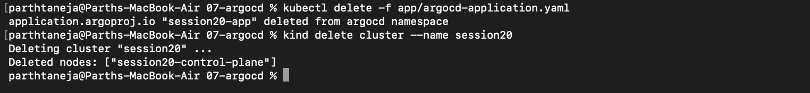

---

## 8. Mini Project: End-to-End GitOps Pipeline

Deploying an application via Argo CD, scaling it declaratively, and verifying self-healing automated reconciliation.

```text
Git Repository (Desired State)  ──►  Argo CD (Reconciler)  ──►  Kubernetes (Actual State)
```

### Deploying Cluster & Argo CD

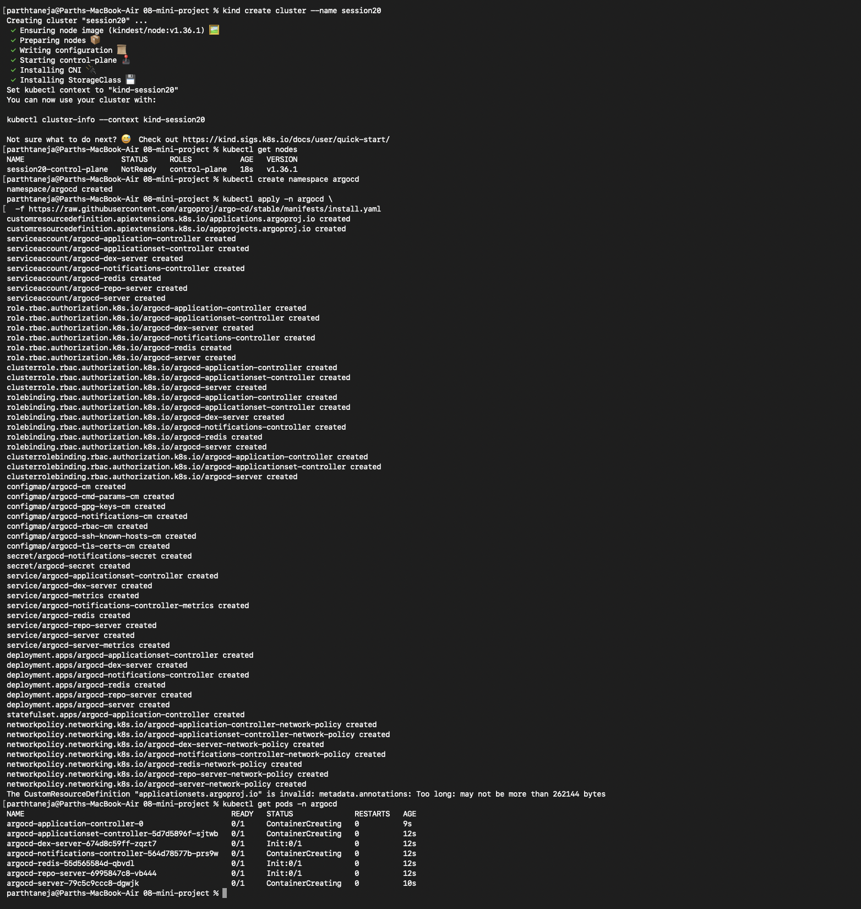

### Verifying Application Synced Status

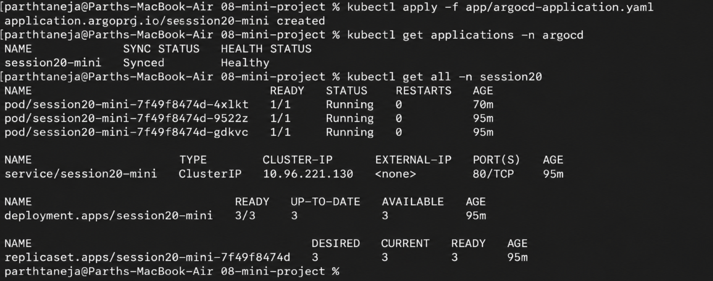

### Scaling Deployment to 3 Replicas in Git

Updating `replicas: 3` in `deployment.yaml`, committing, and pushing to Git:

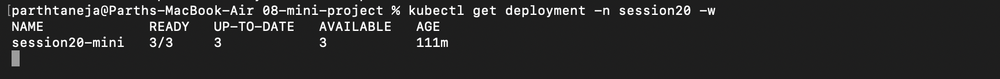

### Demonstrating Argo CD Self-Healing

A manual manual scale command (`kubectl scale --replicas=1`) is automatically detected as configuration drift and reconciled back to `replicas: 3` by Argo CD to match Git.

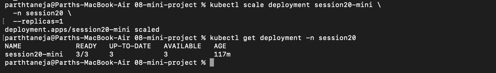

### System Logs & State Verification

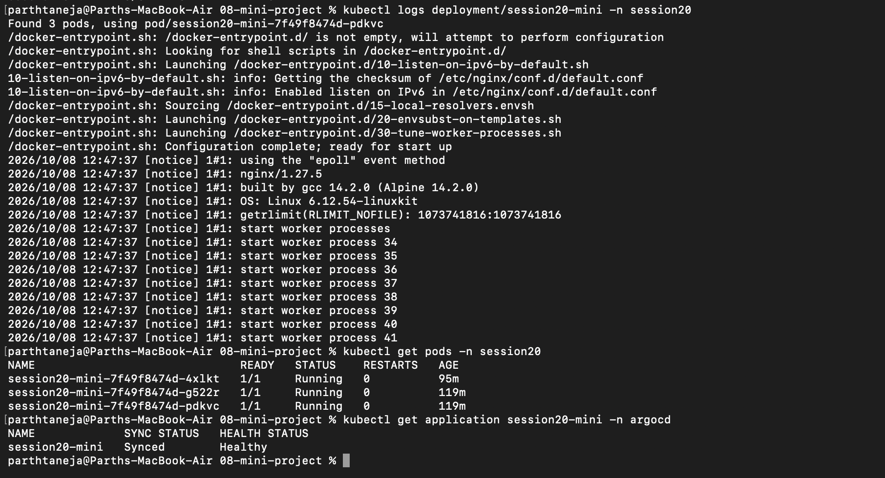

---

## Key Takeaways

- **Observability:** **Metrics, Logs, and Traces** provide complete visibility into system behavior.
- **Monitoring Tools:** **Prometheus** handles time-series metrics ingestion; **Grafana** handles visualization.
- **GitOps Paradigm:** **Git** is the single source of truth for all environment manifests.
- **Automated Sync:** **Argo CD** maintains alignment between Git (desired state) and Kubernetes (actual state) through continuous automated reconciliation and self-healing.