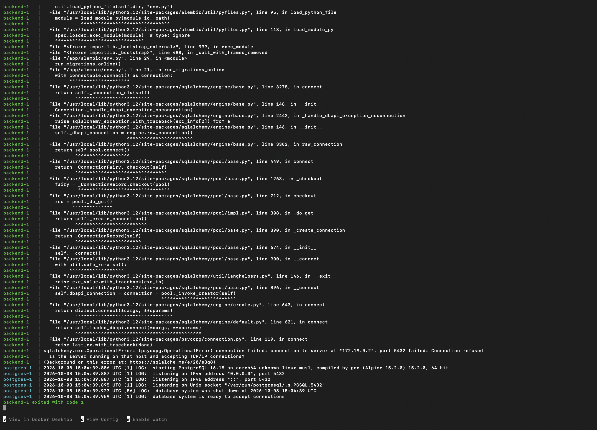
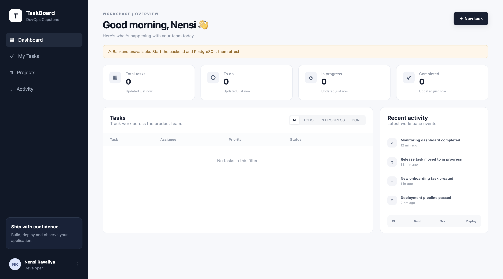
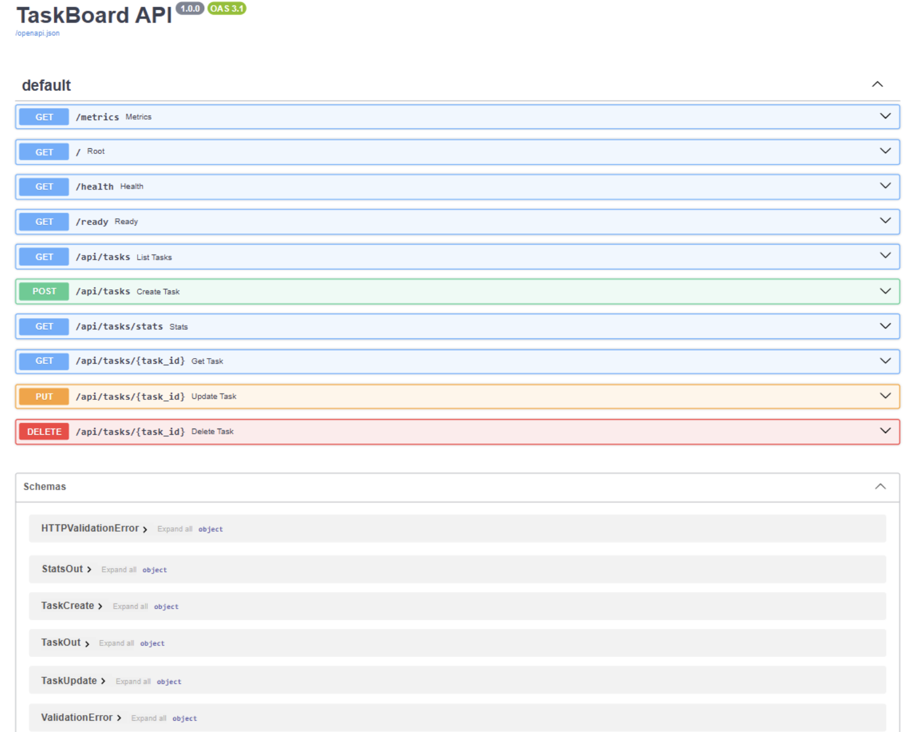
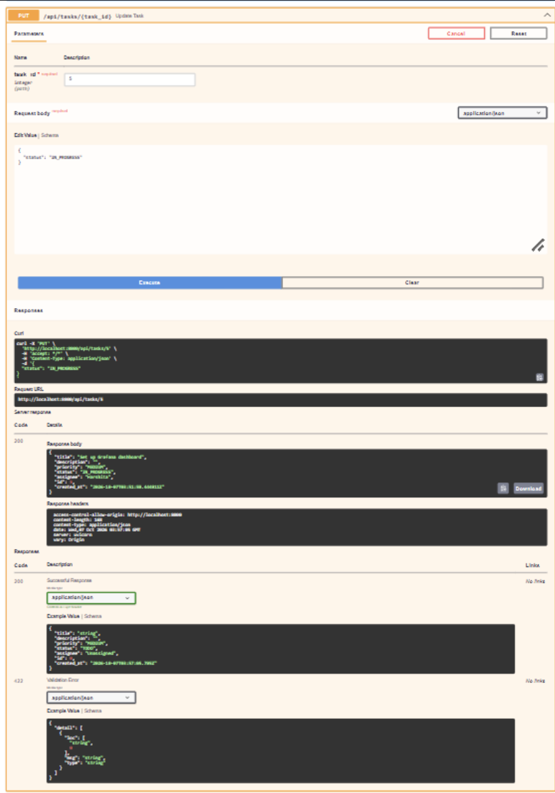
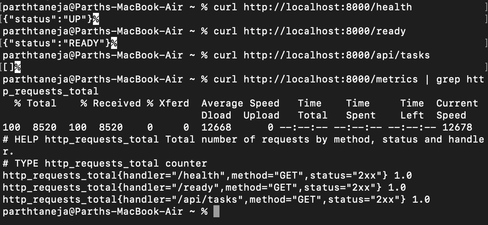
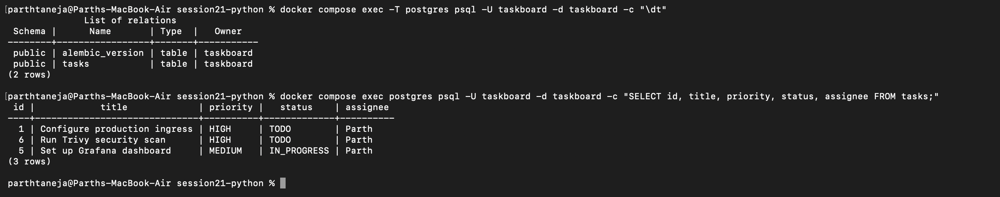
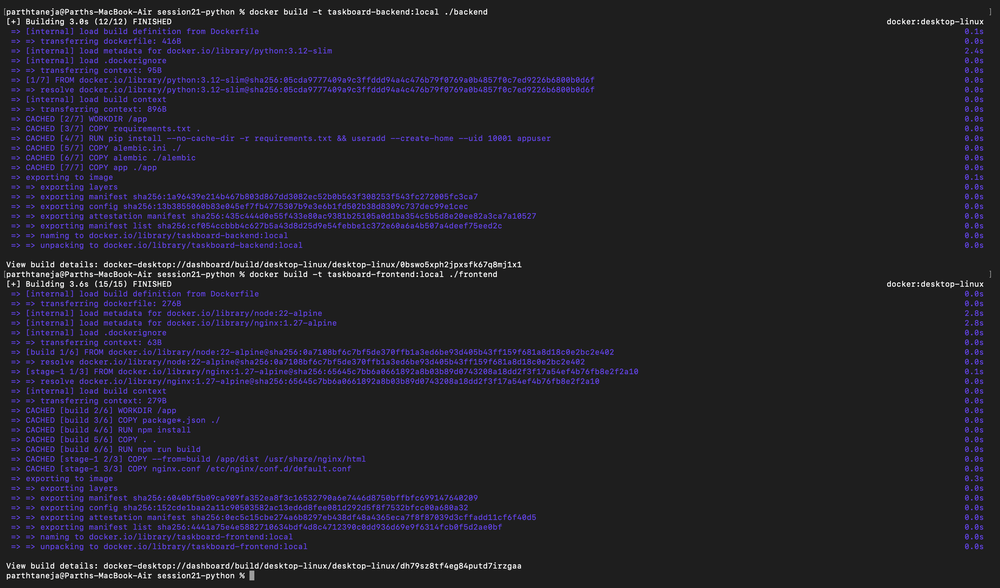
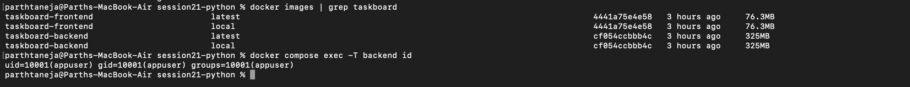
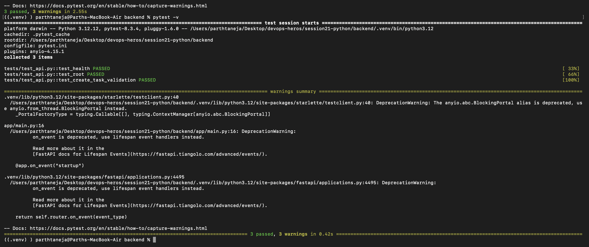

# Session 21: DevOps Final Capstone — TaskBoard Application

**TaskBoard** is the reference project for the DevOps Final Capstone: a full-stack SaaS project management application built with a **React + Vite** frontend, a **FastAPI (Python)** backend, and a **PostgreSQL** database.

```text
Browser  ──►  Frontend (React / Nginx :3000)  ──►  /api  ──►  Backend (FastAPI :8000)  ──►  PostgreSQL (:5432)
```

---

## 1. Application Architecture Overview

- **Frontend:** React + Vite dashboard served by Nginx. The browser only requests `/api/...`, and Nginx proxies request routes to the FastAPI backend.
- **Backend:** FastAPI with SQLAlchemy ORM and Alembic database migrations.
  - **`/health`:** Liveness probe checking container runtime health.
  - **`/ready`:** Readiness probe verifying live PostgreSQL database connectivity.
  - **`/metrics`:** Prometheus metrics instrumentation endpoint.
- **Database:** PostgreSQL storing application state, task records, and assignees.

---

## 2. Running Locally with Docker Compose

A single command builds both container images and starts the Frontend, Backend, and PostgreSQL database together.

```bash
cd session21-python
docker compose up --build -d
```

### Docker Compose Stack Startup



### TaskBoard Web Dashboard (:3000)



### Creating a Task in Dashboard



### API Documentation & Swagger UI (:8000/docs)



### Updating a Task via API (`PUT /api/tasks/{id}`)



### Health & Metrics Telemetry Endpoints (`/health` & `/metrics`)



### Querying PostgreSQL Tasks Table

```bash
docker compose exec -T postgres psql -U taskboard -d taskboard -c "SELECT id, title, priority, status, assignee FROM tasks;"
```



### Docker Images & Security (Non-Root User UID 10001)

- **Backend Container:** Runs as unprivileged `appuser` (UID `10001`) for enhanced security.
- **Frontend Multi-Stage Build:** Uses Node.js to build static assets, serving them via a minimal Nginx runtime image.

```bash
docker compose exec -T backend id
```



---

## 3. Automated Testing with Pytest

Tests act as the primary quality gate in the CI/CD pipeline. They run against an isolated SQLite test database, preventing broken code from promoting to container image builds.

```bash
cd session21-python/backend
source .venv/bin/activate
pytest -q
pytest -v
```



```text
Application Code  ──►  Pytest Quality Gate  ──►  Docker Build  ──►  Trivy Scan  ──►  Deployment
```

---

## Summary & Key Learnings

- **Single-Command Local Stack:** `docker compose up --build` launches the full multi-container stack (Frontend, Backend, Database) seamlessly.
- **Reverse Proxy Routing:** Nginx handles API proxying to `/api`, decoupling backend internal IPs from client browsers.
- **Observability Primitives:** `/health`, `/ready`, and `/metrics` provide essential probes for Kubernetes orchestrators and Prometheus scrapers.
- **Automated Testing:** Pytest unit and integration tests enforce quality control before container image creation and pipeline deployment.